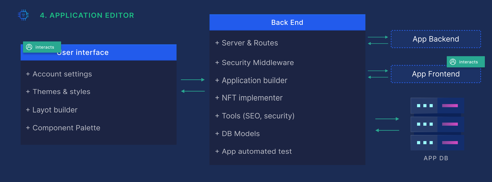

# Application Editor

The Application Editor generates the UI and backend of the resulting application.

Here a user can define:

1. How the resulting application’s users and privileges will be managed.
2. What themes and styles will be used.
3. Select which components will be used.
4. How will the components be placed on the pages.
5. Connecting the components to smart contract functions.

The module builds the resulting application’s frontend, backend and database. Automated QA tools will check the resulting application’s functionality.

The resulting application will be connected to the XP.network Substrate pallet and the chosen blockchains. It will be fast, search engine optimized and secure.