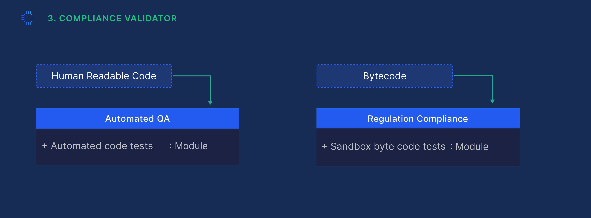

# Compliance Validator

The Compliance Validator is an automated QA tool for the generated code. It also enforces the latest regulations issued by the designated blockchains.

By default, the Migration-Module’s output is error free and regulations compliant. However, since the option to manually modify the resulting code exists, this tool is invaluable in validating and reporting errors. The Compliance Validator results can be found in the “Validation Panel” of the code tab.

For example, if a user tries to copy resources inside a smart contract in Move (which is prohibited according to the Diem policy) a regulation compliance error will pop up.