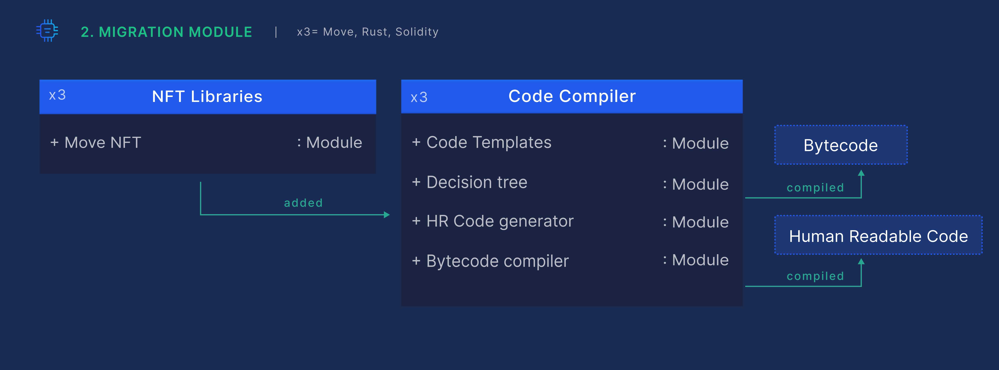

# Migration Module

The Migration-Module generates human readable code which can be read and edited by the user in the code tab on the UI.

This allows more experienced users to read and edit the code. The window in the code tab is listening to the user generated events. Should a user edit and save a new version of code, a request is sent to the backend and the Compliance Validator to modify the previously generated code with the new one and ensure the code is still error free.

The Migration-Module contains:

1. Pre-programmed audited code templates which are populated by data from the “intention” object.
2. Decision tree responsible for building the structure of the selected NFT use case.
3. Human readable code generator.
4. Bytecode compiler.

Since Move does not have a standard library for working with NFTs, XP.NETWORK’s NFT library for Move is an extension of the original standard library. Potentially other libraries and protocols could be added in the future.

Also, since user-edited code can contain errors or may contradict some chosen blockchain policies, the code is tested by the XP.network Compliance Validator tool. The code tab includes a Validation Panel which displays the results of the Code Validator’s checks and either confirms that the code is free from errors and is regulations compliant, or indicates the lines in code that contain errors alongside with suggestions of improvement.

In order to interact with the Polkadot pallet for XP.network, a user’s application must register one’s account. To ensure confidentiality and integrity, it can be done from the “Polkadot Interaction” tab of this tool.

All the data connected to this module is persisted in a database, be it user choices, errors or smart contract edited code.
