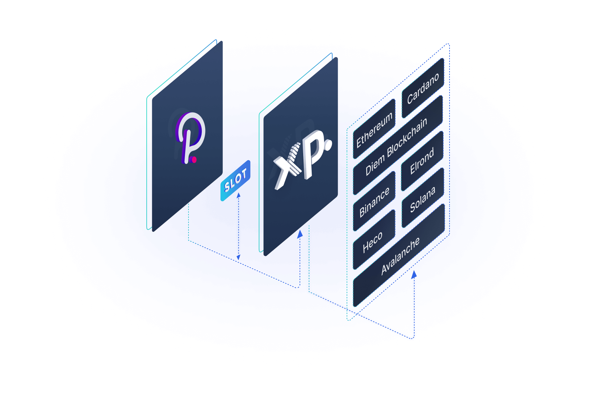

# Polkadot VM Hub

The VM Hub Layer is a Substrate pallet which allows different Virtual Machines to interact with each other. The Layer implements serialization and deserialization of data formats and shared storage between different VMs, making requests between them possible. For example, one could call a smart contract written in Solidity from a smart contract written in Move or Ink! and vice versa.

A user can choose between the following blockchains: Avalanche, Binance, Cardano, Diem, Elrond, Ethereum, Heco, Polkadot and Solana. Depending on the user’s blockchain choice, a smart contract programming language will be chosen. For example, if a user wants to interact with Ethereum, Solidity will be chosen as a target language.

This module consists of:

1. **Bytecode Deserializer** - it receives hexadecimal input and returns a human readable code in assembly.
   
2. **Assembly Code Converter** - it  creates the following key - value pairs:
   * The chosen smart contract programming language.
   * Template number.
   * Data to populate the smart contract with.
  
3. **Bytecode Compiler** - it takes the key - value pairs generated at the previous stage as an input and generates the chosen smart contract language bytecode as its output.
   
4. **Polkadot parathread** - it uses the Relay Chain callback mechanism to communicate with the other parachains and parathreads using XP.network protocol. Since the existing mechanism is connectionless and stateless there’s no way to automatically be notified whether a message or a transaction succeeded. This is why every transaction is marked with a unique token. While waiting for the results of the transaction or to identify the incoming messages as related to the transaction the token is stored together with the transaction info.

A set of pre-programmed audited code templates are ready to be populated by the arbitrary data. Once a request is received, the templates are populated with the incoming data and are instantly compiled into transaction ready bytecode. Initially there will be a limited set of ready code templates for each platform. However, new templates will be added on a permanent regular basis. Eventually most possible use cases will be available for each bridged platform. Finally, the original smart contract bytecode will be translated directly into the target language bytecode, removing all limitations.

Since the architecture is designed for an injectable interface, we are not limited to Solidity, Move, Rust and Ink! programming languages. Any other language can implement this adapter, should its requests comply with the adaptable interface.