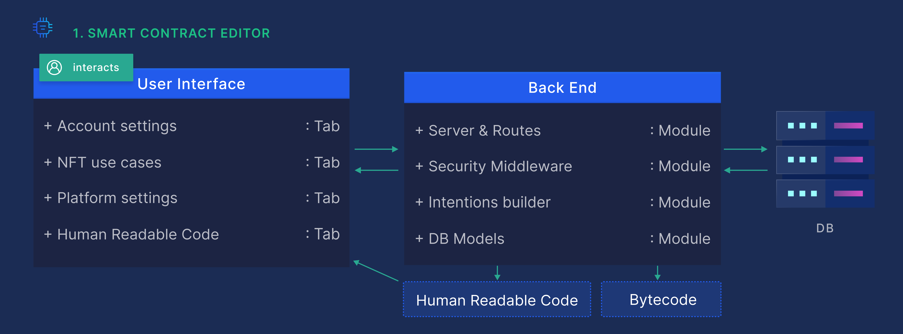

# Smart Contract Editor

The Smart Contract Editor is a codeless UI tool which allows users to generate valid human readable code in Move, Solidity and Rust, resulting in  smart contracts that can be launched  on Diem, Polkadot, Ethereum, BSC and countless other blockchains.

Users select an NFT use case, business specific details and blockchains.

When all the steps are completed, the following occurs:

1. A JSON request is sent to the server.T
2. he request is sanitized and validated.
3. A JSON “intention” object is generated.

The “intention” object contains:

1. The chosen blockchains’ smart contract programming languages.
2. The NFT use case is translated to smart contracts.
3. The business specific details are inputted as rules, functions, and variables.
   
The “intention” object is sent to the next platform tool called the Migration-Module.