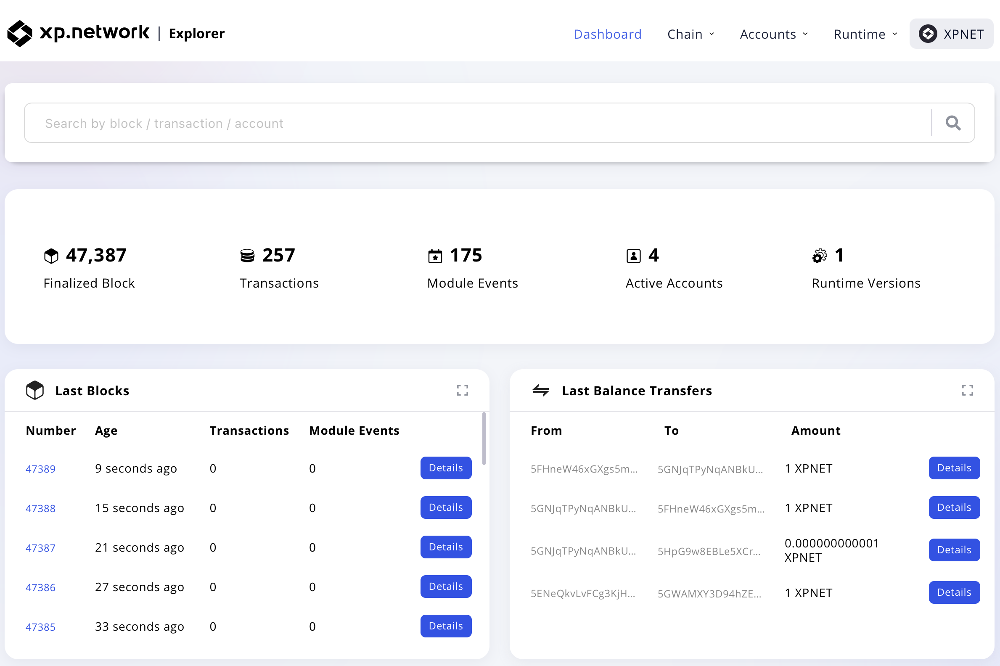
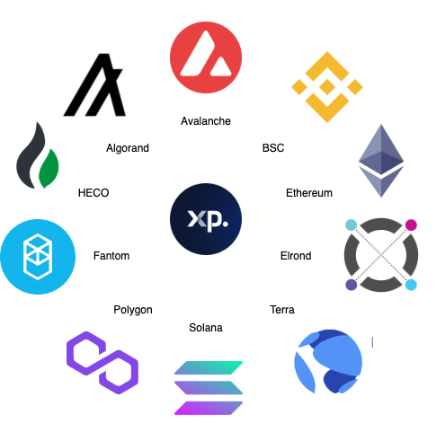

# Testnet

Costless blockchain playground

A small network of computers with running Substrate nodes allows our users to test the resulting applications with zero costs before connecting them to the live mainnets . Other blockchain’s testnets will also become available in the near future.

Thanks to our Multibridge our testnet is connected with the testnets and devnets of the most famous blockchains supporting smart contracts wich allows to test fungible and non-fungible tokens transfers.

