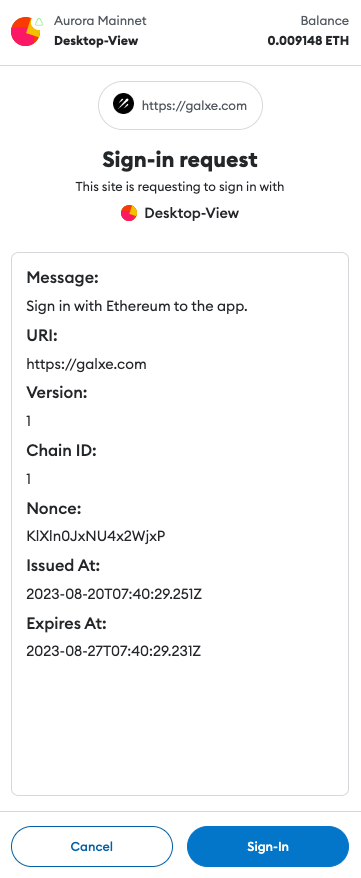
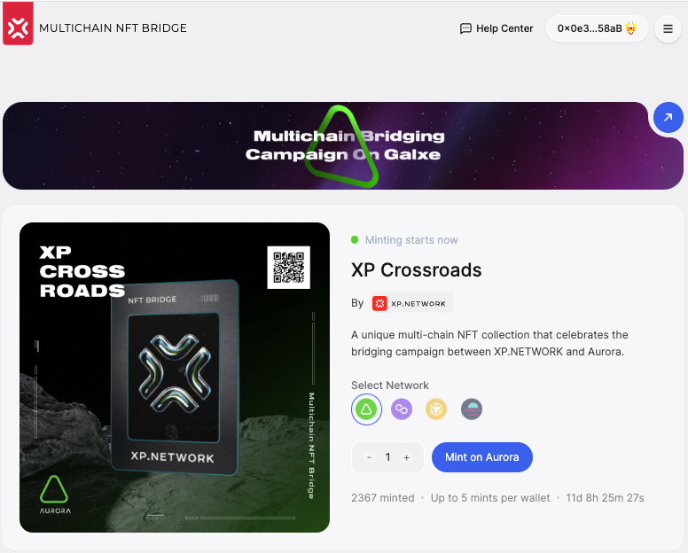

# Aurora & XP.NETWORK Campaign on Galxe

[Galxe](https://galxe.com/) emerges as the paramount platform for cultivating web3 communities, and in conjunction with the synergistic forces of Aurora blockchain (a dynamic layer-2 extension of the NEAR blockchain) and the innovative prowess of XP.NETWORK, this collaboration takes on even greater significance. With an impressive track record of over 11 million unique users, Galxe has played a pivotal role in propelling the advancements of Optimism, Polygon, Arbitrum, and a comprehensive network of more than 2700 partners, all united by rewarding loyalty programs. Begin your transformative journey today at galxe.com, where the future of collaborative growth beckons.

Diving into the realms of innovation and collaboration, XP.NETWORK and the Aurora blockchain, an influential layer-2 solution integrated with the NEAR blockchain, have embarked on an exceptional journey together. The synergy between these two technological powerhouses has culminated in the launching a remarkable joint campaign on the esteemed platform, Galxe.com on August 18th, 2023.

XP.NETWORK, known for its groundbreaking contributions to the NFT bridging landscape, has joined forces with Aurora to create a campaign commencing on August 18th, 2023, that not only harnesses our combined strengths but also leverages the dynamic potential of Galxe's expansive user base, which boasts an astounding tally of over 11 million unique users. Aurora's proficiency as a layer-2 solution amplifies the NEAR blockchain's capabilities, ensuring scalability, efficiency, and reduced transaction costs – all pivotal factors in advancing the blockchain ecosystem.

## 0. Finding the campaign

To find the campaign follow the URL: https://galxe.com/spaces?q=Aurora and click the found card. 

Then select the campaign called `Aurora Adventures.`

Inside Aurora Adventures, find `Week 11-12`

or follow this link: [Campaign](https://galxe.com/aurora/campaign/GCo35UjkS8) for instant access.

## 1. Wallet login

To participate in the campaign, you must log in with your EVM account via one of the compatible wallets. Additionally, you can log in with your Solana account via the Phantom wallet if you want to participate in Solana-related assignments. 

### 1.1 EVM wallet login

Choose the wallet you prefer: Bitkeep, Blocto, CLV, Coinbase Wallet, Halo, Metamask, Trust Wallet, WalletConnect, or Zerion, and inject your EVM account into the Galxe application.

After a successful connection, you will see the blockchain logos supported by the selected wallet and the account you logged in with.

### 1.2. Solana wallet login

To sign in with a Solana account, click `Solana` in the category `Add network.`

Only Phantom Wallet is supported by Galxe for Solana. Click it.

In the wallet, agree to `Connect.`

Then sign a test message to prove you control the account.

Now your profile should look similar to this:

Make sure you have native coins to pay the transaction fees on the blockchains.

You're all set to participate in the campaign.

## 2. Minting Assignments

Currently, there are four minting assignments:

1. Minting 5 NFTs on Aurora. Reward: 25 points.
2. Minting 5 NFTs on BSC. Reward: 25 points.
3. Minting 5 NFTs on Moonbeam. Reward: 25 points.
4. Minting 5 NFTs on Polygon. Reward: 25 points.

To meet the 25 points reward requirements, mint exactly 5 NFTs in one of the available chains. You are not limited to one chain only. You can mint on all four chains and get 25 points each time you mint 5 NFTs.

### 2.1. To start minting, 

1. Click one of the assignments, for example, Aurora, and you will be taken to the minting UI:

2. Click one of the blockchain icons: Aurora, Polygon, BSC, Moonbeam
3. Click the `Connect wallet` button.
4. Select the wallet where you have your account

5. Click the button `Mint on` + the chain name you previously selected.

6. Confirm the transaction in the wallet of your choice.

As you can see, the NFT contract does not charge you for minting. All you're paying is the blockchain transaction fee for saving the record of your ownership.

7. Mint another NFT or bridge the minted one to another chain.

Remember that you need exactly five minted NFTs on a chain to get the 25 points reward.

## 3. Bridging NFTs

The campaign has multiple bridging assignments:

1. Bridge 1, 3 & 5 NFTs from Ethereum to Aurora and get 10, 30 & 50 points, correspondingly
2. Bridge 1, 3 & 5 NFTs from Moonbeam to Aurora and get 5, 15 & 30 points, correspondingly
3. Bridge 1, 3 & 5 NFTs from Polygon to Aurora and get 5, 15 & 30 points, correspondingly
4. Bridge 1, 3 & 5 NFTs from Solana to Aurora and get 5, 15 & 30 points, correspondingly
5. Bridge 1, 3 & 5 NFTs from Avalance to Aurora and get 5, 15 & 30 points, correspondingly
6. Bridge 1, 3 & 5 NFTs from Fantom to Aurora and get 5, 15 & 30 points, correspondingly

Mind that every next award already includes the previous award. For example, your 30 points for transferring 5 NFTs from Moonbeam to Aurora already include the reward of 15 points for bridging 3 NFTs and 5 points for bridging 1. But bridging 5 NFTs is better because you get a 5 points premium for completing this. Without this premium, you would get 25 points, 5 for each bridged NFT.

### 3.1 Bridging Assignments

1. Click a bridging assignment to launch it.

2. Select the departure and destination chains.

3. Connect the wallet relevant to the chain of departure

4. Select an NFT you want to send by clicking NFT card.
5. Provide the destination address. You can send it to yourself.
6. Slide the Approve button
7. Confirm the Approval transaction in the wallet.

8. Send the NFT.

You can view your transaction in the [bridge explorer](https://explorer.xp.network/).

You can click the sender & the receiver address; the original and destination transaction hashes to find more information about the cross-chain transaction. The record in the bridge explorer is a convenient way to track your transactions and refer to them later.

## 4. Assignments and points

1. A green tick in the top right corner marks a finished assignment.

2. At the bottom of the assignment list, you can claim your earned points.

3. Open the [Leaderboard](https://galxe.com/aurora/leaderboard) to compare your results with the competitors.

Happy Hacking!

