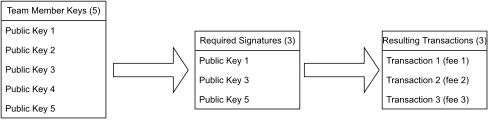
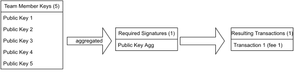

# Multisignature

Multisig, as Multisignature is often called for short, is a subset of Public-key cryptography (PKC). It implies that private and public keys are generated prior to transactions. The private key is kept secret, and the public key is freely exchanged via open communication channels.

## Drawbacks of Public-key cryptography

PKC has its risks:

1. If the private key is compromised in a software attack, everything this key pair had access to becomes available to the attacker.
2. If multiple people have access to the private key, any one of them can transact  without the approval of the other parties and may mistakenly and irreversibly damage the company.
3. Once the private key is lost, restoring access to the funds controlled by this account is impossible.

## Multisignature as a solution

Multisignature implies the involvement of several parties in the signing process, which mitigates the above issues and, thus, increases security.

Two types of multisignature aggregation are distinguished:

1. A Classical Multisignature
2. A Joint Multisignature

## Classical Multisignature

The smart contract or a wallet owner can set the number of required signatures from the list of acknowledged signers. For example, a team has five signers, and at least three signatures can be set as required for a transaction to get through. This setup is called a 3-of-5 wallet.

This type has a significant drawback. Every signer individually pays for a transaction increasing the costs for the team. It can be negligible in the protocols with low fees, but on such chains as Ethereum or Aptos, the difference with a single transaction can be substantial. Using the "Big O" notation, it can be represented as $O(n)$. It means that the more signers are on the team, the more transactions they will have to sign and the more gas they will pay. Such setup was used in version 1.0 of the bridge.

*Pic.1 Classic Multisignature*

## Joint Multisignature

This type implies aggregation of the public key values into a common public key before signing the transaction. Each party separately signs the transaction. The signatures are added, and the result can be verified against the aggregated public key.

This setup solves the problems of the Classical Multisignature, reducing the complexity to $O(1)$. The Schnorr algorithm used by XP.NETWORK provides an example of such aggregation in version 2.0 of the bridge.

*Pic.2 Joint Multisignature*

Besides its economic advantage, joint multisignature provides higher confidentiality for the signers. The aggregated key cannot be used to compute the original public keys of the signers.