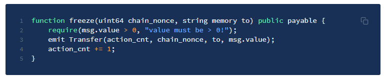
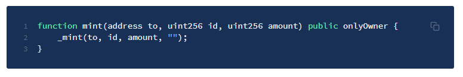
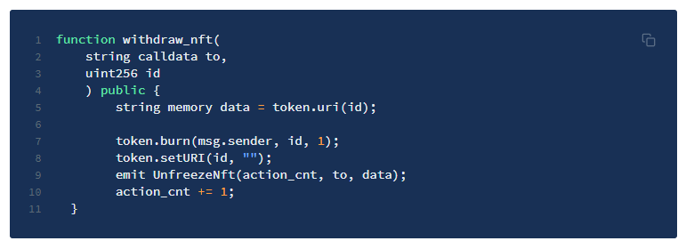
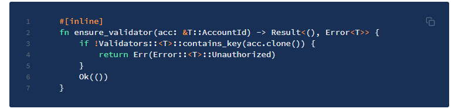
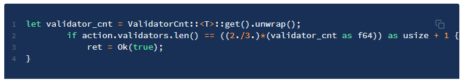

# How does the bridge work?

<hr/>

## Sending a Non-Fungible Token (NFT)

For the purposes of outlining the bridge functionality at a simplistic level, we will make reference to:

* The sending blockchain as the source blockchainThe receiving blockchain as the target blockchain
* Non-fungible tokens are transferred between blockchains via the following steps:

## 1. NFT locked in source blockchain
NFTs are locked in the source blockchain smart contract / pallet (we will call this the native token)



## 2. Wrapped NFT minted in source blockchain
A 1:1 representation of the native token is minted as a wrapped token in the target blockchain.



## 3. Wrapped NFT sent to target blockchain
The wrapped token is then sent to the target blockchain via the below function. (Rust example):



## 4. Validator signatures checked
The bridge validators listen to bridge-related events via the nodes of the linked blockchains and sign the transactions in the target ledger with their private keys.


## 5. Validator signatures collected
Once all signatures are confirmed to have come from verified validators, their signatures are collected.


## 6. BFT threshold calculated
The target blockchain smart contract checks that the BFT threshold of the multisignature is reached. 



## 7. Wrapped NFTs released 
Wrapped NFTs are then released to the designated receiver account on the target blockchain.


<hr/>

## Other Functions
### Transferring Fungible Tokens

```TypeScript
function validate_transfer(
		uint128 action_id, 
		uint64 chain_nonce, 
		address to, 
		uint256 value
		) public {
				ValidationRes res = validate_action(action_id, Action.Transfer);
				if (res == ValidationRes.Execute) {
					token.mint(to, chain_nonce, value);
				}
}
```

### Sending Wrapped Fungible Tokens to a target blockchain

```TypeScript
function withdraw(
		string memory to, 
		uint64 chain_nonce, 
		uint256 value
		) public {
				token.burn(msg.sender, chain_nonce, value);
				emit Unfreeze(action_cnt, chain_nonce, to, value);
				action_cnt += 1;
	}
```

### Transferring NFTs


```TypeScript
function validate_transfer_nft(
	uint128 action_id, 
	address to, 
	string calldata data
	) public {
		ValidationRes res = validate_action(action_id, Action.TransferUnique);
		if (res == ValidationRes.Execute) {
			token.mint(to, nft_cnt, 1);
			nft_cnt += 1;
			token.setURI(nft_cnt, data);
		}
	}
```

### Locking a native token & sending its wrapped quantity to a target blockchain


```TypeScript
function freeze(uint64 chain_nonce, string memory to) public payable {
		require(msg.value > 0, "value must be > 0!");
		emit Transfer(action_cnt, chain_nonce, to, msg.value);
		action_cnt += 1;
}
```