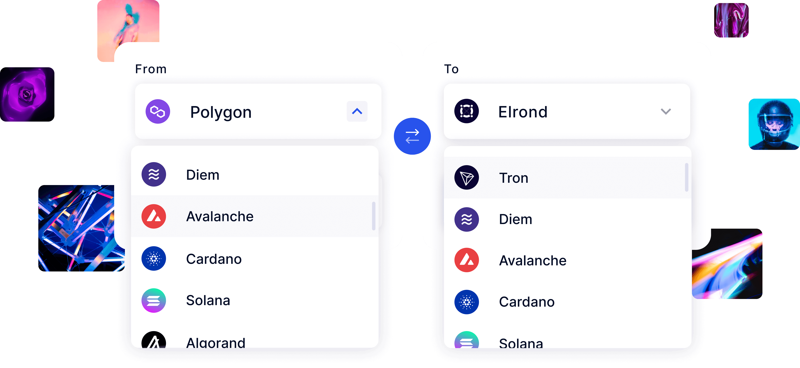

# Overview & Structure

We have developed the first and only cross-chain NFT Bridge which enables the exchange of NFTs between the following chains, with more to follow:

- Avalanche
- Binance Smart Chain
- Elrond
- Ethereum
- Fantom
- Huobi ECO (HECO) Chain
- Polygon
- Tron
- XP.NETWORK

The XP.NETWORK's multi-chain bridge facilitates the seamless transfer of NFTs between all of the aforementioned mainnets. This accomplishment proves that interoperability between Ethereum Virtual Machine-based chains and WASM-VM-based chains is not only possible, but is also on the verge of being operational.

## Components & Functionality

The Multibridge is as a state mutation protocol for the connected distributed ledgers, it is comprised of the following core components:

### A. Substrate Pallet

Written in Rust for the XP.network or any other Substrate parathread, performs the following actions:

1. Represents the bridge in XP.network
2. Emits events for the validators
3. Retrieves & locks XPNET before sending to a target blockchain
4. Mints & burns wrapped fungible & non-fungible tokens
5. Collects the validators' signatures
6. Calculates the BFT threshold

### B. Minter & NFT Smart Contracts

Written in both Solidity (EVM chains) & Rust (Non-EVM chains), performs the following actions:

1. Represent the bridge in the target blockchains
2. Emits events for the validators
3. Retrieves & locks native tokens before sending them to a target blockchain
4. Mints & burns wrapped fungible & non-fungible tokens
5. Collects the validators' signatures
6. Calculates the BFT threshold

### C. Relay Validators

Written in TypeScript and accompanied by the node of the bridged chains, they possess the following characteristics:

1. Represented by valid accounts with private & public keys for each bridged blockchain and relaying logics
2. Listen to the events in the bridged blockchains
3. Sign the relayed transactions and pay the transaction fees in the target blockchain in its native tokens
4. Responsible for dynamically adding new blockchains & tokens to the running blockchains.

### D. Target blockchain compatibility and dependency injection libraries

The source blockchains are ignorant of the target chains which allows for dynamic bridging with the new ledgers. The dependency injection is done via the target blockchain IDs which the source blockchain cannot map to a blockchain name.

The ID will come from the Frontend UI, where a user cannot make an error.

The changes will happen in the code of the validators, where the IDs will be mapped to the target blockchain names.

Transferable tokens on XP.NETWORK comply with the following standards:

- ERC-20
- ERC-721
- ERC-1155
- ESDT
- BEP-20
- BEP-721
- BEP-1155

This provides us with the flexibility to move tokens between chains without losing data. In the event that a chain has its own standards, we can build a compatibility layer and still make the tokens easily movable.
