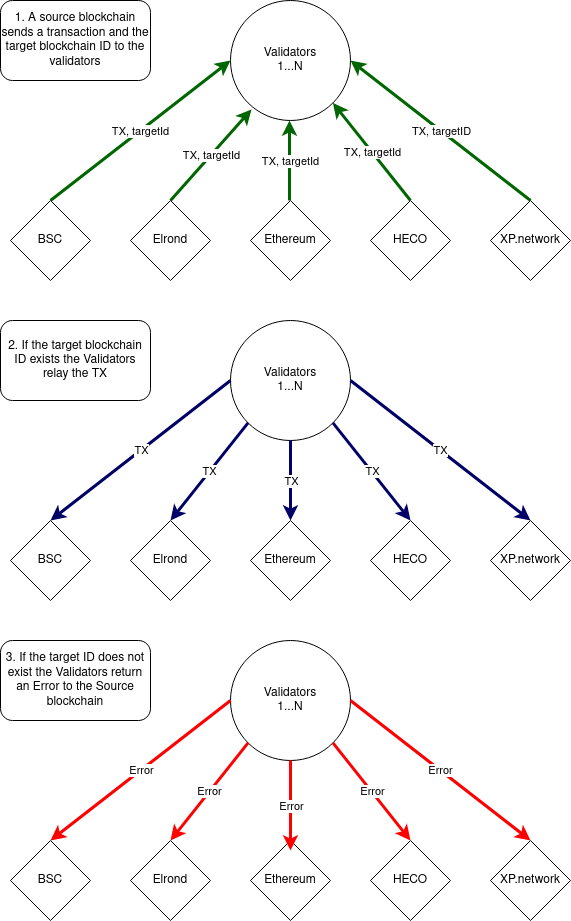

# Relay Validators

<hr/>

## What role do validators play?

A validator runs all the nodes of all the bridged chains and listen to the events of the bridged chains.

For example, if our smart contracts freeze tokens or NFTs, validators need to approve the transactions with the same types and amounts of tokens in the target chain. In effect, they are responsible for maintaining state and account balances between source and target blockchains.

Each validator is comprised of:

1. A set of accounts one per account standard,
2. A set of private keys for signing transactions in the bridged blockchains,
3. Logic (implemented as "helpers") is required for 
   1. listening and 
   2. relaying events from the source to the target blockchain.

The below diagram provides an overview of the actions carried out by validators:



<hr/>

## What are helpers?

Helpers are pieces of code aimed at interpreting events from disparate source blockchains. If the source blockchain has a different codebase or programming language to that of XP.network, a custom helper needs to be developed.

The following sections provide an overview of each type of helper currently available on XP.network

### Elrond Helper

**Signature**

```Rust
class ElrondHelper implements
        ChainListener<
                // Listens to the events:
                TransferEvent         | 
                TransferUniqueEvent   | 
                UnfreezeEvent         | 
                UnfreezeUniqueEvent, 
                TransactionHash>,
        ChainEmitter<
                // Emits events:
                string, 
                void, 
                TransferEvent         | 
                TransferUniqueEvent   | 
                UnfreezeEvent         | 
                UnfreezeUniqueEvent>,
        ChainIdentifier
{ ... }
```

**Functionality**
Verifies the following transactions:

1. eGLD transfer to a foreign blockchain
2. ESDT NFT transfer to a foreign chain
3. minting wrapped semi-fungible tokens to an account on Elrond
4. minting wrapped NFT to an account in Elrond

### PolkadotPallet Helper

**Signature**

```Rust
class Web3Helper
implements ChainEmitter<
                // Emits events
                SolEvent, 
                void, 
                TransferEvent | 
                UnfreezeEvent
                >, 
           ChainListener<
                // Listens to events
                TransferEvent | 
                UnfreezeEvent, 
                string
                >, ChainIdentifier 
{ ... }
```

**Functionality**

Verifies the following transactions:

1. Native Tokens transfer to a foreign blockchain
2. NFT transfer to a foreign chain
3. minting wrapped fungible tokens to an account on a web3 compatible chain
4. minting wrapped NFT to an account on a web3 compatible chain

<hr/>

## What types of events do validators listen for?

Validators are responsible for monitoring a number of events and coordinating subsequent actions based on those events. Normal events are known simply as "events" where as events relating to NFTs are known as Unique Events.

The following are some examples of the main types of events:

## TransferEvent

An event of fungible liquidity transfer.  It indicates that the tokens were locked in the source chain and are ready to be minted as wrapped tokens in the target blockchain and released to a designated account.

Signature:

```TypeScript
class TransferEvent implements MultiChainEvent { ... }
```

Inner fields:

```TypeScript
readonly     action_id:     BigNumber;    // an action ID
readonly     chain_nonce:   number;       // a unique target chain ID
readonly     to:            string;       // target account
readonly     value:         BigNumber;    // amount of transmitted tokens
```

## TransferUniqueEvent

An event for non-fungible tokens moving from the original to a foreign blockchain. It indicates that an NFT was locked in its original chain and is ready to be minted as wrapped NFTs and released to a target account on a target blockchain.

Signature:

```TypeScript
class TransferUniqueEvent implements MultiChainEvent { ... }
```

Inner fields:

```Solidity
readonly     action_id:     BigNumber;    // an action ID
readonly     chain_nonce:   number;       // a unique target chain ID
readonly     to:            string;       // target account
readonly     id:            Uint8Array;   // NFT identifier (see below)
// For XP.network - it is a hash
// For Elrond it is an ID + nonce
// For web3 compatible chains it is:
//     1. for ERC-721  tokens: contract address
//     2. for ERC-1155 tokens: contract address + ID
```

## UnfreezeEvent

An event of fungible liquidity transfer.  It indicates that the tokens were burned in a foreign chain and are ready to be unlocked as native tokens in the original blockchain and released to a designated account.

Signature:

```TypeScript
class UnfreezeEvent implements MultiChainEvent { ... }
```

Inner fields:

```TypeScript
readonly     action_id:     BigNumber;    // an action ID
readonly     chain_nonce:   number;       // a unique target chain ID
readonly     to:            string;       // target account
readonly     value:         BigNumber;    // amount of transmitted tokens
```

## UnfreezeUniqueEvent

An event for non-fungible tokens returning to the original blockchain. It indicates that an NFT was burned in a foreign chain and is ready to be unlocked as native NFTs and released to a target account on the original blockchain.

Signature:

```TypeScript
class UnfreezeUniqueEvent implements MultiChainEvent { ... }
```

Inner fields:

```TypeScript
readonly     action_id:     BigNumber;    // an action ID
readonly     chain_nonce:   number;       // a unique target chain ID
readonly     to:            string;       // target account
readonly     id:            Uint8Array;   // NFT identifier (see below)
// For XP.network - it is a hash
// For Elrond it is an ID + nonce
// For web3 compatible chains it is:
//     1. for ERC-721  tokens: contract address
//     2. for ERC-1155 tokens: contract address + ID
```

<hr/>

## How are events emitted?

Events are emitted via the following sets of function calls and subfunctions:

The function call signature:

```TypeScript
export async function emitEvents<Handlers extends MultiChainEvent>(
    // The socket: Server<ServerEvents>
    io: TxnSocketServe, 
    // Bridged blockchain array
    chains: Array<FullChain<any, any, Handlers, IntoString>>
    // 
): Promise<void>
```

Internal fields:

```TypeScript
// Internal chain mapper
const map: ChainMap<any, any, Handlers, IntoString> = {};
```

Internal subfunctions:

```TypeScript
// Event handler function
const handleEvent = async (
    // Chain listener handlers
    listener:      ChainListener<Handlers, IntoString> & ChainIdentifier, 
    // The handled event
    event:         Handlers,
    // The ID of the original blockchain
    origin_nonce:  number
    
    ) => {
    
        const tx = await listener.emittedEventHandler(event, origin_nonce);
        
        if (event instanceof TransferUniqueEvent) {
        
            io.emit(
                "transfer_nft_event", 
                listener.chainNonce, 
                event.action_id.toString(), 
                tx.toString());
                
        } else if (event instanceof UnfreezeUniqueEvent) {
        
            io.emit(
                "unfreeze_nft_event", 
                listener.chainNonce, 
                event.id.toString(), 
                tx.toString());
        }
    }
```

Listening to the events of the chains in a loop:

```TypeScript
for (const chain of chains) {
        if (map[chain.chainNonce] !== undefined) {
            throw Error("Duplicate chain nonce!")
        }
        map[chain.chainNonce] = chain;
        listenEvents(chain);
}
```