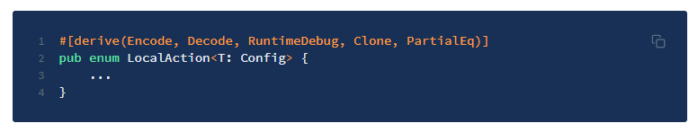

# Substrate Pallet

In order for a target blockchain to recognize incoming assets, we make use of:

a) the Bridge Substrate Pallet on the XP.NETWORK blockchain or

b) Solidity/Rust smart contracts "Minter" and "XPNet" on other blockchains 

Smart contracts are used for other chains as the Bridge Substrate pallet can only be used on the XP.NETWORK blockchain. Both have the same functionality, however the pallet has more flexibility by leveraging the Substrate framework, as opposed to Polkadot's smart contract language.

The pallet and the smart contracts are responsible for:

* Communicating bridge-related events and transactions to bridge relay validators and
* Submitting transactions on the XP.NETWORK blockchain.

Transactions on the XP.NETWORK blockchain are executed via a number of LocalAction enums, which contain definitions for local transactions:

## Available local transactions
1. Unfreezing the locked fungible & non-fungible tokens to a designated account in XP.network
2. Transfering wrapped foreign fungible & non-fungible tokens
3. Calling the functions of other smart contracts