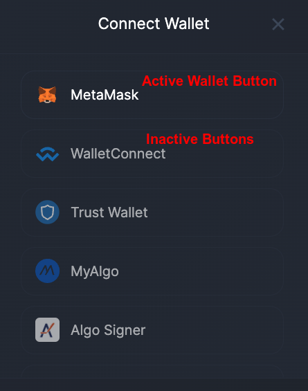
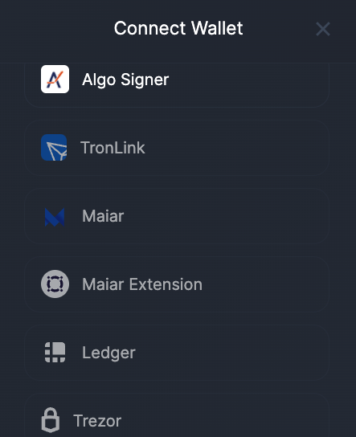

# Connecting the wallet

The bridge supports the wallets compatible with the integrated blockchains. Active buttons with the logo and the name of the wallets indicate that the wallet is compatible with the chain of departure and can be selected.

The inactive buttons with greyish font color and blurred wallet logos indicate that the wallets are incompatible with the chain of departure therefore, the user is protected from accidentally selecting a wrong wallet.

When a wallet is selected from the list, the user account is injected in the bridge allowing the user to view NFTs and sign transactions on the chain of departure.

XP.network NFT Bridge Supported wallets:

|                                 Logo                                 |                                                        Wallet Name                                                         |                                                            Supported Chains                                                             |
| :------------------------------------------------------------------: | :------------------------------------------------------------------------------------------------------------------------: | :-------------------------------------------------------------------------------------------------------------------------------------: |
|                        |                                        <a href="https://metamask.io/">MetaMask</a>                                         |                  Desktop support for the EVM chains: Ethereum, BSC, Avalanche, Polygon, Fantom, Velas, xDai, Fuse                   |
|                  |                           <a href="https://walletconnect.com/registry/wallets">WalletConnect</a>                           |                                  Mobile support for the wallets: MetaMask, TrustWallet, fuse.cash                                   |
|                            |                                  <a href="https://trustwallet.com/assets">TrustWallet</a>                                  | Mobile support for:Ethereum, BSC, Solana, Avalanche, Polygon, Tron, Tezos, Fantom, Elrond, xDai, VeChain, Algorand, NEAR, and many more |
|                  |                                    <a href="https://wallet.myalgo.com/home">MyAlgo</a>                                     |                                                                Algorand                                                                 |
|  |                         <a href="https://www.purestake.com/technology/algosigner/">Algo Signer</a>                         |                                                                Algorand                                                                 |
|                  |                                      <a href="https://www.tronlink.org/">TronLink</a>                                      |                                                                  Tron                                                                   |
|                        |                                           <a href="https://maiar.com/">Maiar</a>                                           |                                                             Elrond (mobile)                                                             |
|                        | <a href="https://chrome.google.com/webstore/detail/maiar-defi-wallet/dngmlblcodfobpdpecaadgfbcggfjfnm">Maiar Extension</a> |                                                            Elrond (desktop)                                                             |
|                      |                                        <a href="https://www.ledger.com/">Ledger</a>                                        |                                                       Hardware Ledger cold wallet                                                       |
|                      |                                          <a href="https://trezor.io/">Trezor</a>                                           |                                                       Hardware Trezor cold wallet                                                       |

