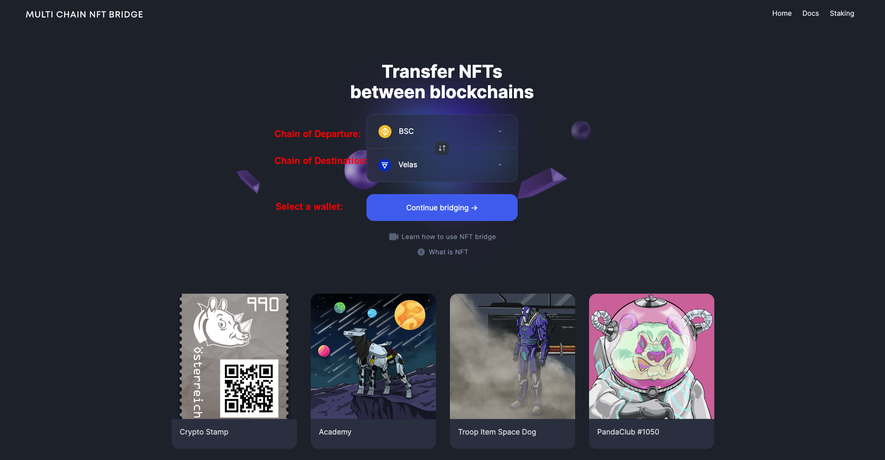

# The Initial Page

On the initial page, a user can:
1. Select the chain of ***departure*** where the NFT(s) are located from the list of the supported networks. (See above).
2. Select the chain of ***destination*** where the user wants to send the NFT(s) to. (Same list excluding the chain of departure).

**NB**: 
    a. The user has to ***own*** the NFTs to be able to send them.
    b. The smart contract of the NFT must be whitelisted by XP.NETWORK for the bridge to accept it. This protects the users' assets and the bridge infrastructure from malicious smart contracts.

