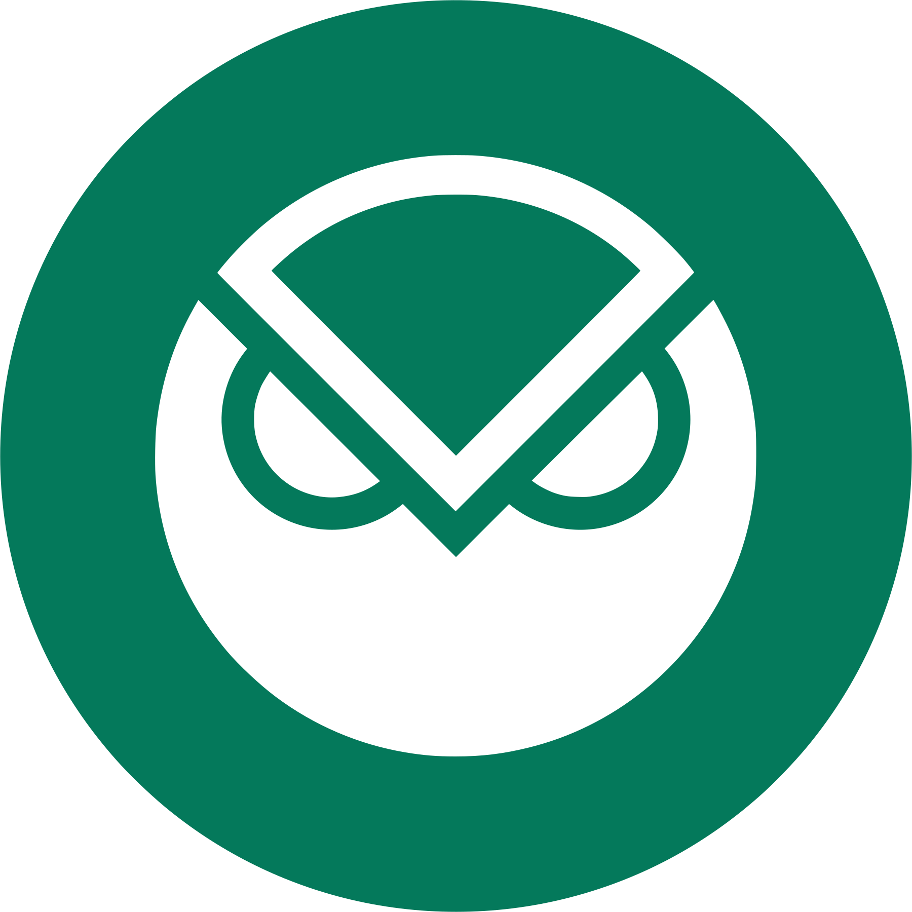

import ReactPlayer from 'react-player'

# Multi-Chain NFT Bridge v 2.0

XP Network's NFT Bridge v2.0 is unique in many ways, leaving alone that it connects more blockchains than any other NFT bridge. The shortlist of the bridge advantages boils down but is not limited to:

1. Cheap transactions even when transferring NFTs to or from Ethereum.
2. Validators scalable to any number without impacting the transaction price.
3. Optional royalties and other smart contract logic and NFT collection name transfer to the target chain.
4. Support of 10+ NFT standards.
5. The bridge explorer for tracking cross-chain NFT transactions that were previously only available to blockchains.
6. An intuitive JavaScript library allowing for integration of the bridge into any cross-chain game, marketplace, metaverse, or DEFI project in a matter of hours.
7. A widget that can be set up and added to a user UI in minutes with zero coding.

<ReactPlayer  className="introduction-player"  controls url='https://www.youtube.com/watch?v=CTxtFnABUrg' />

|&nbsp; &nbsp; # &nbsp; &nbsp;|&nbsp; &nbsp; Logo &nbsp; &nbsp;|&nbsp; &nbsp; Blockchain &nbsp; &nbsp;|&nbsp; &nbsp; Protocol &nbsp; &nbsp;|&nbsp; &nbsp; Chain Nonce &nbsp; &nbsp;|&nbsp; &nbsp; Bridge Version &nbsp; &nbsp;|
|:-:|:-:|:-:|:-:|:-:|:-:|
| 1 ||MetaversX| Elrond|2|v2.0|
| 2  | |BSC| EVM|4|v3.0|
| 3 | |Ethereum| EVM|5|v3.0|
| 4 | |Avalanche| EVM|6|v3.0|
| 5 | |Polygon| EVM|7|v3.0|
| 6 | |Fantom| EVM|8|v3.0|
| 7 | |Tron | Semi-EVM|9|v2.0|
| 8 | |Harmony| EVM|12|v2.0|
| 9|  | Gnosis Chain| EVM|14|v2.0|
| 10 | |Algorand| Algorand|15|v2.0|
| 11  | | Fuse| EVM|16|v2.0|
| 12 | |Tezos| Tezos|18|v2.0|
| 13  | | Velas| EVM|19|v2.0|
| 14  | | IoTeX| EVM|20|v2.0|
| 15  | | Aurora| EVM|21|v2.0|
| 16  | | Godwoken| EVM|22|v2.0|
| 17  | | GateChain| EVM|23|v2.0|
| 18  || Secret Network|Cosmos|24|v2.0|
| 19  || Solana| Solana|26|v2.0|
| 20  || TON| TON|27|v3.0|
| 21  || Dfinity|ICP|28|v2.0|
| 22  || Hedera| EVM|29|v2.0|
| 23  || SKALE| EVM|30|v2.0|
| 24  || NEAR| NEAR|31|v2.0|
| 25  || Moonbeam| EVM|32|v3.0|
| 26  || AbeyChain| EVM|33|v2.0|
| 27  || Aptos|Aptos|34|v2.0|
| 28 || Caduceus| EVM|35|v2.0|
| 29 || OKC| EVM|36|v2.0|
| 30 || Arbitrum Nova| EVM|37|v2.0|
| 31 || Bitgert| EVM|38|v2.0|
<!--  -->

## Bridge versions

|Version | Link| Network / Stage|
|:-:|:-:|:-:|
| 1.0 | https://bridge.v1.xp.network/| Mainnets - integrated|
| 2.0 & 3.0 | https://bridge.xp.network/|Mainnets - integrated|
| 2.0 & 3.0 | https://staging-bridge.xp.network/|Mainnets - integration in progress|
| 2.0 & 3.0 | https://testnet.bridge.xp.network/|Testnets - experimental mode|
