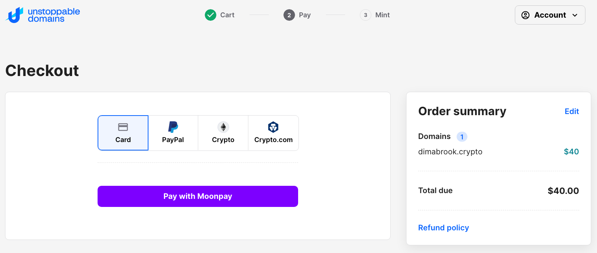

import ReactPlayer from 'react-player'

# Logging in with domain names

Version 2.0 of the bridge allows logging into the bridge with a domain name, for example with the names of one of our partners the [Unstoppable Domains](https://unstoppabledomains.com/). It is one of the possible domain name utilities. The domain names acan also be used as URL names of WEB-2 sites, as KYC IDs, as a convenient and easy to remember 

The domain names can be purchased or received for free as a part of the givaway campaign on the platforms of the [Unstoppable Domains's](https://unstoppabledomains.com/) partners.

## 1. Purchasing a domain name

## 1. To purchase a domain name from Unstoppable domains follow the link:

   [https://unstoppabledomains.com/search](https://unstoppabledomains.com/search)

## 2. Type the name of your prospect domain, for example:

   [https://unstoppabledomains.com/search?searchTerm=dimabrook](https://unstoppabledomains.com/search?searchTerm=dimabrook)

## 3. An you will get a list of domain name offers:

## 4. Select a domain name that matches your cost and esthetic expectations and click `Add to cart` button. The button's text will change to ` Added`.

## 5. If you're done choosing your domain names, proceed to the basket at the top right corner:

## 6. Provide your Zip code if you are a US resident:

## 7. If you're are not a US resident select `No` and click the `Checkout` button:

## 8. You will be offered four ways of loggin in:

## 7. Select your preferred way of payment

## 8. Example of selecting payment with a card

Click `Continue` to proceed:

## 9. In your Metamask wallet select an account to be attached to the domain name

## 10. Login with your email to `MoonPay`

## 11. Receive an email with a login code

## 12. Populate the form with the code from your email and click `Continue`

## 13. Provide your payment credentials & click `Continue`

Once your purchase succeeds, an NFT with your domain will be minted and attached to the EVM wallet you provided in Metamask.

## 2. Getting a free domain name & Logging-in

In this 7 minute video we will walk you through getting a free domain and using the domain to log in the bridge.

<ReactPlayer controls url='https://www.youtube.com/watch?v=lljf5KYV1KU' />
