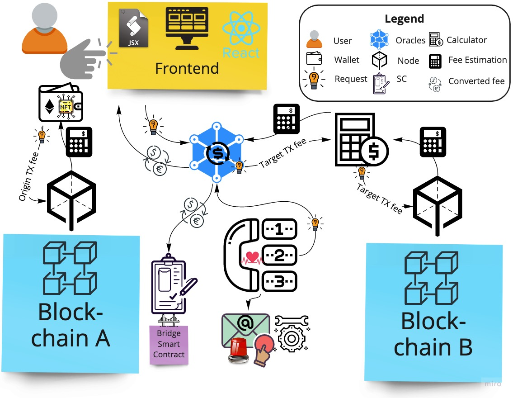
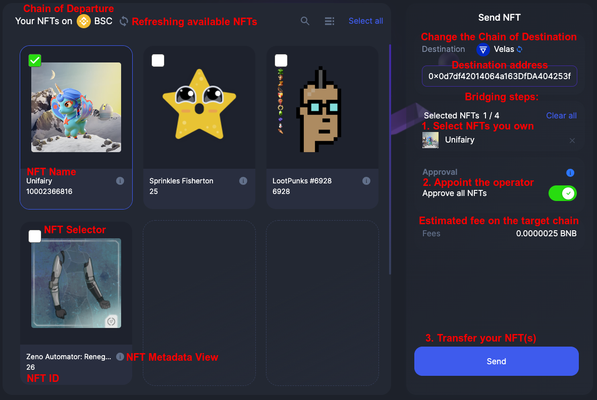
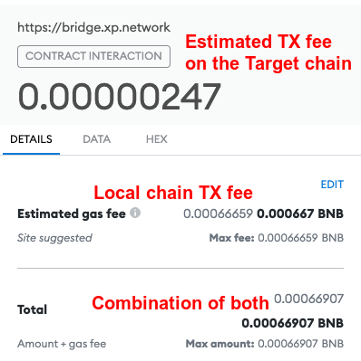

# Transaction Fees

XP.NETWORK bridge allows the users to cover the gas fees on both chains (departure and destination) in the native tokens of the chain of origin. It is not only convenient, but, sometimes, it is the only possible way since some ledgers do not support the tokens of some others.

:computer: ***_Fee Calculator_*** is a tool estimating fees on the target chain. Some chains have built in functionality that the tool is reusing. In other chains the tool runs the transaction in a sandboxed environment without sending it to the network. In both cases the result is the amount in the tokens of the chain of destination.

The next step is converting the gas fee required on the target chain to the currency of the  network of NFT departure. This is where the XP.NETWORK ***Exchange Rate Oracles (EROs)*** come into play. EROs are responsible for collecting & providing the exchange rate via the USD equivalent for the supported currencies.

***_Oracles_*** are distributed off-chain nodes feeding information to the smart contracts. A ***set*** of oracles can be represented as <code>Odelta = {o1, ..., on}</code>.

***_Resilience_*** of the ***set*** is achieved through the *Byzantine fault tolerance* consensus. The *set* functions properly relying on the `n * 2 / 3 + 1` benevolent oracles, while `n / 3 - 1` can be down, have narrow Internet bandwidth or be controlled by imaginary malicious adversaries.

:heartpulse: ***_Heartbeat guardian_*** is a hardenning tool used for monitoring the state of the oracles. It querries each and every oracle every 5 seconds. If the oracles respond adequtely - the network is assumed to operate normally. If one or several oracles do not respond or respond abnormally - the team gets informed via an e-mail notification to be timely restore the functionality of the faulty network link.

:dollar: ***_Supported Cryptocurrencies_***

XP.NETWORK Exchange Rate Oracles support all the native coins of the bridged networks:

| Coin | Blockchain |
|:-:|:-:|
|XPNET|TBN |
|EGLD|Elrond|
|BNB|BSC|
|ETH|Ethereum|
|AVAX|Avalanche|
|MATIC|Polygon |
|FTM|Fantom |
|TRX|Tron |
|ALGO|Algorand |
|FUSE|Fuse |
|XTZ|Tezos |
|VLX|Velas |

## Efficiency

To reduce the number of requests & ensure fast response, the tool caches the received batch result for 10 minutes.

If the new batch is not available after the expiration of the hour, the 10+ minutes long rate is returned.

## Result

The tool returns the exchange rate quotent of the two arbitrary Supported Currencies.

| Term | Cryptocurrencies |
|:-:|:-:|
| Divided | The foreign coin |
| Dividend | The native coin |
| Quotent | 1st / 2nd |

We can multiply the fee estimation by the quotent and get the fee in the native currency.

## Example

A bridge user is sending an NFT from BSC to Velas. 

| Term | Cryptocurrencies | Actual figures | USD Equivalent |
|:-:|:-:|:-:|:-:|
| Divided | VLX | 1 | $0.3257 |
| Dividend | BSC | 1 | $465.35 |
| Quotent |  1 VLX /  1 BNB | 0.00069990329 | - |
| Fee Estimation | VLX | 0.00352905894 | $ 0.0011494145 |
| The user sees | BNB | 0.00000247 | $ 0.0011494145 |

So, when a user is confirming the transaction in Metamask this is what (s)he will see:

In fact, the user may pay even less. 
> 1. The TX fee on BNB 0.000441595 BNB
> 2. The fee on the target chain (Velas) 0.000002471877613277 BNB 
> 3. Sum total: 0.00044406687 BNB ($ 0.20664652149)

Here's the transaction details on the Binance Smart Chain Explorer:

