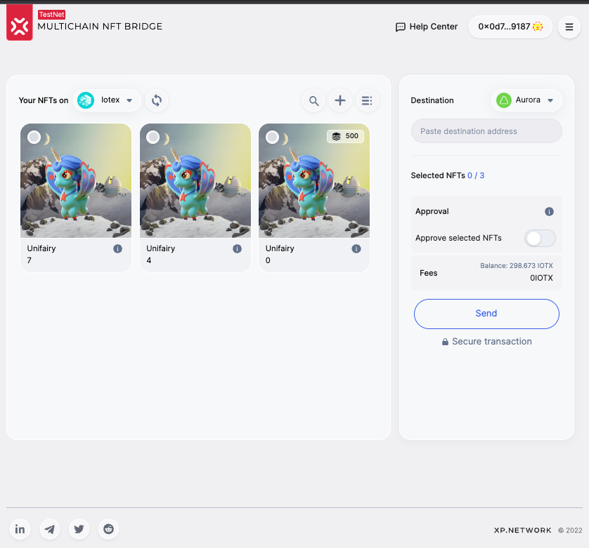
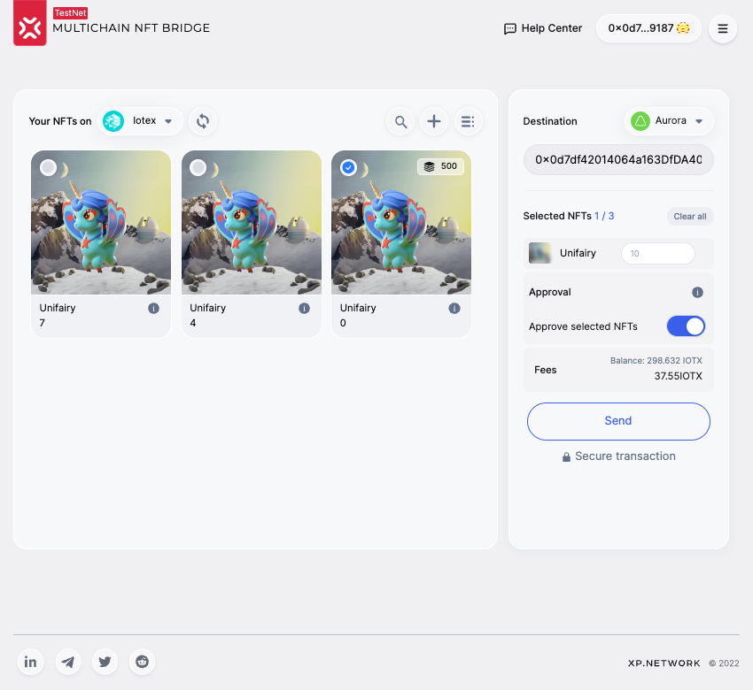
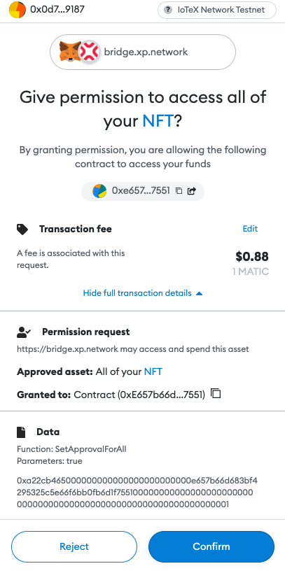
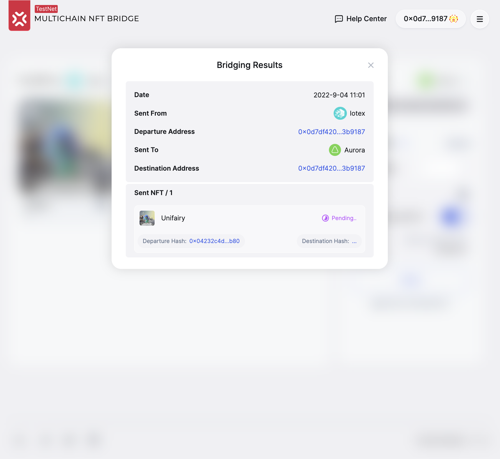
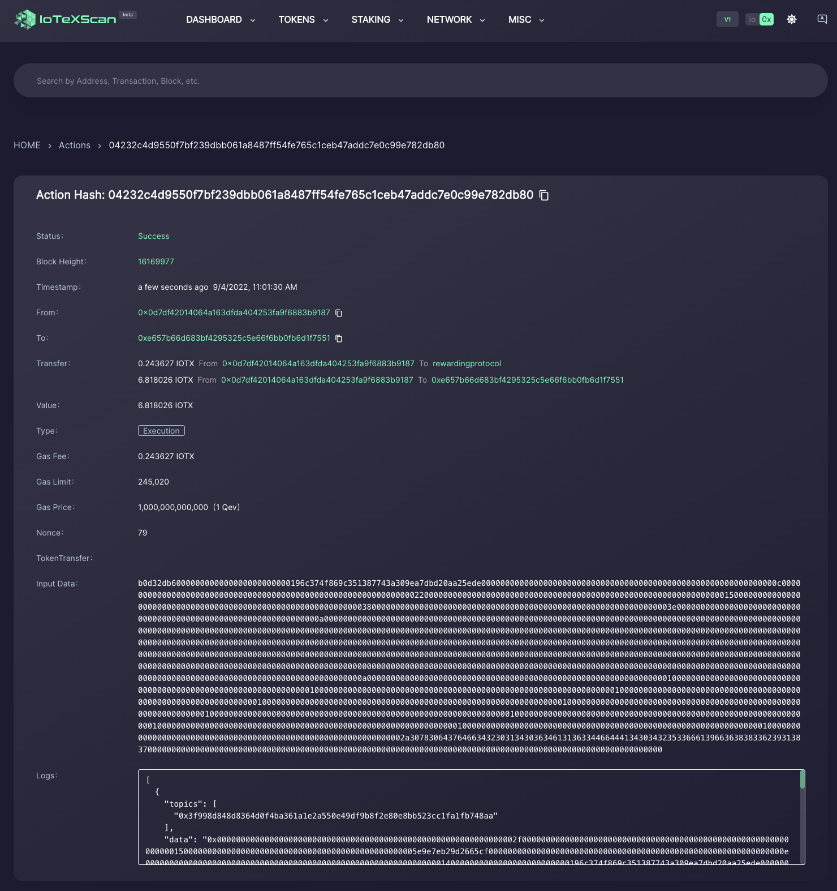

# Transferring SFTs

XP.NETWORK bridge supports NFT and SFT transfers. SFTs are similar to NFTs, but their amount is greater than one.

The most popular use-case SFTs is game utilities (weapons, armor, clothes, characters, etc.) 

## Interchangeable like FTs
SFTs have the same value as other SFTs and are completely interchangeable with other SFTs bearing the same token ID in this collection. In this, they resemble fungible tokens. 

## Unique like NFTs
But SFTs have metadata with attributes and are usually not equal in value to SFTs with other token IDs.

## Distinguishing SFTs from NFTs in the bridge UI

The two NFT cards on the left hold NFTs, while the NFT card on the right holds an SFT. In the top right corner of the NFT card, there is the amount 500 preceded by the icon:

## Setting the SFT amount

Click the NFT card holding SFTs. The right panel will add this item to the selected items. There's an additional input field with the prompt `Enter amount` to the right of every selected SFT. Add the number of SFTs you plan to transfer. In the example below, the number 10 is provided for the amount.

## Approving

Before the bridge contract can interact with your assets, it must get your permission. Click the slide to the right from the caption `Approve selected NFTs.` A pop-up window with the selected wallet will open. Confirm the approval transaction.

## Sending

After the destination address is set, an SFT is selected, and the amount is provided, the `Send` button becomes active. Click the button and confirm the transaction in the selected wallet. After the transaction succeeds, you will see the `Bridging results` panel, at least on the chain of departure. Once the transaction hashes are available for the transitions on the chains of departure & destination, you can click the links at the bottom of the panel to view the transaction results in the respective explorers of the chains.

For example, on IoTeX, it could look like this:

## Seeing the result

After successful transfer, the remaining SFTs have diminished exactly by the amount transferred.

