# Viewing the Results of Bridging

Once the signature has been accepted the bridge will display the Transaction screen. There a user can click on the "View Txn" button to see the Transaction on the Explorer of the chain of departure.

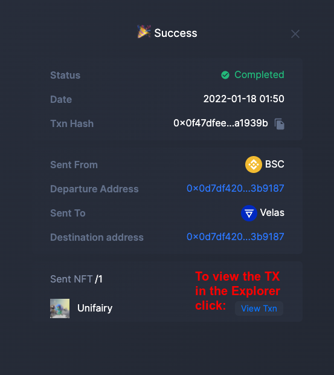

In the explorer of the departure chain a user can find more information about the transaction and get the third party confirmation of success in the chain of origin. It is also possible to see the actual paid amount of the transaction fee which can be even less than the estimation in the wallet.

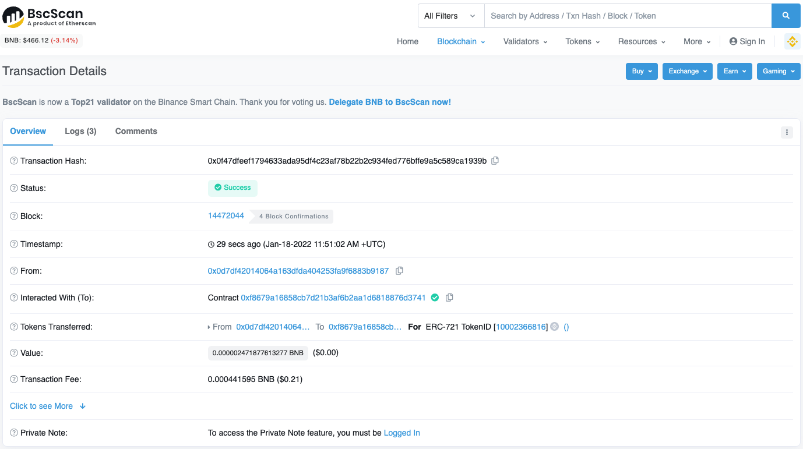

If a user controlls the account on the target chain (s)he can use the bridge to check whether the NFTs have arrived to the destination. If an asset was sent to an account the sender does not controll, there's always a possibility to look up the asset in the explorer of the target network by the address of the receiver. Ususally the last transactions will be related with the recently bridged NFT.

Since the bridge only displays the tokens of the departure chain the user needs to select what was previously the chain of destination in the departure chain dropdown box. (In our example Velas was the network of destination, now we're choosing it as the departure chain). 

Because we are setting the bridge only to see the results, it does not matter what we choose as the destination chain. For example, we can choose BSC.

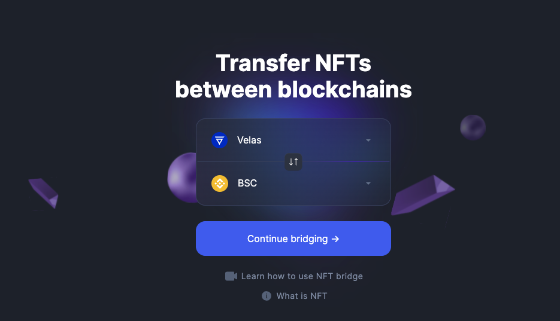

While changing networks you will see a notification like this. Press the "Switch Network" button. 

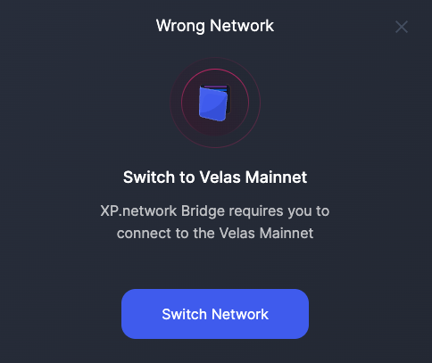

Confirm connection to the new blockchain in the wallet. Press the "Switch Network" button. 

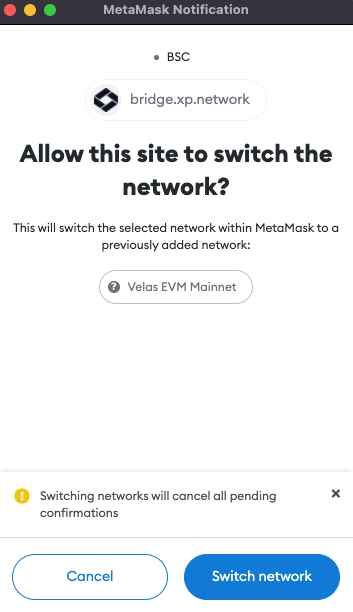

The Unifairy NFT has successfully arrived from BSC to Velas. However, we can see that its ID has changed to 17. This is the ID of the wrapped NFT in the smart contract it was minted with on the target chain.

Thanks to the new smart contracts developed by XP.network, it is possible to mint wrapped NFTs with arbitrary addresses on the target chain. This fundamental change allows transferring logic togeather with the assets.

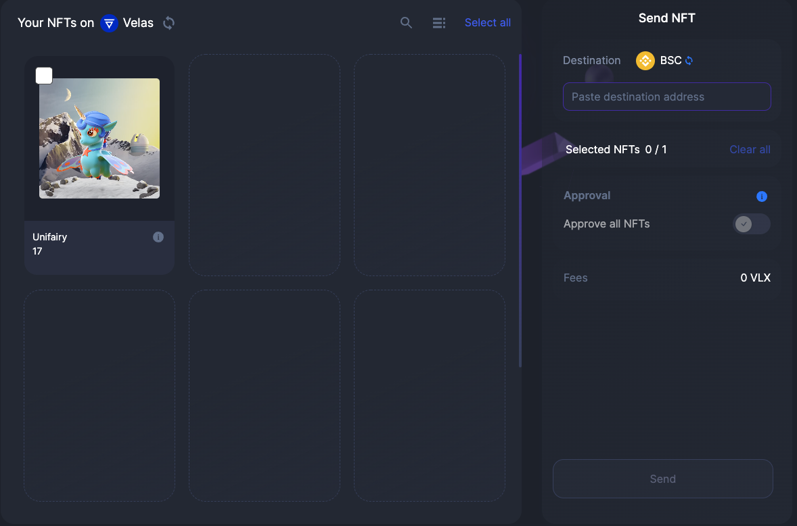

To make sure the wrapped NFT is linked to the original one a user can click the (i) button to view its metadata.

The wrapped copy's metadata has additional fields:

1. Original Chain (BSC in this case)
2. Original chain nonce (the internal bridge ID of the chain, nonce stands for a "number used once")
3. Original URI - the link to original NFT metadata

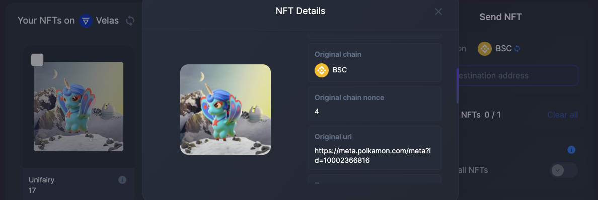

The link to the initial metadata allows to view the original NFT properties assigned at the time of minting or during the process of interacting with the asset, for example in a game.

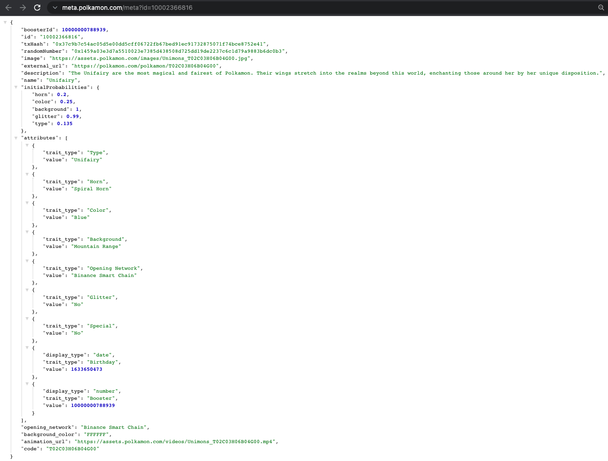

Wrapped NFT metadata holds the same values as the original one. Additionally there's an inner object called "wrapped". We will take a closer look at this object.

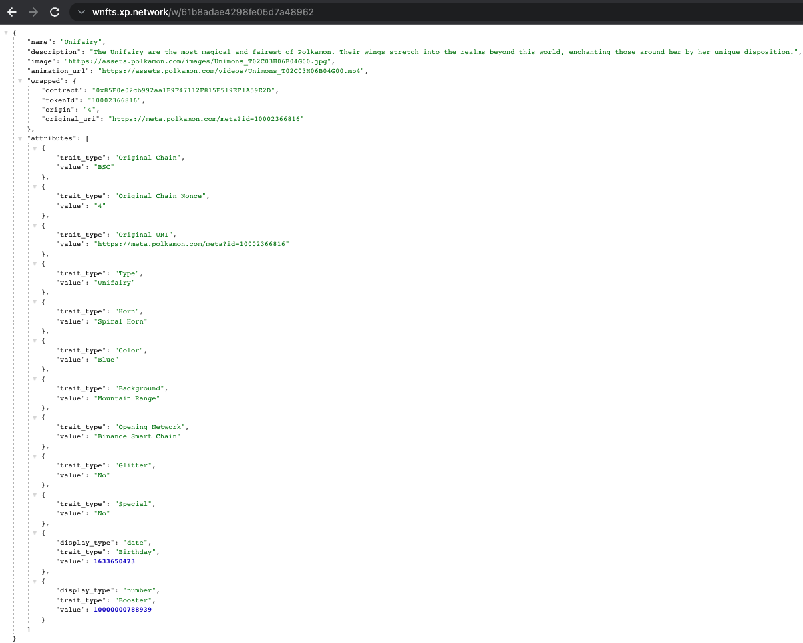

The new "wrapped" object "*remembers*" the following crucial information about the original:
1. The smart contract address
2. The ID the original NFT had in its native chain.
3. Original chain nonce (the internal bridge ID of the chain, BSC is #4)
4. The origina URI linking to the original metadata

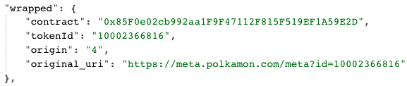

In order to unwrap the NFT it must be sent to the native blockchain using the XP.NETWORK bridge. This is the only way since the original is locked in the bridge smart contract which will only release the asset to an arbitrary address following the instructions of the bridge relay validators (oracles.)

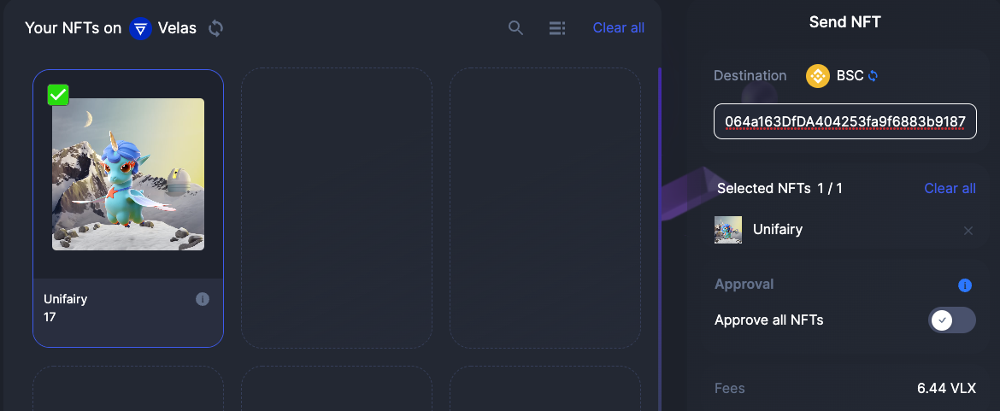