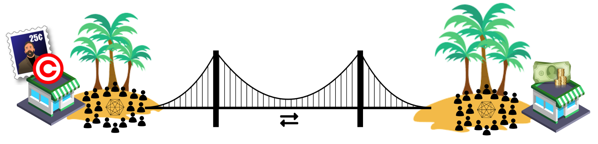
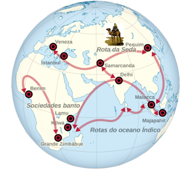
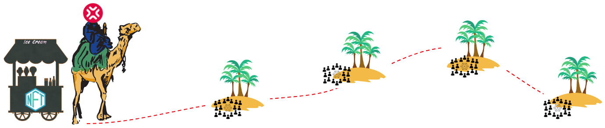
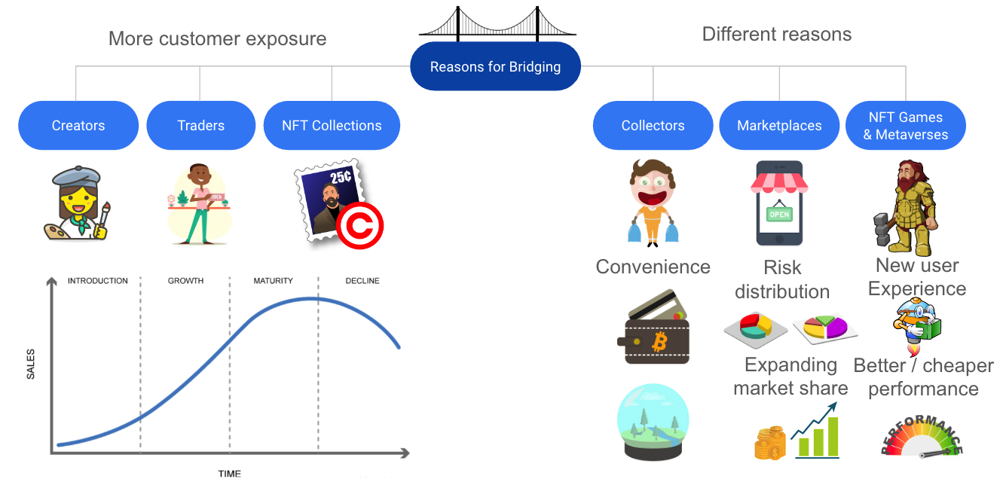
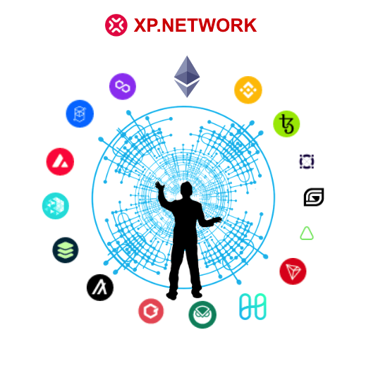

import ReactPlayer from 'react-player'

## Who needs the NFT Bridge?

Watch a 5 minute video with a brief outline of the topic:
<ReactPlayer controls url='https://www.youtube.com/watch?v=p21pCEvyDQw' />

## ⛩️ Bridges scale growth 📈
Without token bridges, **blockchains** are limited to their ecosystems, like islands or oases. Assets cannot leave or enter the community boundaries. 

The bridge opens the gates for the "foreign goods," turning trade into "international" geometrically increasing the number of transactions with every bridged chain.

Looking back to human history, we can see that civilizations rose and flourished every time there were trade routes between the centers of cultural and industrial life. Western culture's most famous is the "Silk Road" and the "Spice Route." 

💔 However, once the routes were cut due to military ⚔️ or epidemic 🦠 reasons, civilizations declined and degraded, losing literacy ✍🏻 and most of the past achievements. Such periods are called the dark ages 🧙🏼‍♂️, marked by poverty 🤷🏼‍♀️, a decline in morale 🧟‍♂️, life happiness 🧚🏼‍♀️, and length 👴🏻.

🎓 Knowledgeable blockchains understand that the growth and prosperity of their ecosystems depend on interoperability with other networks. But many ledgers are developed with different protocols.

⚗️ The solution is cross-protocol bridges. They connect the otherwise isolated communities and enrich each connected chain with fresh ideas and technologies due to reciprocal feedback loops forming a new level of synergy only available in a network.

🛣️ XP. Network Bridge is the "Silk Road" of the modern crypto oases, insular and sovereign by their nature. 

We allow for free movement of the assets desired by the developing markets.

Each such oasis is a whole new market for the rest of the connected chains whose fast track to prosperity relies heavily upon it being a part of an open network.

## ❓ Why NFTs 🪬
There's no question, that trading cryptocurrencies is a lucrative business. However, tokens are only a means of payment for goods and services. While *Transaction fees* are the **native services** 🚖 of the blockchains that can be paid with FTs, they still need something other than tokenomics in itself to develop and thrive. 

Every economy needs goods to be traded to bring action and life into an ecosystem. *NFTs* are universal wrappers of ownership or access control rights to physical or virtual assets and therefore, are the most **natural goods** 🛍️ that can be bought and sold for fungible tokens and ensuring further development. 

Anything can be minted as an NFT in the crypto world: art 🎨, music 🎻, tickets 🎫, diplomas 📜, certificates 🏵️, licenses 📑, permits 📃, ownership contracts of any kind 💼 , control over IoT devices 📹 or AI 🧠 entities, and traded as derivatives.

# Reasons for Bridging

The most intriguing question is, why would someone bridge NFTs?

> Most ecosystem dwellers such as NFT creators, traders, and Collections seek more customer exposure.

> NFT Collectors transfer their assets to their favorite wallets on the ecosystems they feel comfortable with.

## 🗃️ Collection's Product Life 🛒
 (Credit to [TWI-Global](https://www.twi-global.com/technical-knowledge/faqs/what-is-a-product-life-cycle)) 

There's no doubt that NFT Projects can easily prolong their collections' lives by bridging them to the other blockchains. But there's an alternative. The product's peak can be doubled or tripled by bridging parts of the collection to other environments and simultaneously launching on different chains using the base chain as proof of the collection's integrity.

In a brief video video below we're discussing two NFT projects. They both gained profit and success after bridging that was not available to them in the original ecosystems they started from.

<ReactPlayer controls url='https://www.youtube.com/watch?v=QUtH9_vURTA' />

## 🛖 Games 🏰
NFT-centered games can go cross-chain. That adds new, previously unavailable interaction to the game flow. NFT armies can invade the foreign kingdoms of the other chains. NFT explorers can travel in the parallel worlds of foreign chains and either return promoted with treasure and experience or be burned on the other sides of reality. They can also add extra rarity for the bridged NFTs, slightly changing the look of the asset and increasing the characters' experience.

## 🔮 Metaverses 🪩
NFT guests can visit Metaverse locations on various chains and gain experience or earn tokens for completing complicated quests. Colledges and universities can open metaverse courses and lectures for NFT students from different chains and accept foreign ledger currencies as tuition.

## 🗺️ Globalizing Markets 🏪
Keeping all the NFTs at home means bounding them to the local ecosystem user base. Quickly increasing the demand for the goods whose life cycle is at its decline can be achieved by moving them to a *new market on another blockchain*. That is where our bridge comes into play. Marketplaces distribute their risks, and instead of putting all their eggs in one basket, go cross-chain. This way, they simultaneously expand their reach and market share.

## ❓ Why choose US? ⛩️ 

1. 🏆 The biggest NFT bridge connecting 10+ EVM with 4+ Non-EVM chains is a one-window solution for the biggest NFT ecosystems in the industry. 
2. 🛡️ Our superior multilayer security system protects the bridged assets following the best cybersecurity practices.
3. 💰 NFT projects can earn part of the bridge transaction fees.
4. 🔬 The bridge is supplied with the cross-chain transactions explorer, which is critical for tracking NFT history and greatly impacts the asset's value.
