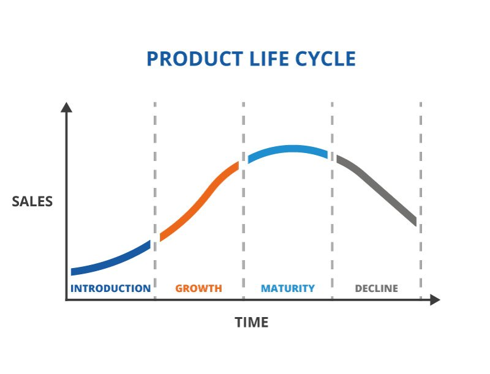

# Who needs the NFT Bridge?

## Bridges scale growth
Without token bridges, **blockchains** are limited to their ecosystem. Assets cannot leave or enter the community boundaries. The bridge opens the gates for the "foreign goods," turning trade into "international" geometrically increasing the number of transactions with every bridged chain.

## Why NFTs
There's no question that trading cryptocurrencies is a lucrative business. However, tokens are only a means of payment for goods and services. *Transaction fees* are the **native services**, while *NFTs* are the most **natural goods** that can be bought and sold for fungible tokens. 

## Globalizing Markets
Keeping all the NFTs at home means bounding them to the local ecosystem user base. Quickly increasing the demand for the goods whose life cycle is at its decline can be achieved by moving them to a *new market on another blockchain*. That is where our bridge comes into play.

## Collection's Product Life
 (Credit to [TWI-Global](https://www.twi-global.com/technical-knowledge/faqs/what-is-a-product-life-cycle)) 

There's no doubt that NFT Projects can easily prolong their collections' lives by bridging them to the other blockchains. But there's an alternative. The product's peak can be doubled or tripled by bridging parts of the collection to other environments and simultaneously launching on different chains using the base chain as proof of the collection's integrity.

## Games
NFT-centered games can go cross-chain. That adds new, previously unavailable interaction to the game flow. NFT armies can invade the foreign kingdoms of the other chains. NFT explorers can travel in the parallel worlds of foreign chains and either return promoted with treasure and experience or be burned on the other sides of reality.

## Metaverses
NFT guests can visit Metaverse locations on various chains and gain experience or earn tokens for completing complicated quests. Colledges and universities can open metaverse courses and lectures for NFT students from different chains and accept foreign ledger currencies as tuition.

## Why XP.NETWORK
1. The biggest NFT bridge connecting 10+ EVM with 4+ Non-EVM chains is a one-window solution for the biggest NFT ecosystems in the industry. 
2. Our superior multilayer security system protects the bridged assets following the best cybersecurity practices.
3. NFT projects can earn part of the bridge transaction fees.
4. The bridge is supplied with the cross-chain transactions explorer, which is critical for tracking NFT history and greatly impacts the asset's value.
