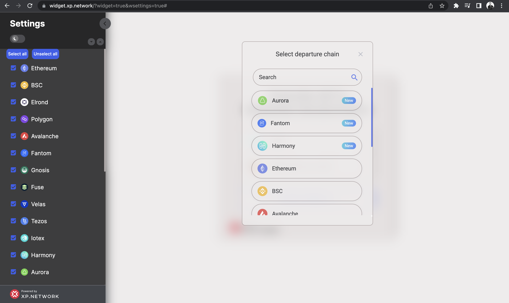
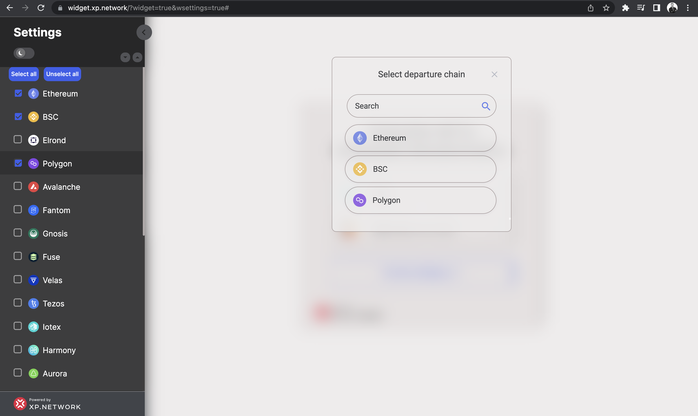
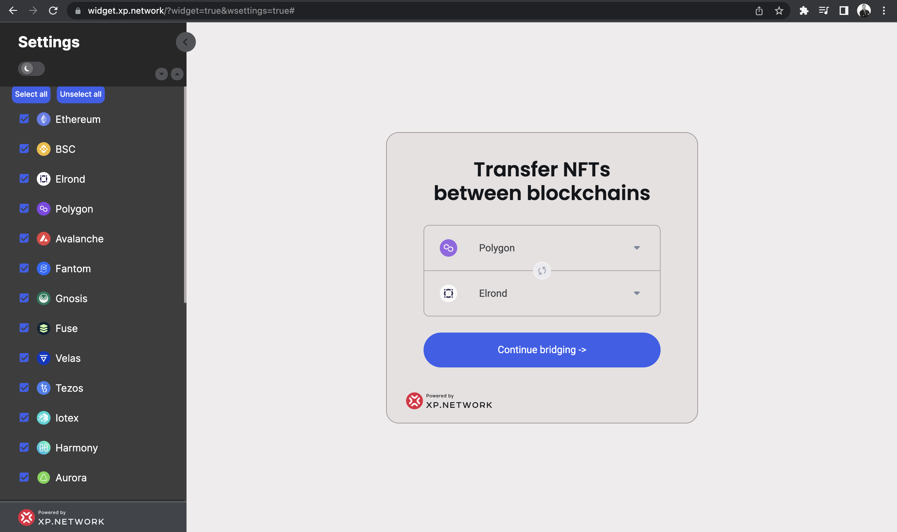
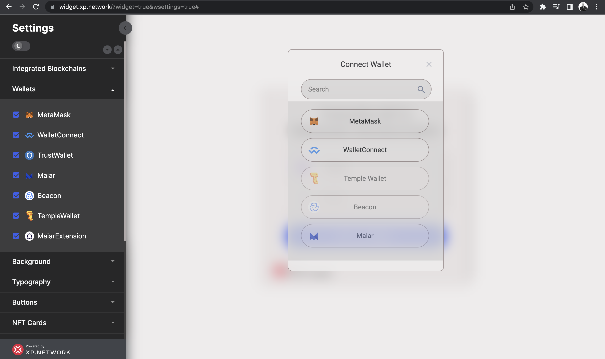
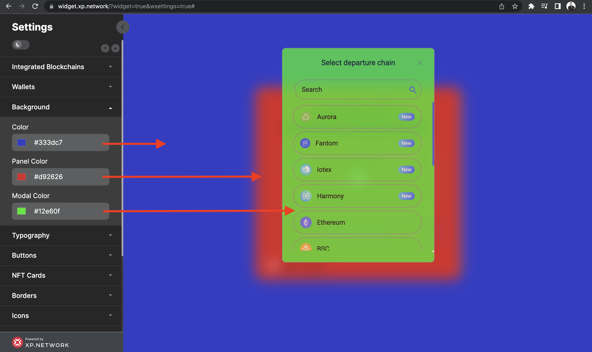
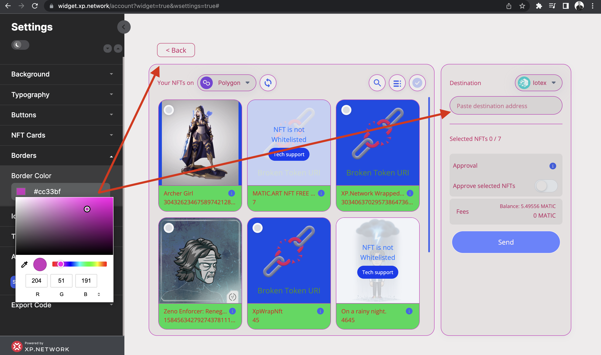
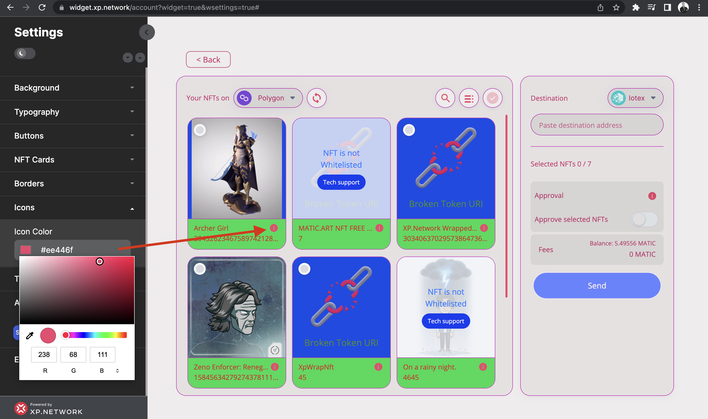
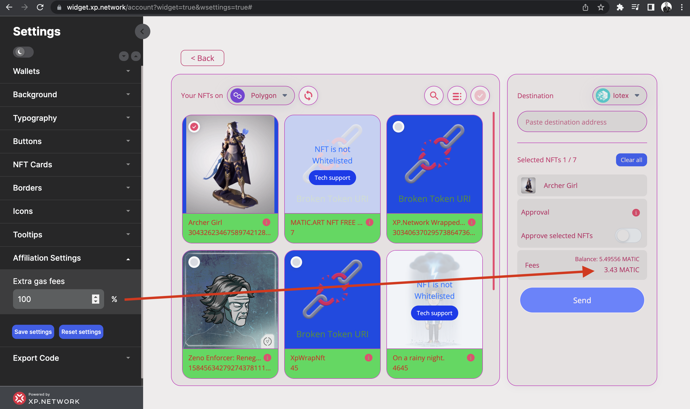
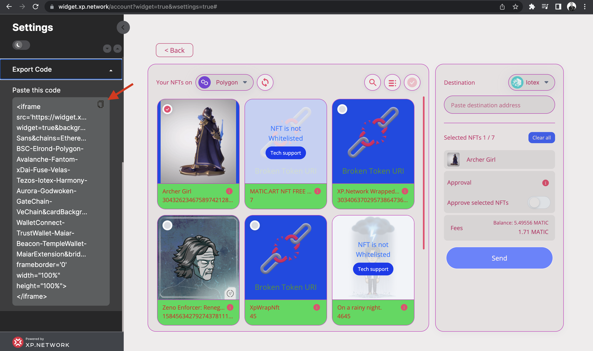

# The Bridge Widget

A widget is a tool that enables codeless integration of the Multi-Chain NFT Bridge to any UI. Every component of the bridge is adjustable to the needs of a user, including the color palette of its components and the chains and wallets available to the user.

## 1. Adjusting the Settings Panel

The widget attributes can be manipulated with the Settings panel located on the left side of the screen.

1. To view the bridge on the full screen, hide the Settings panel.
2. To edit the bridge attributes, show the Settings panel.
3. Click the Day / Night mode slider to switch between the dark-grey and white backgrounds of the Settings panel. By default, the panel is dark to contrast with the light background of the bridge screen. Should you change the background of the bridge to something dark, it would make sense to switch to the day mode of the panel.
4. To open all the dropdowns at once, click the left and close the right arrows located immediately above the `Integrated Blockchains` tab.
5. The HTML code of the resulting iframe will be generated in the `Export Code` tab at the very bottom of the panel.

## 2. Adding & removing the Blockchains

Open the topmost `Integrated Blockchains` tab to manipulate the presence or absence of the available chains in your version of the bridge. It may be a precaution to help your NFT ecosystem to only send their NFTs to the ledgers where you have prepared the required infrastructure to accept and list the assets properly. By default, all the available chains are selected. Deselect the chains you don't need. You will see them disappear from the selected departure or destination chain popup window, should you keep any of those open.

For example, you only plan to use the bridge between Ethereum, BSC, and Polygon. Click the `Unselect all` button. It will leave only two blockchains selected - Ethereum and BSC. Click the Polygon checkbox, and you're all set. Check the "select departure chain." 

## 3. Adding & removing the wallets

Select the departure and destination chains to see what wallets are currently available. It will activate the `Continue bridging` button making it clickable.

Click the `Continue bridging` button to see the wallets that your community will be able to use while bridging NFTs. 

By default, all the wallets are selected. Deselect the ones you want to exclude. 

If a blockchain that uses those wallets were deselected at the previous stage, its wallets would appear unselected too once you open the tab. However, deselecting a wallet does not unselect a chain since a chain can use multiple wallets.

## 4. Setting Backgrounds

To change the colors of the major surfaces, open the `Background` tab.

1. To visually set the colors - use the color picker and click the relevant setting.
2. To precisely match the style guides of the corporate palette - paste the hexadecimal values of the colors.

- The `Color` setting changes the color of the entire bridge background.
- The `Panel Color` setting impacts the departure and the destination chain selectors' background.
- The `Modal Color` setting alters the background of the pop-up window.

## 5. Adjusting the Fonts

To change the color, font family, or size of the captions, open the `Typography` tab.

1. To change the color of most component labels, use the `Font Color` setting.
2. The `Secondary Font Color` impacts the captions in the middle of the NFT cards.
3. The `Accent Font Color` setting adjusts the text at the bottom of the NFT image.
4. Changing the `Font Size` will impact most labels and texts.
5. The following `Font family` are available:
   - Open Sans
   - Roboto
   - Inter
   - Josefin sans
   - Lato
   - Monserrat
   - Mukta
   - Playfair Display
   - Poppins
   - Quicksand
   - Raleway
   - Ubuntu

## 6. Button settings

Button settings are quite intuitive.

1. Change the `Color` to impact the button's background.
2. The `Text color` adjusts the font color of the button text.
3. The `Corner radius` makes the button corners round or square.

## 7. Changing NFT Cards

Each card represents a Non-Fungible Token.

1. Change the `Background` color to impact the layer behind the NFT image or video.
2. The `Background Bottom` adjusts the lower part of the card.
3. The `Color` setting changes the color of the NFT name and ID color.
4. The `Card corner radius` makes the corners more rounded or square.

## 8. Borders Setting

To change the color of the components' borders, change the `Border Color` in the `Borders` tab.

## 9. Icons Color

To change the color of the information buttons - change the `Icon Color` in the `Icons` tab.

## 9. Getting a share in the Transaction Fees

Leaving the `Affiliation Settings` field with the default `0` will not bring you additional profit.

Change the percentage to anything you consider reasonable for your community.

## 10. Getting the code

Unfold the `Export Code` dropdown and click the button at the top right corner to copy the HTML of the iframe to the RAM of your machine.

## 11. Using the iframe

Paste the resulting iframe in your frontend code. Make sure the height of the widget is at least 800px.

## 12. Enjoy the Widget

