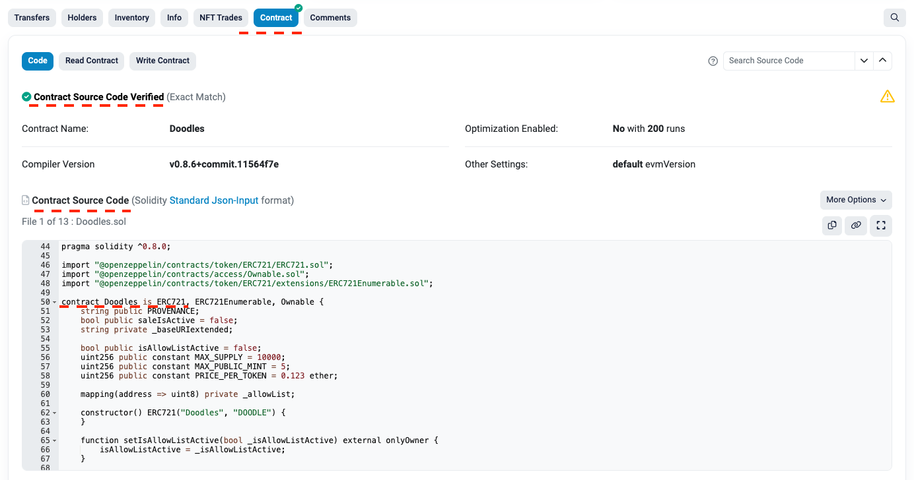
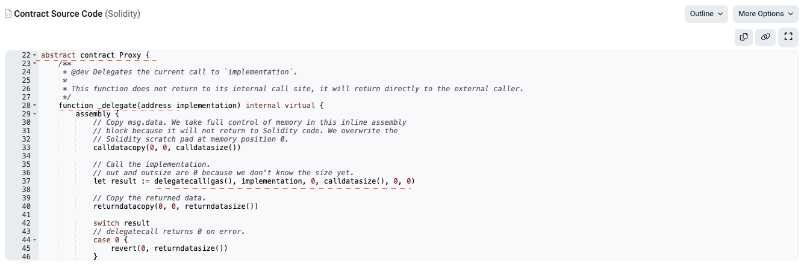
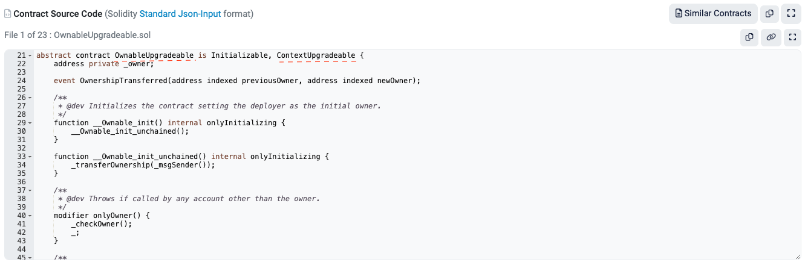

# Whitelisting Limitations

Besides the original NFT smart contracts with found malicious code, three groups of potentially benevolent contracts will not be added to the list of trusted by the v3.0 of XP.NETWORK Bridge.

## 1. Unverified Contracts

If the team of collection creators has not verified the contract where your NFTs were minted, this contract will not be automatically scanned for malware and whitelisted.

### 1.1 How to check whether a smart contract has been verified

1. Open the explorer of the chain where you own NFTs
2. Find your account and the assets you own
3. Click the asset of interest, which should take you to a page where its smart contract address can be found
4. Open the smart contract page in the explorer
5. If you only see the contract's bytecode and no human-readable code is available, your contract has not been properly verified

The signs of unverified contracts are:
1. The tab with the word `Contract` does not have a green tick
2. Buttons or links suggesting the contract verification
3. The only available version of the contract is its bytecode

A chain explorer has many indicators that a contract has been verified:

1. The tab with the word `Contract` has a green tick
2. There is an explicit text saying the contract's source code has been verified
3. The contract's code is available
4. You can read and understand the logic of the contract

### 1.2 How to proceed with contract verification and whitelist

You can ask the collection team to whitelist their smart contract on the chain and then try whitelisting it again in the bridge UI or ask them to contact the XP.NETWORK team for manual smart contract whitelisting.

Only a collection team member with the original contract source code can succeed in manual contract whitelisting. XP.NETWORK team will build the contract code to binary with the same Solidity or other SC language version, optimization rounds, and other build settings. If all the bytes of the resulting code match the one on the chain, we will accept the source code for whitelisting.

## 2. Proxy Contracts

Proxy[^1] contracts have minimal logic required to delegate calls to an implementation contract and forward its output as if a caller were interacting with it. However, the implementation contract can be replaced with another malicious one. Therefore, XP.NETWORK Bridge cannot trust or whitelist proxy contracts.

### 2.1 How to check whether a smart contract is a proxy

To be 100% sure the contract of your interest is a proxy, it must be verified. Here are some indicators proving the contract you're interested in is a proxy:

1. It inherits from a proxy contract or is itself called `Proxy`
2. The contract or its ancestor has a function similar to `_delegate(address implementation)`
3. It calls an opcode `delegatecall(...with parameters)` inside `assembly { ... }`

### 2.2 How to proceed

We can whitelist the implementation contract as long as it is not upgradable or unverified and the implementation contract allows direct interaction without its proxy middleware. In other words, an implementation contract must be a regular NFT contract with no code limiting who can call it.

## 3. Upgradable contracts

Upgradable contracts are a subset of proxy contracts. Even though one cannot change a program once deployed on a network, the code that executes when users interact with an upgradeable [^2] contract can be changed. Because currently, we cannot guarantee that an upgradable contract we whitelisted stays the same forever; we do not trust it and therefore do not whitelist it.

### 3.1 How to check whether a smart contract is upgradeable

To be 100% sure the contract of your interest is upgradeable, it must be verified. Here are some indicators that can help distinguish it from the rest:

1. It inherits from an upgradable contract or is upgradable itself
2. Such words like `Beacon`, `Upgradable`, `TransparentUpgradeableProxy`, `ERC1967`  and similar can be found in the source code
3. Events like `event Upgraded` and `emit Upgraded`, or `event BeaconUpgraded` and `emit BeaconUpgraded` are present in the code
4. Inside `assembly{...}` has calls of `create`, `create2` opcodes

### 3.2 Possible solution

We are testing whether passing NFTs from an upgradable contract to our intermediate contract is safe. It will be implemented in the next bridge iteration if it proves safe.

[^1]: https://github.com/OpenZeppelin/openzeppelin-contracts/tree/master/contracts/proxy

[^2]: https://ethereum.org/en/developers/docs/smart-contracts/upgrading/
