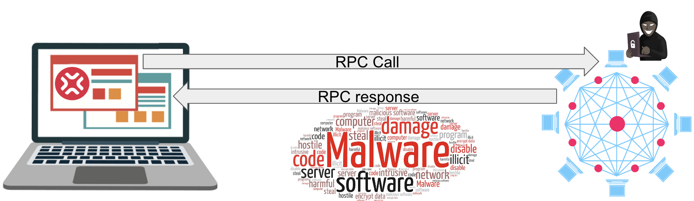
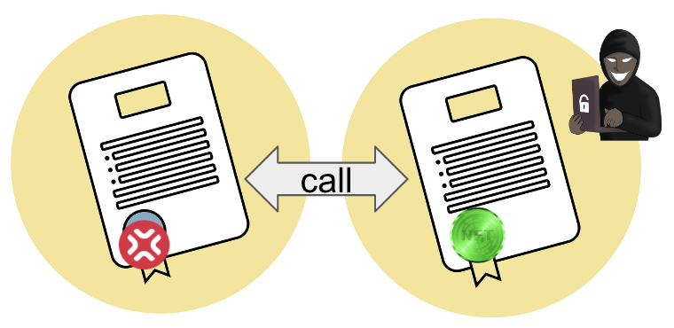

import ReactPlayer from 'react-player'

# XPJS Library Security

## Potential Vulnerabilities

[XPJS](https://github.com/XP-NETWORK/xpjs/tree/bleeding-edge) stands for XP.NETWORK JavaScript library. As with any software, xpjs, a JavaScript (in our case TypeScript) library for interacting with the [XP.NETWORK NFT bridge](https://bridge.xp.network/#), may have vulnerabilities or bugs that could potentially be exploited by malicious actors. 

Since XPJS interacts with multiple protocols, it has JS libraries of the relevant chains as internal dependencies. Here's the full list of dependencies at the moment of writing:

```json
{
    "@dfinity/agent": "^0.15.5",
    "@dfinity/candid": "^0.15.5",
    "@dfinity/identity-secp256k1": "^0.15.5",
    "@dfinity/nns": "^0.14.0",
    "@dfinity/principal": "^0.15.5",
    "@dfinity/utils": "^0.0.12",
    "@elrondnetwork/erdjs": "9.0.3",
    "@ethersproject/providers": "^5.7.0",
    "@hashgraph/hethers": "^1.2.6",
    "@hashgraph/sdk": "^2.23.0",
    "@json-rpc-tools/utils": "^1.7.6",
    "@multiversx/sdk-core": "^11.4.1",
    "@project-serum/anchor": "^0.25.0-beta.1",
    "@randlabs/myalgo-connect": "^1.1.1",
    "@solana/spl-token": "^0.2.0",
    "@solana/web3.js": "^1.44.2",
    "@taquito/signer": "^16.1.1",
    "@taquito/taquito": "^13.0.0",
    "@taquito/utils": "^13.0.1",
    "@vechain/connex-driver": "^2.0.8",
    "@vechain/connex-framework": "^2.0.8",
    "@walletconnect/client": "^1.7.0",
    "algosdk": "^2.2.0",
    "aptos": "^1.6.0",
    "axios": "^0.21.1",
    "base64url": "^3.0.1",
    "bignumber.js": "=9.0.1",
    "bn.js": "^5.2.1",
    "buffer": "^6.0.3",
    "crypto-exchange-rate": "git+https://github.com/xp-network/exchange-rate#a2915673342ee33aedd1cb4a12b304c36f55fa15",
    "ethers": "^5.5.4",
    "js-base64": "^3.6.1",
    "near-api-js": "1.0.0",
    "secretjs": "=1.4.7",
    "socket.io-client": "^4.1.3",
    "ton-x": "^2.0.0",
    "tonweb": "^0.0.57",
    "tonweb-mnemonic": "^1.0.1",
    "tronstation": "^1.0.1",
    "tronweb": "^4.1.0",
    "web3-providers-connex": "^0.3.1"
}
```

Here are some potential vulnerabilities in xpjs mostly caused by the JS libraries it depends on:



**JSON-RPC injection**: `xpjs` allows users to send JSON-RPC requests to EVM and Non-EVM nodes. If an attacker can inject malicious code into a JSON-RPC request, they could execute arbitrary code on the user's computer or gain access to sensitive data. It is also true for all JS libraries connecting the users with the JSON-RPCs, such as [ethers](https://docs.ethers.org/v6/), [web3.js](https://web3js.readthedocs.io/en/v1.8.2/), [sdk-js](https://docs.multiversx.com/sdk-and-tools/sdk-js/), [Solana-Web3.js](https://docs.solana.com/developing/clients/javascript-api) and others. XPJS uses the libraries mentioned earlier to create a convenient interface for the end users but, unfortunately, inherits all the bugs and vulnerabilities of its dependencies.



**Malicious contract execution**: `xpjs` provides a simple interface for interacting with smart contracts on the EVM and Non-EVM networks. If an attacker can deploy a malicious contract or exploit a vulnerability in a legitimate contract, they could potentially steal funds or execute unauthorized transactions. Again, it is true for all the JS libraries interacting with the protocols. Hence `xpjs` is not an exception, especially since it depends on the libraries interacting with the chains.


**Private key theft**: `xpjs` allows users to sign transactions using their private keys. If an attacker can compromise one of the chain's JS libraries, they could gain control of the user's EVM or Non-EVM funds, depending on which library has been hacked.


**Cross-site scripting (XSS)**: `xpjs` is often used in web applications. If a vulnerability exists in the application that allows an attacker to inject malicious code (such as through an input field), they could potentially steal sensitive data or execute unauthorized transactions. If one of the libraries XPJS depends on is vulnerable to XSS, it automatically makes XPJS vulnerable.

It's important to note that the XP.NETWORK team is constantly working to identify and address potential vulnerabilities.

## Vulnerabilities Mitigation

Here are some steps that the library users can take to mitigate potential `xpjs` vulnerabilities proactively:

1. **Keep `xpjs` up-to-date**: Developers should regularly update their `xpjs` library to the latest version to ensure any known vulnerabilities have been addressed.
2. **Report any found bugs** in the [issues](https://github.com/XP-NETWORK/xpjs/issues) tab of the GitHub repository. Do NOT report vulnerabilities here because this repository is public.
3. **Report vulnerabilities** to the email address: contact@xp.network without making them public till the team fixes or patches them not to expose all the users to a potential threat.
4. **Validate user input**: When accepting user input, validate and sanitize the data to prevent malicious code injection.
5. Use **secure storage for private keys**: To prevent private key theft, users should use secure storage solutions such as hardware wallets or encrypted key stores.
6. **Limit access to sensitive data**: Only grant access to sensitive data and functionality to trusted parties or specialized entities with specific roles.
7. **Perform security audits**: Developers should regularly perform security audits on their application and any third-party libraries they use, including `xpjs`, to identify and address potential vulnerabilities and report any found vulnerabilities to contact@xp.network.
8. **Follow best practices**: Developers should follow best practices for secure codings, such as minimizing the attack surface, enforcing the least privilege, and using secure communication protocols.
9. **Monitor for suspicious activity**: Regularly monitor for suspicious activity, such as unauthorized transactions or unexpected changes to the smart contract state, and take appropriate action if detected.

By following these best practices, developers can help mitigate potential vulnerabilities in `xpjs` and reduce the risk of exploitation by malicious actors for their dApp and other users.