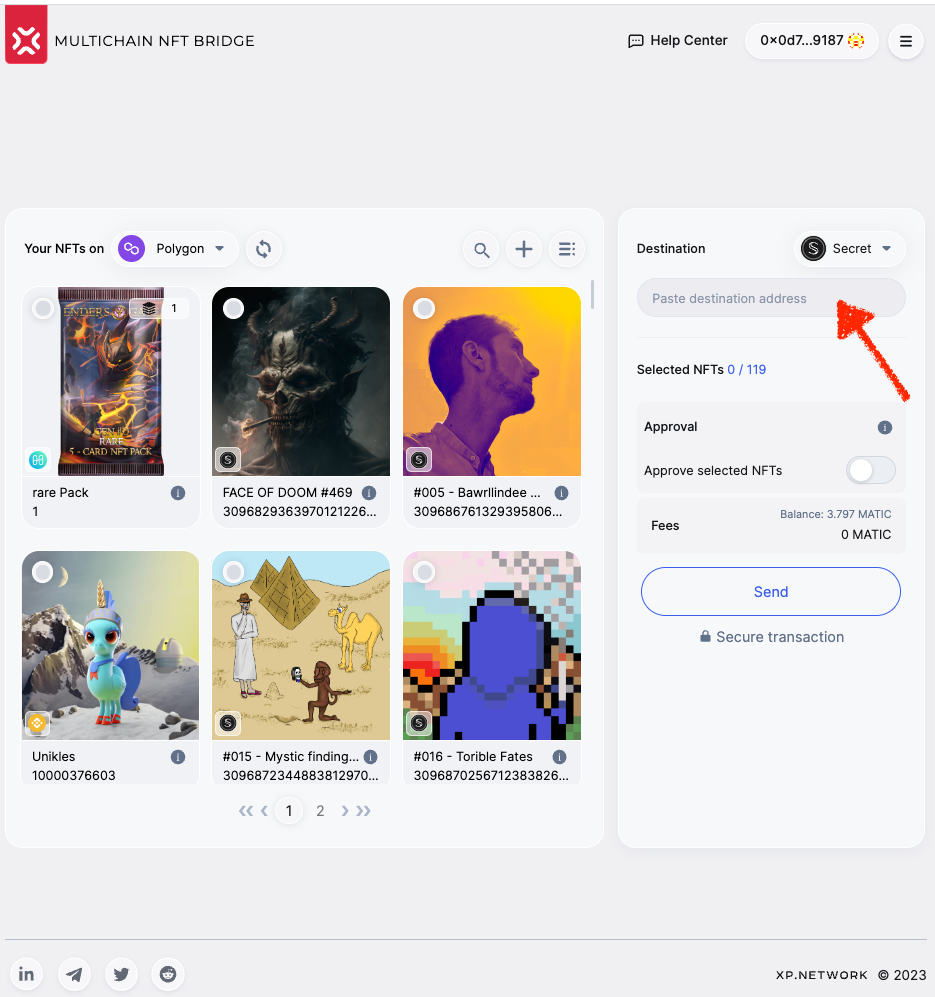
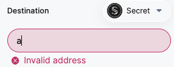
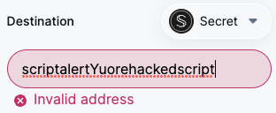
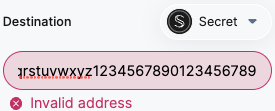

import ReactPlayer from 'react-player'

# Bridge UI Security

<ReactPlayer className="introduction-player" controls url='https://www.youtube.com/watch?v=e_XHF0CMj1U' />

Out of the list of the most common UI vulnerabilities, it is clear that only one out of seven applies to our UI. It is called **security by architecture**.

|#| Applicable| Vulnerability|
|:-:|:-:|:-:|
|1|$$\color{red}Yes$$|[Cross-Site Scripting (XSS)](#1-cross-site-scripting-xss) |
|2|$$\color{green}No$$| [Cross-Site Request Forgery (CSRF)](#2-cross-site-request-forgery-csrf) |
|3|$$\color{green}No$$| [Clickjacking](#3-clickjacking) |
|4|$$\color{green}No$$| [UI Spoofing](#4-ui-spoofing) |
|5|$$\color{green}No$$| [Information Disclosure](#5-information-disclosure) |
|6|$$\color{green}No$$| [Insecure Direct Object References (IDOR)](#6-insecure-direct-object-references-idor) |
|7|$$\color{green}No$$| [UI Input Validation Bypass](#7-ui-input-validation-bypass) |

## 1. Cross-Site Scripting (XSS)

### Two types of XSS are distinguished:

A. **Reflected XSS**: Used in phishing attacks, where a user is tricked into clicking a hidden link and launches a malicious code in their browser.

B. **Stored XSS**: A website permanently stores malicious code. Once a victim views the hacked page, they get compromised, even without clicking anything.

The last one can quickly go viral if the infected page is popular and has many viewers, for example, on social media.

### The main targets of the XSS attack are:

A. **User cookies**: allows interacting on behalf of the user using the user's registration in web applications and assigning user tokens

B. **Stealing Credentials**: the script can steal user credentials when the user types them in a form 

C. **Install keyloggers**: they are programs that log every keystroke a user makes

D. **Site defacing**: the display of embarrassing or controversial images on a website

The impact surface of the bridge UI is quite small. The only input is expecting the destination address as a `string.`

The input is validated & informs the user whether the address is valid for the destination chain:

The classical HTML to check XSS vulnerability: `` cannot be typed in the input since all the punctuation marks are removed:

To prevent the possibility of inputting a long script in the input component, the number of characters is limited to 44:

### The Bridge UI secure setup:

> - All transaction signatures happen in the user-selected wallet.
- No user data other than the user's public key is ever requested.
- No user credentials are ever requested or moreover stored anywhere.
- No cookies are collected or stored at any moment.
- The UI has no sensitive data hard-coded or even in the environment vars
- The UI is ignorant about the location, IP address, or credentials of validators
- The UI has a very limited impact surface where users can submit arbitrary data, such as string literals that could potentially contain malicious code.
- Every such impact surface has input verification and limits the length of the possible input to make potential code injection impossible.

## 2. Cross-Site Request Forgery (CSRF)

Cross-Site Request Forgery (CSRF), also known as session riding or XSRF, is a type of web security vulnerability that allows an attacker to trick a victim into performing unwanted actions on a website where the victim is authenticated. CSRF attacks exploit the trust between a website and its users, leveraging the fact that the website cannot distinguish between legitimate requests initiated by the user and forged requests sent by the attacker.

There are a few variations and types of CSRF attacks:

**GET-based CSRF**: In this type of attack, the attacker embeds a malicious URL in a website or email. When the victim clicks on the link, a GET request is sent to the target website, potentially causing an action to occur.

**POST-based CSRF**: Here, the attacker tricks the victim into submitting a form on the attacker's website, which submits a POST request to the target website. The request could perform actions like changing account settings, purchasing, or deleting data.

**CSRF with XSS**: Cross-Site Scripting (XSS) vulnerabilities can be combined with CSRF to create more potent attacks. By injecting malicious scripts into a vulnerable website, the attacker can execute arbitrary code on the victim's browser, sending unauthorized requests to the target website.

### Some potential consequences of a successful CSRF attack could include:

**Account hijacking**: Attackers can change account passwords, emails, or other sensitive information, effectively taking control of the victim's account. It is impossible with elliptic curve accounts because even if an attacker has the public key of the victim, it is not enough to sign the transactions on behalf of the victim so that the signature is valid unless the adversary has the private key, which is protected by the crypto wallet and never requested or stored by the bridge UI.

**Unauthorized transactions**: CSRF attacks can be used to make purchases or transfer funds on behalf of the victim, leading to financial loss.

**Data manipulation**: Attackers may forge requests to modify or delete data on the target website, potentially causing data loss or integrity issues.

**Malicious actions**: CSRF attacks can be leveraged to perform actions that have negative consequences, such as sending spam, spreading malware, or escalating privileges.

### To protect against CSRF attacks, the following security measures can be undertaken:

**Using CSRF tokens**: Unique tokens are generated and associated with user sessions, which must be included in every request that modifies state or performs sensitive actions.

**Checking the origin and referrer headers**: Verifying that the request originates from the same domain and ensuring that the referrer header is valid can help prevent CSRF attacks.

**Implementing strict access controls**: Limiting the impact of potential CSRF attacks by implementing proper authorization and authentication mechanisms.

**Utilizing SameSite cookies**: Configuring cookies with the SameSite attribute to restrict their transmission only for same-site requests, reducing the risk of CSRF attacks.

**Performing security audits**: Regularly review and test the web application's security to identify and address potential vulnerabilities.

### Why this attack is irrelevant to us:

1. In a typical CSRF attack, the attacker **crafts a malicious website or email** that contains a link or form that acts on the target website.

As long as the user sticks to the authentic bridge UI `https://bridge.xp.network/`, this type of attack is irrelevant. Make sure you are exactly on that website, and all of the characters have yet to be replaced by a similar looking one. 

For example:
:::danger
https://bridge.xp.netw0rk/ 
https://bridge.xp.netuork/ 
https://bridge.xp.networc/ 
https://bridge.xp.neetwork/ 
https://bridge.xb.network/ 

Or any other combinations of similar characters.
:::

2. When the victim **accesses the malicious content while being authenticated** on the target website, their browser automatically sends a request to the target website, including any associated session cookies or credentials. As a result, the target website processes the request as if it were initiated by the victim, leading to unauthorized actions.

XP.NETWORK UI does not store any credentials or cookies. The UI is injected with the user's public key coming from the selected wallet. 

## 3. Clickjacking

Clickjacking, UI redress attack, or UI rewriting is a web security vulnerability that tricks users into clicking on elements on a webpage without their knowledge or consent.

By carefully manipulating elements' visual appearance and positioning, attackers can trick users into clicking on hidden or invisible buttons, links, or interactive elements.

### There are a few variations and types of clickjacking attacks:

**Classic Clickjacking**: In this type of attack, the attacker overlays an $$\color{red}invisible~or~disguised~iframe$$ on top of a legitimate website. The iframe contains malicious content or functionality, such as buttons or forms. When the victim interacts with the visible elements on the webpage, they unknowingly interact with the hidden elements, triggering unintended actions.

**Likejacking**: Likejacking attacks target social media platforms and exploit the "Like" or "Share" buttons. Attackers use clickjacking techniques to conceal the social media buttons, tricking users into liking or sharing content they did not intend to interact with.

**Cursorjacking**: Cursorjacking manipulates the appearance and behavior of the cursor on a webpage. By modifying the page's CSS or using JavaScript, the attacker hides the actual cursor or replaces it with a different graphic. The victim may unknowingly click on invisible elements or interact with deceptive content.

**UI redressing**: UI redressing attacks involve manipulating a webpage's visual appearance and layout to mislead users into clicking on unintended elements. It can be achieved by cleverly positioning or resizing elements, using transparent overlays, or obscuring parts of the webpage.

### Some potential consequences of clickjacking attacks include:

**Unauthorized actions**: Clickjacking can lead to users inadvertently performing actions they did not intend, such as making purchases, changing settings, deleting data, or posting content on social media.

**Information disclosure**: Attackers can exploit clickjacking to trick users into revealing sensitive information, such as entering login credentials, providing personal details, or granting permission to access sensitive data.

**Social engineering**: Clickjacking can be used as a tool for social engineering, tricking users into sharing content, spreading malware, or engaging in other activities that may compromise their privacy or security.

### To protect against clickjacking attacks, the following measures can be implemented:

**X-Frame-Options header**: Setting the X-Frame-Options header to "SAMEORIGIN" or "DENY" can prevent the webpage from being loaded within an iframe on a different domain.

**Content Security Policy (CSP)**: Utilizing CSP headers can restrict the sources from which a webpage can load content, mitigating the risk of clickjacking by preventing unauthorized iframes or scripts from being loaded.

**Frame-busting script**: Including a frame-busting script in web pages can detect if the page is loaded within an iframe and break out of the frame if necessary.

**JavaScript protections**: Implementing JavaScript protections that check the window's "top" property and ensure the page is not loaded in a frame can help prevent clickjacking.

### Why is it not applicable to our bridge UI

1. The attacker achieves this by **overlaying or embedding a malicious webpage or invisible element on top of a legitimate webpage**, making the victim believe they are interacting with the genuine site. Unless a user is tricked into going to a website mocking ours, there is no way an adversary could embed an additional element without physical access to the victim's machine.
2. The primary goal of clickjacking is to deceive users into performing unintended actions or **divulging sensitive information** without their awareness. Again, there is no sensitive information the bridge users have to share.

All this makes the attack irrelevant against the NFT Bridge users.

## 4. UI Spoofing

UI Spoofing, also known as User Interface Spoofing, is a type of attack that manipulates a website or application's user interface (UI) to deceive users and trick them into performing unintended actions.

By altering the UI elements' appearance, behavior, or content, attackers can create a convincing illusion that the user is interacting with a legitimate system.

### There are different ways in which UI Spoofing can be employed:

**Login Page Spoofing**: Attackers may create fake login pages that closely resemble the legitimate login pages of popular websites or applications. These spoofed pages trick users into entering their login credentials, which the attackers capture for malicious purposes such as account hijacking or identity theft.

**Content Manipulation**: UI Spoofing can involve modifying the content displayed on a website or application to deceive users. It can include altering text, images, or buttons to mislead users into taking unintended actions or divulging sensitive information.

**Overlay Attacks**: In this scenario, attackers overlay deceptive UI elements on top of legitimate pages to trick users into interacting with the overlay instead of the genuine underlying content. For example, a deceptive overlay might ask users to click a button or enter personal information, leading to unauthorized actions or data disclosure.

**In-App Browser Spoofing**: Some mobile applications use an in-app browser to display web content. Attackers can manipulate the appearance of the in-app browser to deceive users into believing they are interacting with a legitimate website when, in fact, they are interacting with a malicious one. It can lead to unintended actions or the disclosure of sensitive information.

### Some potential consequences of UI Spoofing attacks can include:

**Unauthorized access**: Attackers may trick users into providing sensitive information or performing actions that grant unauthorized access to accounts, systems, or data.

**Data leakage**: UI Spoofing attacks can lead users to disclose confidential or personal information to malicious actors inadvertently.

**Account compromise**: By mimicking legitimate login pages, attackers can capture users' login credentials and gain unauthorized access to their accounts.

**Financial loss**: UI Spoofing attacks can deceive users into making fraudulent transactions or revealing financial information, resulting in financial losses.

### To mitigate the risk of UI Spoofing attacks:

**Input validation**: Implement robust input validation mechanisms to ensure that user-supplied data is properly sanitized and does not lead to unintended UI modifications.

**Secure coding practices**: Adhere to secure coding practices to minimize the risk of UI vulnerabilities, such as properly handling user-generated content and preventing code injection attacks.

**User education**: Promote user awareness and education regarding common phishing techniques, such as recognizing and verifying the authenticity of UI elements and being cautious when entering sensitive information.

**Strong authentication mechanisms**: Utilize multi-factor authentication and other strong authentication methods to protect against unauthorized account access even if login credentials are compromised.

### Why is UI Spoofing not applicable to our bridge UI

1. The attacker aims to **mimic the legitimate UI elements** and interactions, leading users to believe they are interacting with an authentic interface when, in reality, they are interacting with a malicious or unauthorized one.
2. UI Spoofing attacks typically exploit vulnerabilities in the rendering or display of the UI, often using techniques such as **CSS** (Cascading Style Sheets) **manipulation, HTML injection, or JavaScript injection**. To do this, the attacker must access the server that fetches the website. If that happens, then no protection measures are relevant because, having access to the server, the adversary can remove them.
3. The attack is only relevant for websites where highly skilled users can add components to the website served from a server they cannot access but which unintentionally **allows permanent addition of new components**. This attack will likely happen on the websites **where users are allowed to generate content**. For example, the sites where users can write **blogs, social networks, or webpages constructors**, where users can add custom components, etc. None of this is possible in the bridge UI.

## 5. Information Disclosure

UI Information Disclosure, also called User Interface Information Disclosure, is a security vulnerability that occurs when sensitive or confidential information is unintentionally exposed through the user interface of a website, application, or system.

While there aren't distinct types of UI Information Disclosure, the vulnerability can occur in different contexts:

**Direct Information Disclosure**: This type of UI Information Disclosure involves directly presenting sensitive information to users without intentional user action or exploitation. Examples may include displaying personally identifiable information (PII), financial data, API keys, or internal system details on the user interface when it should be hidden from view. None of this is relevant for an NFT bridge.

**Indirect Information Disclosure**: In this case, the UI Information Disclosure is not a result of direct presentation but rather the unintentional exposure of sensitive information through indirect means. For example, error messages or status notifications that contain sensitive details might inadvertently disclose information about the underlying system or data structure.

**Input Validation Issues**: UI Information Disclosure can occur when insufficient input validation or output encoding is applied to user-supplied data displayed on the user interface. If the input is not properly sanitized, it may be possible for an attacker to inject malicious code or crafted input that causes the disclosure of sensitive information.

### The impact of UI Information Disclosure can be significant and pose risks to users and the organization responsible for the application or system. Some potential consequences include:

**Privacy breaches**: UI Information Disclosure can expose personally identifiable information (PII), such as names, addresses, social security numbers, or email addresses, violating user privacy and potentially leading to identity theft or fraud.

**Data exposure**: Sensitive data, including financial records, medical information, or proprietary business data, can be inadvertently revealed, resulting in potential legal and reputational consequences.

**System enumeration**: Information disclosed through the user interface may provide attackers with insights into the system's configuration, version numbers, or internal structure, aiding them in subsequent targeted attacks.

**Social engineering**: Disclosed information can be leveraged by attackers for social engineering purposes, manipulating users into providing additional sensitive information or performing unintended actions.

To mitigate UI Information Disclosure vulnerabilities, developers and organizations should take the following measures:

**Proper access controls**: Ensure that sensitive information is appropriately protected and only accessible to authorized users or roles. Implement access control mechanisms to restrict access to sensitive UI elements.

**Input validation and output encoding**: Validate and sanitize user-supplied data to prevent the injection of malicious code or crafted input that could lead to information disclosure. Apply proper output encoding to ensure sensitive information is displayed correctly and securely.

**Error handling and messaging**: Avoid disclosing sensitive details in error messages or status notifications. Use generic error messages that do not reveal specific system or data information.

**Secure configuration**: Ensure that security settings, such as file and directory permissions, are appropriately configured to prevent unauthorized access to sensitive files or directories containing UI-related information.

**Regular security testing**: Conduct comprehensive security testing, including vulnerability assessments and penetration testing, to identify and remediate any UI Information Disclosure vulnerabilities.

### Why is this attack irrelevant to our UI

1. It refers to instances where **information that should be kept private or hidden is inadvertently revealed** to users or potential attackers. In our case, this information is the user's private key handled by the user's crypto wallet. The bridge UI neither requests nor stores this key. The transaction signature happens in the wallet, so the UI does not even interact with the secret key in any way.
2. UI Information Disclosure can manifest in various ways and can be caused by various factors, including **improper access controls**, insufficient input validation, misconfigured security settings, or coding errors. Our UI 

## 6. Insecure Direct Object References (IDOR)

Insecure Direct Object References (IDOR) in the UI refer to security vulnerabilities that arise when an application exposes direct references to internal objects or resources in its user interface, allowing unauthorized users to access or manipulate sensitive data or resources.

IDOR vulnerabilities typically occur when an application fails to validate or authorize user requests properly. It leads to direct references to internal objects or resources being exposed and accessible through the UI. Attackers can then modify the references or guess valid ones to access unauthorized data or perform actions for which they should not have privileges.

### Here are some common scenarios:

**User Profile IDOR**: In certain applications, users may have a unique identifier associated with their profile or account. If the application uses these identifiers directly in the UI, attackers can manipulate the identifiers to access or modify other users' profiles or sensitive information.

**File or Resource IDOR**: Applications that allow users to access or manage files, documents, or other resources may expose direct object references in the UI. Attackers can manipulate the references to access unauthorized files or resources, potentially exposing sensitive data or gaining unauthorized access to restricted content.

**Order or Transaction IDOR**: E-commerce or financial applications often use unique identifiers for orders or transactions. Suppose these identifiers are exposed in the UI and need to be properly validated or authorized. In that case, attackers can modify the references to view or manipulate other users' orders, perform unauthorized transactions, or access sensitive financial information.

### The impact of IDOR vulnerabilities in the UI can be significant and lead to various consequences:

**Unauthorized data access**: Attackers can bypass access controls and retrieve sensitive or confidential information from the application or database by manipulating direct object references.

**Data modification or deletion**: Insecure direct object references can enable attackers to modify or delete data they should not have permission to access, leading to data integrity issues or loss.

**Account takeover**: IDOR vulnerabilities in the UI may allow attackers to escalate their privileges, take over user accounts, or impersonate other users, compromising the security and privacy of the affected accounts.

### To mitigate IDOR vulnerabilities in the UI, the following best practices should be implemented:

**Use indirect references**: Avoid exposing direct object references in the UI. Instead, use indirect references or tokens that are validated and mapped to the appropriate objects or resources on the server side.

**Implement proper authorization and access controls**: Ensure user requests are validated and authorized to prevent unauthorized access or manipulation of data and resources.

**Perform input validation and sanitization**: Validate and sanitize user-supplied data to prevent injection attacks or manipulation of direct object references.

**Implement least privilege principle**: Apply the principle of least privilege by granting users only the necessary access and permissions to perform their intended actions. Avoid exposing sensitive data or resources to unauthorized users.

**Conduct security testing**: Regularly perform security testing, including penetration testing and code reviews, to identify and remediate IDOR vulnerabilities in the UI.

### Why is this attack irrelevant to us

1. There is no role-based access in the bridge UI. Anyone can view NFTs. This information is public. But only the owner of the tokens can sign `approve` or `transfer` transactions inside the crypto wallet.
2. We already discussed above that our only input field validates the user input, making any injection impossible. In the worst-case scenario, that can happen with the user if a user makes an error in the destination address. The tokens will arrive at a wrong or even a non-existing account. We recommend copy-pasting the destination address rather than typing it to avoid it.

## 7. UI Input Validation Bypass

Input Validation Bypass in the UI refers to a security vulnerability where an application fails to properly validate user input on the user interface, allowing attackers to submit malicious or malformed input that circumvents the intended validation checks. As a result, the application accepts and processes the invalid input, potentially leading to security vulnerabilities or unexpected behavior.

While there isn't a specific categorization of types for Input Validation Bypass in the UI, there are various ways in which this vulnerability can manifest:

**Client-Side Validation Bypass**: Client-side validation is performed on the user's device or browser using JavaScript or other technologies. Attackers can manipulate or disable client-side validation mechanisms, allowing them to submit malicious input directly to the server without being properly validated. It can be achieved by modifying the client-side code, intercepting and modifying network traffic, or using browser developer tools.

**Context-Specific Validation Bypass**: Input validation requirements may vary depending on the context or the specific action. Attackers can attempt to bypass input validation by exploiting inconsistencies or weaknesses in the validation logic for different contexts. For example, the application might enforce stricter validation on user registration forms than editing user profiles, allowing attackers to submit malicious input through the less restrictive context.

**Encoding and Transformation Bypass**: Applications often apply encoding or transformation techniques to sanitize user input and prevent common vulnerabilities like cross-site scripting (XSS) or SQL injection. Attackers may attempt to bypass these protections by using alternative encoding techniques, character encoding tricks, or different representations of malicious input to evade detection and validation.

**Hidden Field Manipulation**: Web forms often include hidden fields that store additional information or control the application's behavior. Attackers can manipulate these hidden fields to bypass validation checks or alter the application's intended behavior.

### The impact of Input Validation Bypass in the UI can be severe and lead to various security risks:

**Injection Attacks**: Bypassing input validation can enable injection attacks, such as SQL injection or cross-site scripting (XSS), allowing attackers to execute arbitrary code, access unauthorized data, or perform malicious actions.

**Unauthorized Access**: Attackers may exploit input validation bypass vulnerabilities to bypass authentication or authorization checks, gaining unauthorized access to restricted functionality or sensitive information.

**Data Corruption or Manipulation**: By submitting unexpected or invalid input, attackers can cause data corruption or unintended modifications to data stored or processed by the application.

**Elevation of Privilege**: Input validation bypass can lead to privilege escalation, allowing attackers to gain higher access levels or perform actions reserved for privileged users.

### To mitigate Input Validation Bypass vulnerabilities in the UI, follow these best practices:

**Server-Side Validation**: Implement robust server-side input validation to complement client-side validation. Client-side validation can improve user experience but should not be solely relied upon for security.

**Whitelist Input Validation**: Use a whitelist-based approach to validate and sanitize user input, allowing only known safe input while rejecting or sanitizing any unexpected or potentially malicious input.

**Input Transformation and Encoding**: Apply appropriate encoding and transformation techniques to ensure that the application correctly interprets and handles user input. Use secure coding practices and libraries to prevent vulnerabilities like XSS or SQL injection.

**Validate Input in Context**: Implement context-specific validation rules to ensure input validation is appropriate for the specific context or action, considering factors like data types, length, format, and allowed characters.

### Why is this attack irrelevant to us

1. We do not store user data anywhere, especially in SQL. So SQL injections or similar attacks are only useful against the project with such components.
2. The bridge UI does not send any information to a backend server because it is typical of WEB2 applications. The bridge UI populates the transaction, signed and sent to the blockchain via the relevant crypto wallet. All the parts of the transaction are populated from selectable components, where the user cannot mutate the provided data. If the user tries to mutate it manually, the transaction will break, and the user will waste some gas fees, but the assets will remain intact.
3. Privilege elevation is impossible in the existing setup because the only required role is the `owner` of the assets. If the user is not the owner, any operations other than viewing will be impossible.