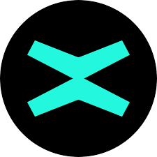
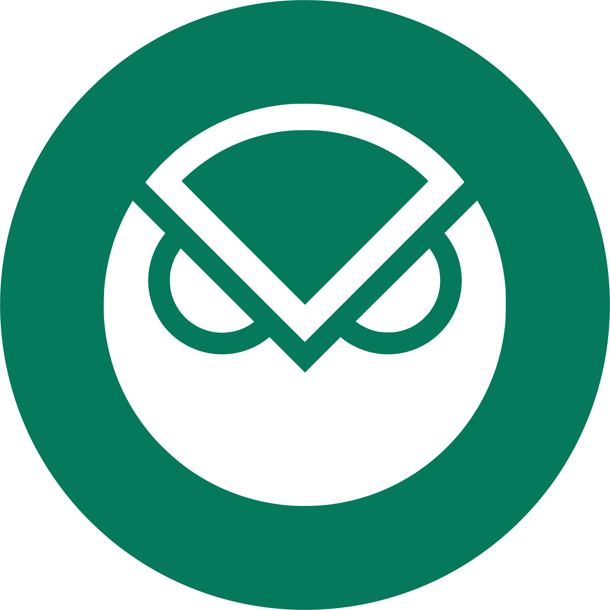

# Supported Chains

## Chains with auto-whitelisting and auto-deployment support

1.  Ethereum
2.  BSC
3.  Polygon
4.  Avalanche
5.  Moonbeam
6.  Fantom

Support of automatic whitelisting and target contract deployment on other chains is in progress.

## Chains supported with manual whitelisting and contract deployment

7.  TON
8.  SKALE
9.  OKC
10.  Caduceus
11.  Godwoken
12.  VeChain
13.  Harmony
14.  Aurora
15.  Tron
16.  Tezos
17.  Algorand
18.  MultiversX
19.  Gnosis
20.  GateChain
21.  Velas
22.  Fuse
23.  IoTeX

## Chains at the final stages of integration

24.  NEAR
24.  Secret Network
25.  Solana
26.  Aptos
27.  Internet Computer
28.  Hedera
29.  Arbitrum (Nova)
30.  Casper