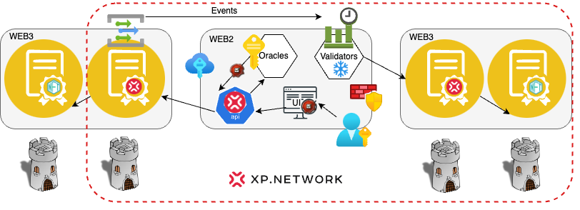

import ReactPlayer from 'react-player'

#  Multilayer Security

## 0. Introduction
The original smart contract's security is out of the XP.NETWORK's scope. All the responsibility for its security lies on the collection team.

## Summary of the bridge hacks

According to [Defilama](https://defillama.com/hacks), since the blockchain technology birth, 39% or **$2.53** billion was stolen from the fungible token bridges out of the total value hacked (TVH) is **$6.46** billion. 

As we can see, the largest known hacks were caused by the Private key Compromise of 16.4% + 7.66% + 1.96% = **26.02%** via social engineering or other methods.

Access control exploits occupy **8.08%**.

Flashloans are involved with 4.74% + 2.42% + 2.22% + 2.22% = **11.6%** attacks. 

Math or logical mistakes are responsible for 6.99% + 2.65% + 1.67% + 1.84% = **13.5%**.

### Latest bridge attacks

|Date|Chain|Bridge|Amount in $|
|:-:|:-:|:-:|:-:|
|Apr 2 2023|Binance|Allbridge|570 K|
|Nov 12 2022|Eth, Solana|FTX|450 M|
|Oct 6, 2022|Binance|Binance Bridge|570 M|
|Oct 2, 2022|Eth, Binance|Transit Swap|21 M|
|Jun 23, 2022|Eth, Binance|Harmony Bridge|100 M|
|Feb 2, 2022|Solana|Wormhole|326 M|
|Nov 7, 2021|Eth, Binance|ChainSwap|4.4 M|

## Bridge components as dungeons

The bridge is built with modular components. Every component is equipped with internal security mechanisms. Neither component blindly trusts any incoming information. 

<ReactPlayer className="introduction-player" controls url='https://www.youtube.com/watch?v=1Os0FLnfNSY=0s' />