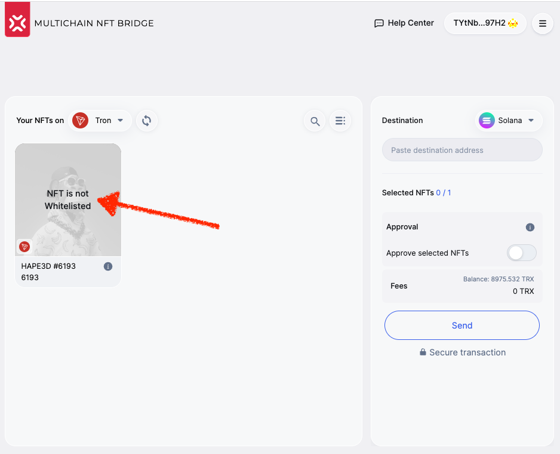

import ReactPlayer from 'react-player'

# Multibridge Version 3.1

The breaking change completely removes the major bottleneck without compromising security - the native contract **whitelisting**. 

Most attacks involve smart contracts due to the nature of the blockchain environment. In the previous versions of the bridge, we meticulously scanned the original contract before allowing the bridge contract to interact with it.

In version 3.1, this is no longer required. We deploy an intermediary contract for holding the locked tokens and releasing them in case someone returns them to the original chain.

## Fully supported chains

When writing this document, ten chains are integrated with complete v3.1 support. They are:

|#|Icon|Blockchain|Bridge chain ID|Protocol|
|:-:|:-:|:-:|:-:|:-:|
|1| | BSC|4|EVM|
|2|| Ethereum|5|EVM|
|3|  |Avalanche|6|EVM|
|4| | Polygon|7|EVM|
|5| | Fantom|8|EVM|
|6| | Gnosis|14|EVM|
|7| | Fuse|16|EVM|
|8| | Velas|19|EVM|
|9| | IoTeX|20|EVM|
|10| | Aurora|21|EVM|
|11| | Godwoken|22|EVM|
|12| | GateChain|23|EVM|
|13| | Solana|25|Solana|
|14| | NEAR|31|NEAR|
|15|  | Moonbeam|32|EVM|
|16| | ABEYCHAIN |33|EVM|
|17| | Caduceus|35|EVM|
|18| | Arbitrum (Nova)|37|EVM|

## Before the change

Before we removed the limitations, the NFTs whose contracts had not been manually whitelisted by the team members we visible in the bridge UI; however, the bridge contract and the bridge UI would refuse interaction with an untrusted contract to prevent potential attempts of the bridge contract attacks. The warning "NFT is not Whitelisted" can still be encountered on chains where version 3.1 of the bridge has not been implemented yet, for example, Tron. Once all chain support is upgraded to version 3.1, no such bottlenecks will prevent users from free token transfers without compromising the users' or the bridge's security.

## A shot video introduction to v3.1

<ReactPlayer className="introduction-player" controls url='https://www.youtube.com/watch?v=B1R6qkEekN8=0s' />