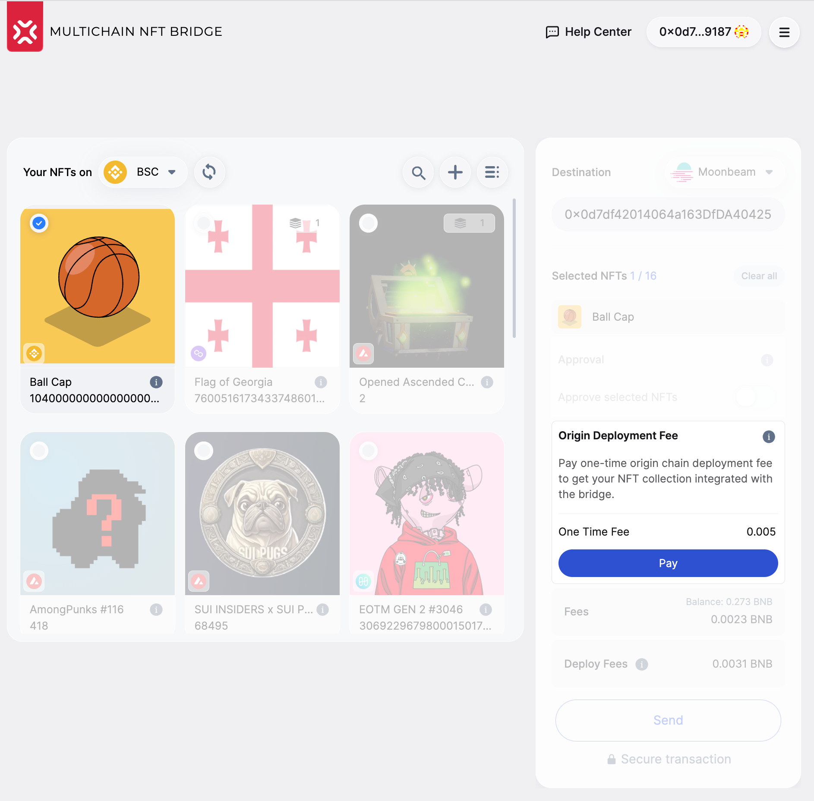
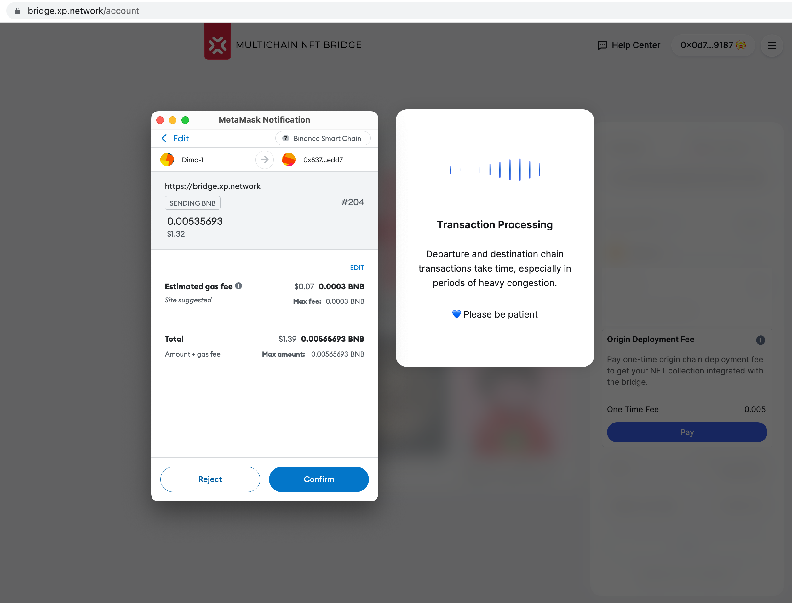
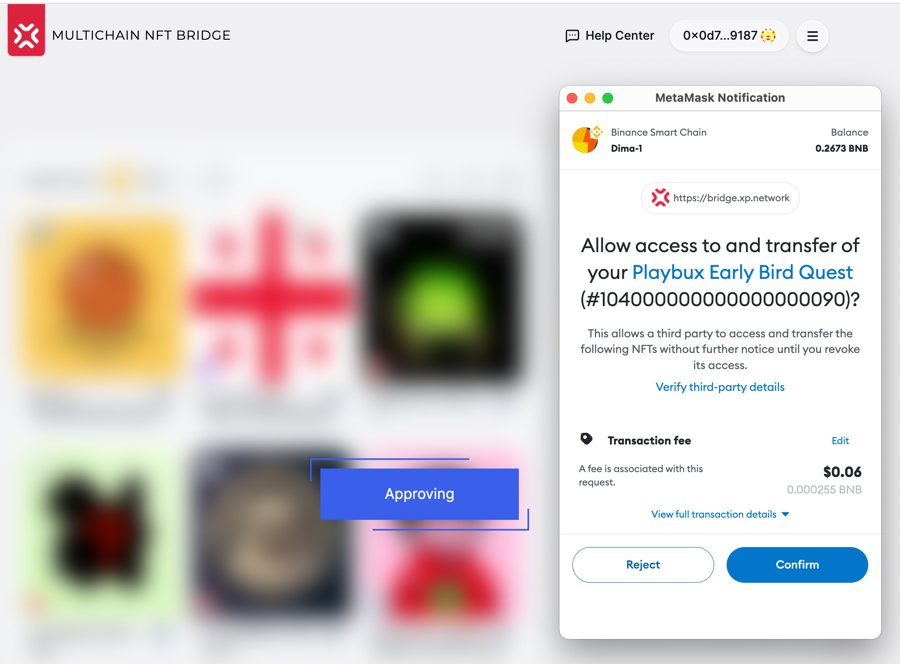
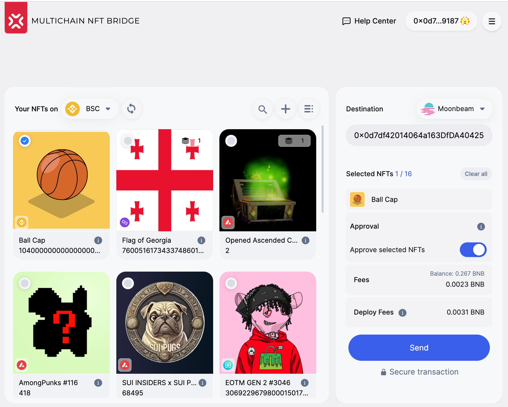
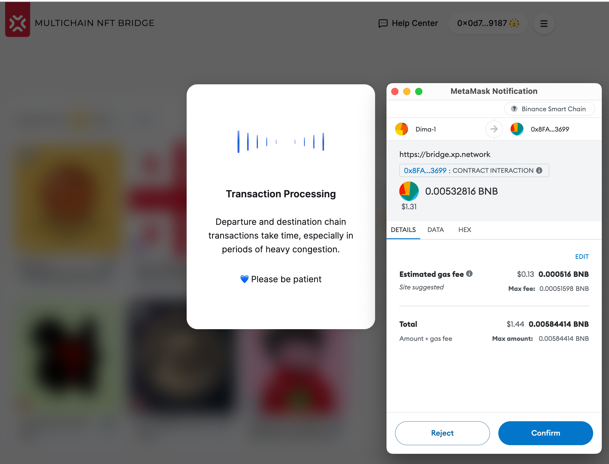
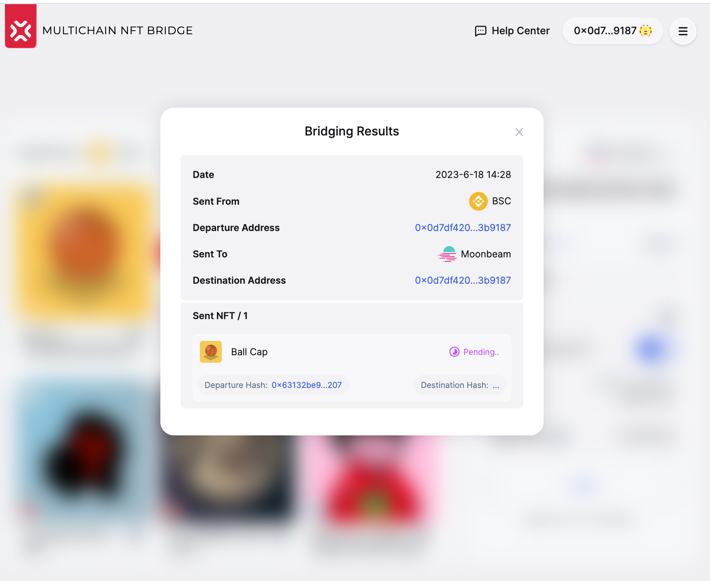
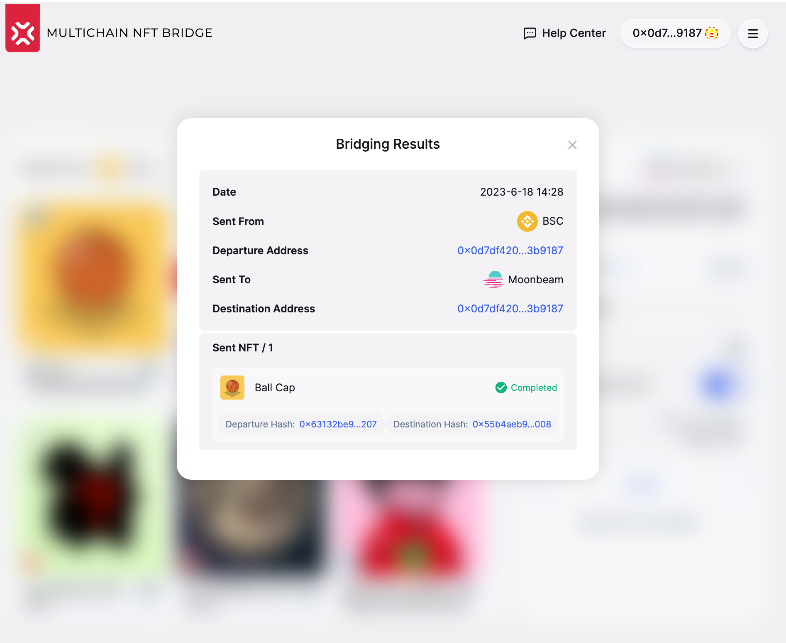
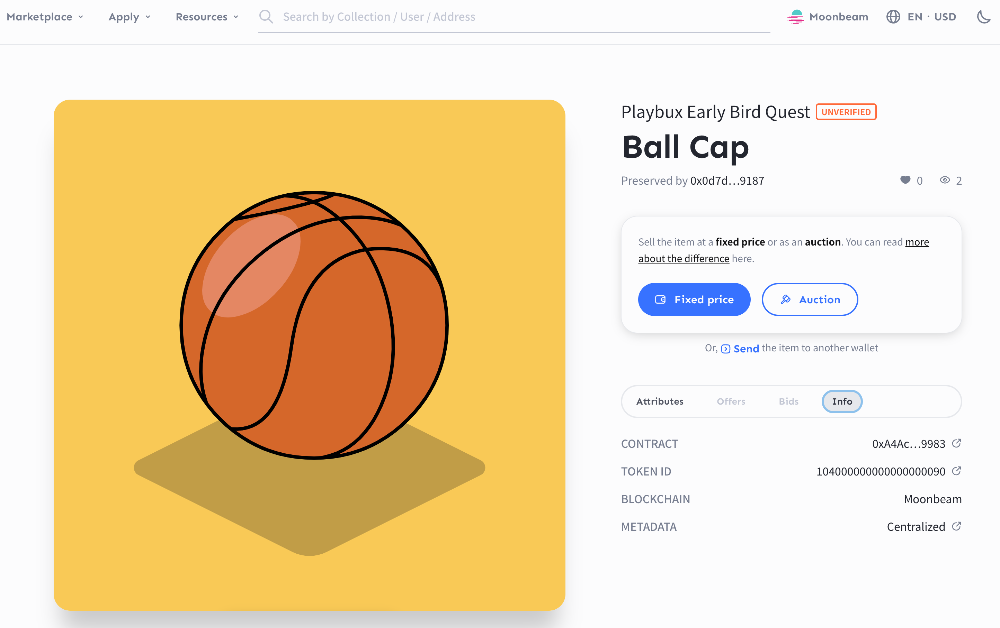
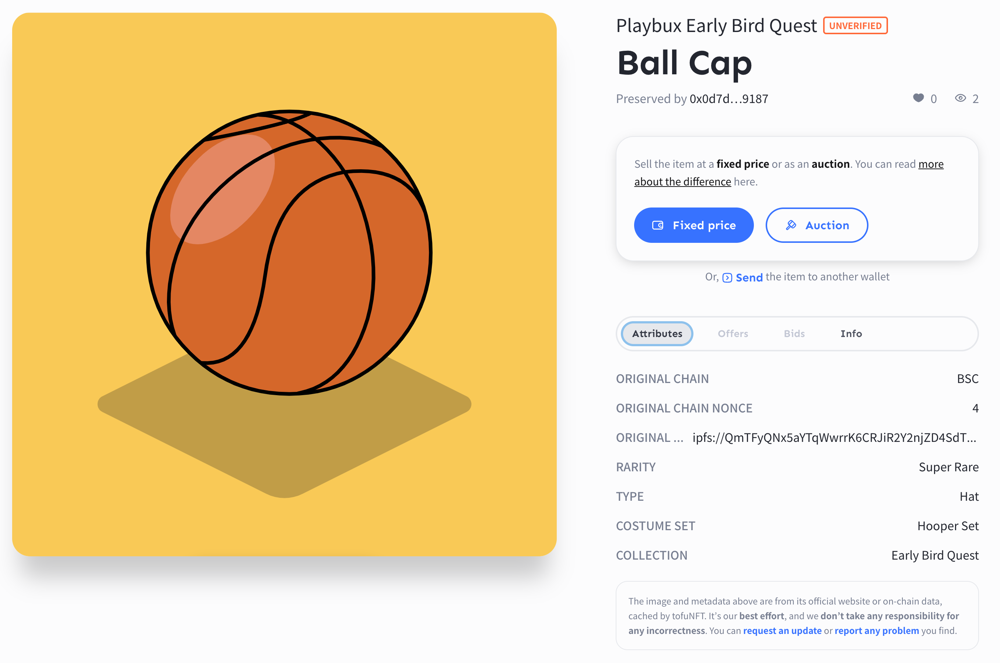
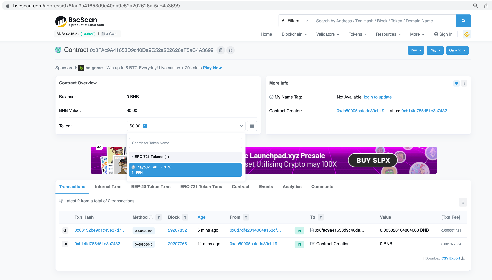

# Breaking Changes in v3.1

## 1. Original chain contract deployment

The first and foremost change is deploying a contract for locking the NFT collection on the chain of origin. 
1. It replaces `whitelisting.`
2. Protects the bridge contract from direct interaction with NFT collection contracts
3. Distributes risks: all NFT collection contracts interact with at most one locker contract. Should the NFT contract be malicious, it won't be allowed to interact with the bridge or other collection lockers.

The change in the user flow:

The first NFT owner to bridge NFTs from a collection will have to cover the `Locker` contract deployment costs. All the rest can safely bridge their assets without paying for this transaction.

To deploy the `Locker` contract, click the $Pay$ button and then $Confirm$ button in the wallet.

## 2. Approval occurs as usual

Move the `Approve` slider to the right and click the $Confirm$ button in the wallet.

After the transaction succeeds on the chain of departure, the slider will switch to the $ON$ state. The $Send$ button will become active.

## 3. Transferring NFTs

NFT Transition happens similarly to the previous versions. Click the $Send$ button, and you'll be taken to the wallet.

Press the $Confirm$ button in the wallet. 

Wait for the transaction to succeed. It might take longer if it is the first time NFTs from a collection are bridged to a destination chain because a designated contract is deployed to keep the ledger of the collection tokens. In normal conditions, it can take from 1 minute to several minutes. If the destination chain is congested (too many transactions)

Once the transaction succeeds on the destination chain, the notification is propagated to the bridge UI, and you can check the transaction on the target chain.

You can also check that the NFT arrived properly on a marketplace that supports the destination chain. To find your NFT, you are usually requested to log in with the destination wallet and check the tokens this account owns. In our example, we found the bridged NFT in TofuNFT. We can see that the token is now on Moonbeam, managed by a contract deployed deliberately to hold the wrapped collection from BSC. 

Switching to the attributes tab, we can inspect that all the original attributes have been preserved in the wrapped token. The attributes include the link to the original URL in case a game or a Metaverse requires it, and the contents of the original metadata are dynamically changed due to the user activity.

In the destination chain explorer, you can check the NFT belongs to the designated receiver.

If you are the first one who sends tokens from a collection to the target chain, you can see that a new contract was deployed to hold the wrapped collection. When bridging ERC721 NFTs, you can compare the original and the wrapped contract's name and symbol. They should match. Since the ERC1155 standard does not have the name & symbol attributes, they are not to be expected in the destination contract.