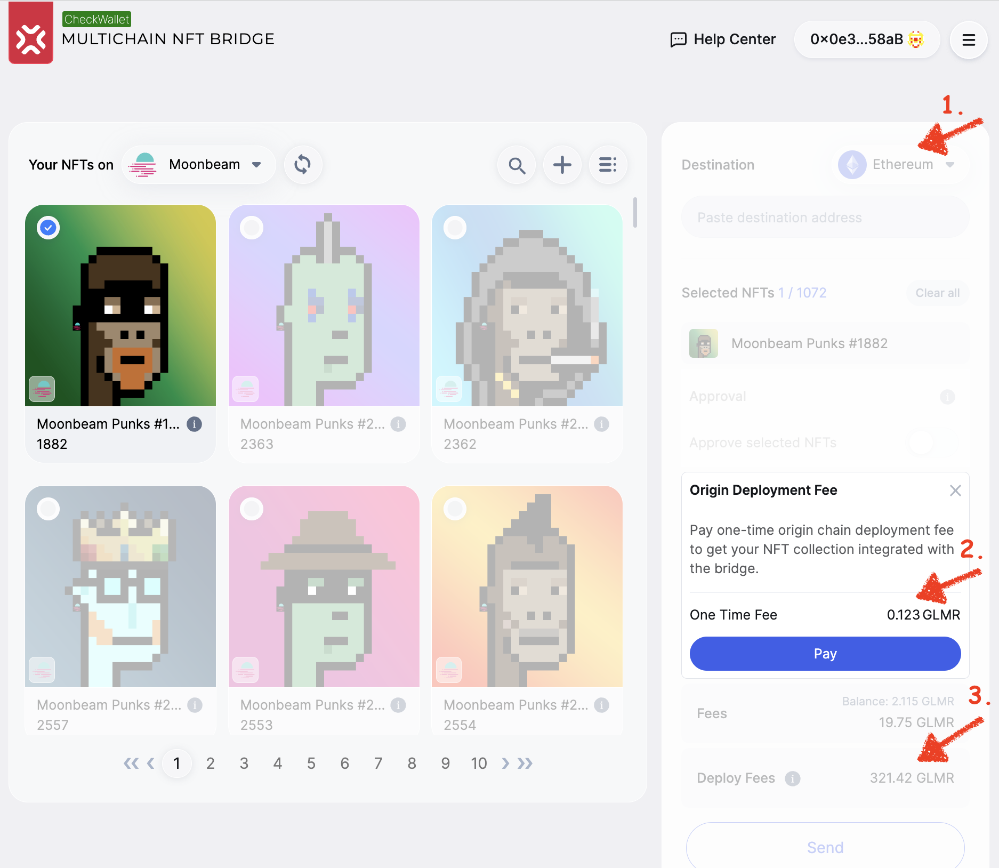
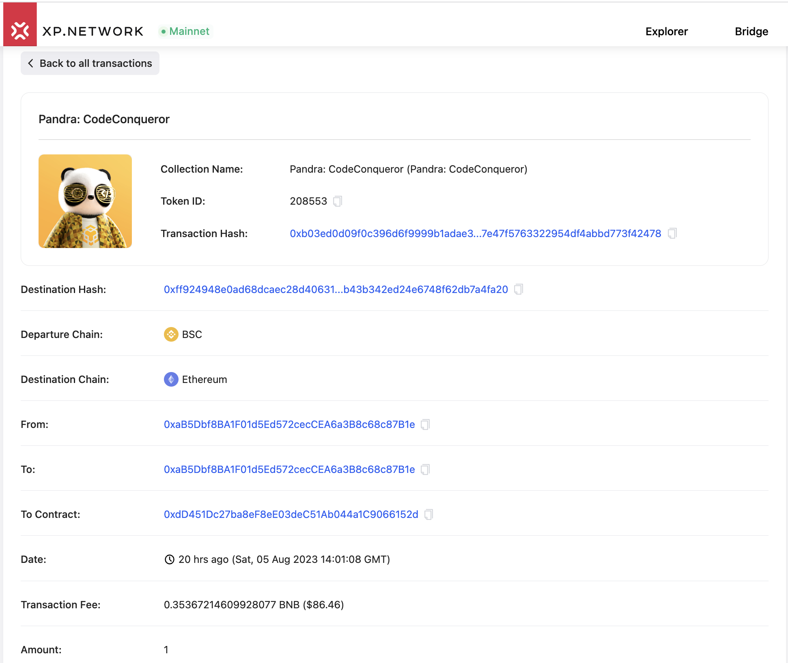

# Bridging Fees in v3.1

## Disclaimer

This document provides a general idea and price approximations for several popular integrated chains rather than presenting a public offer. Current bridge architecture allows the NFT sender to pay all the fees on the chain of origin and the chain of destination in the native coin of the chain where the bridge NFT is currently available. Several objective factors do not allow us to guarantee identical transaction fee rates over time. Here are some of them:

#### Transaction fees

The prices mentioned in the document are based on the transaction and gas fees available on August 6th, 2023. These rates are specific to that date and may not reflect the current rates if accessed later.

#### Token price volatility

Cryptocurrency markets are known for their volatility, and token prices can experience significant fluctuations over short periods. Therefore, the dollar or native token equivalent amounts mentioned in the document may change if the underlying token prices change.

#### Network Congestion

Blockchain networks often face periods of congestion where transaction processing times may be longer, and transaction fees could rise. This congestion can affect the overall cost of bridging between different networks.

The document aims to provide an overview and approximate price estimations for bridging fees across several popular integrated chains. It is not meant to be a precise, real-time, or permanent representation of the costs involved but rather an informative guide.

#### What fee am I paying?

All the fee-related information is transparently displayed in the bridge UI for the users to decide whether they are ready to approve the next action.

1. Ethereum is notorious for its high transaction fees. Most other chains look very affordable compared to the `mainnet`.
2. The first time a collection is bridged to a foreign chain, a designated `locker` contract is deployed to hold the NFTs of this specific collection. It prevents the bridge contract from interacting with third-party contracts or users, protecting it and its ecosystem from potential hacks.
3. The other fees, including the deployment cost on the chain of destination, can be found on the bottom right panel under the user balance.

Another source of information is the wallet software. Most browser extensions and mobile applications explicitly inform the user what fees or amounts they will approve for payment. 

## 1. Fee breakdown

Let's take a recent real-life example where an [unknown user](https://bscscan.com/address/0xab5dbf8ba1f01d5ed572ceccea6a3b8c68c87b1e) bridged the first NFT from their collection and paid for the contract deployment en-route BSC -> Ethereum. 

1. The first paid transaction happens between the user and the token smart contract. The user approved the bridge in the NFT contract for this NFT to be later withdrawn by the bridge contract.

2. On the chain of origin (BSC), the user paid the transaction fee on BSC and the bridge deployment fee.

|#|Fee in BNB| In USD | Description|
|:-:|:-:|:-:|:-:|
|1|0.00013998 BNB|$ 0.03| [Approval chain fee](https://bscscan.com/tx/0x969244dccc3ad8b7d9a6e962ead4f599b1c5cb5612c6b631cb7cbaa5222d0b05)|
|2|0.000237651 BNB| $ 0.06| Chain fee|
|3|0.35367214609928078 BNB|$86.27| [Deployment fee](https://bscscan.com/tx/0xb03ed0d09f0c396d6f9999b1adae32efa7e47f5763322954df4abbd773f42478)|
|SUM|0.35404977709 BNB| $ 86.36| TTL user paid|

All the following owners of the same collection will only pay the approval and the chain fee, ~ \$0.09 plus the fee on the destination chain, approximately \$6.12 plus the bridge fee of $ 0.5 - 1.5.

3. On the destination chain (Ethereum), we see several transactions related to the bridging process covered by the XP.NETWORK bridge from the funds collected from the user on BSC.

|#|Fee in ETH| In USD | Description|
|:-:|:-:|:-:|:-:|
|1|0.043373820431545032 ETH| $ 79.32 | [Deployment fee](https://etherscan.io/tx/0x3685fa741c6bbe6249d4c774cd4a007598ee864782333b9b8bf0ace2de843939)|
|2|0.003343894527347874 ETH|$ 6.12| [NFT Minting fee](https://etherscan.io/tx/0xff924948e0ad68dcaec28d406315a65b7449b43b342ed24e6748f62db7a4fa20)|
|SUM|0.04671771495 ETH| $ 85.44| Paid the Bridge|
|Margin|XP.NETWORK|$0.92| 1.06%|

## 2. Fee comparison by chain

1. Deployment of a smart contract holding the locked NFTs while they are available to the users on other chains.

| Origin |Logo| Native Tokens | USD Equivalent|
|:-:|:-:|:-:|:-:|:-:|
|Moonbeam||0.123 GLM|$0.03|
|BSC|| 0.0023 BNB | $ 0.76 |
|Ethereum||0.0166 ETH| $ 33.56|
|Polygon|| 0.97 MATIC | $ 0.66 |
|Near|| 2.6 NEAR | $ 3.51|
|Solana|| 0.117 SOL | $ 2.7 |

2. Collection contract deployment on the chain of destination. Tested from Moonbeam. Therefore the original prices are in GLM for all chains but Moonbeam.

| Origin |Logo| Native Tokens | USD Equivalent|
|:-:|:-:|:-:|:-:|
|Moonbeam|| 0.028 SOL | $ 0.65 |
|BSC|| 11.88 GLMR| $ 2.72|
|Ethereum||321.42 GLMR|$ 73.60|
|Polygon|| 3.10 GLMR | $ 0.71 |
|Near|| 35.17 GLMR | $ 8.06 |
|Solana|| 3.30 GLMR | $ 0.76|

3. Transaction fees on different chains. The information was collected from the live transactions available in the [bridge explorer](https://explorer.xp.network/).

| Origin |Logo| Native Tokens | USD Equivalent|
|:-:|:-:|:-:|:-:|:-:|
|Moonbeam||2.39645672170312375 GLMR| $ 0.55|
|BSC|| 0.002394585227549661 BNB | $ 0.58|
|Ethereum|| 0.00138984066 ETH | $ 2.6 (to TON) |
|Polygon|| 0.263663587695235051 MATIC | $ 0.18|
|Near|| 0.36386 NEAR | $ 0.49|
|Solana|| 0.029 SOL | $ 0.67|

5. XP.NETWORK Margin

The margin of the bridge is there to cover the cost of the potential slippage while exchanging the native chain for the destination chain tokens and to generate incoming liquidity flow to develop, maintain, improve, and further expand the bridge. It varies from chain to chain between $ 0.5 - $ 1.50 depending on the slippage.

## 3. Bridging NFTs vs. SFTs

Bridging one NFT and one SFT should cost the same to a user. The magic begins when batch bridging from ERC1155 contracts. The most expensive on-chain operation is writing to a new 32-byte slot. It usually costs 21,000 gas on EVM chains. The dollar equivalents vary so much because the monetary value of the tokens is different.

The trick with batch transactions is that the storage slots are touched fewer times than when individual tokens are transferred. It makes batch bridging so attractive. Sometimes, approximately ten SFTs can be bridged at the cost of bridging two regular NFTs.

### Summary

To round this document up, it is important to understand that: 

1. The charged fees are much smaller than the added value the bridge brings. 
2. Contracts become connected across networks without breaking consistency and integrity. NFTs can be sent back and forth multiple times, and should there need be, at the end of the journey, you can get your original NFT on its native chain as if it never traveled.
3. There's no need to learn blockchain programming, especially in Non-EVM ecosystems. The bridge deploys a valid NFT contract, mints standard NFTs, or automatically burns them if the owner sends them to another chain.
4. Bridges open the doors to new markets and allow freedom of asset movement across platforms.

