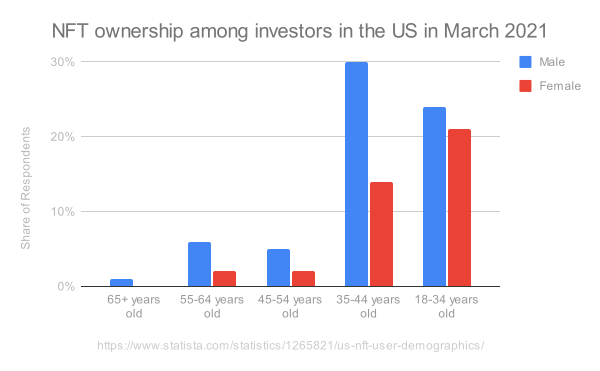

# Non-Fungible Token Utilities

Even though the first non-fungible token prototypes "Colored Coins" appered as extended Bitcoin in December of 2012[^1], after 10 years their potential is still too far from being exausted. Mani Rosenfeld, the author of the "Colored Coins" laid the usage foundation by suggesting several colored bitcoin utilities: 

## Smart Property
1. Mobile phones & computers
2. Vehicles
3. Real estate

## Company Stock
1. Issuing shares used for company governance (voting)
2. Trading like physical equity shares
3. Paying and receiving dividends 

## Bonds
1. Commodity options
2. Futures

Most of the usecases proposed by Mani are not widely implemented because they require proper legislation protecting the on-chain rights for traditional physical world property. 

## NFTs - As a Digital Trading Commodity [^2]

Trading on digital marketplaces is not regulated. However, digital assets is an emerging industry with no predefining rules or long trailing past experience. 

Many participants are male millenials[^3] often comming from computer games and thus are used to virtual worlds, and valuables relevant for a specific game.

The bar chart above is a pivioted aggregation of the number of sold PC games per year taken from wikipedia[^4].

There is a distinct correlation between the graph above and the one below. The people who are now 55-65 years old were 17-27 in 1984 at the down of the PC game era. The number of the PC players grew gradually involving the younger generations. The PC and video games have changed the way players percept the reality. For them the objects of the virtual worlds are as real as the physical ones.

Dmitry Williams, a University of Illinois researcher declares that due to the fact that the gameflow is more interactive and intensive than watching TV it has a "***cultivation effect***" even stronger than the one caused by watching television[^5]. The author states that people watching television are eventually inclined to accept the points of view of the mass media they are exposed to. PC games are even more influential. During online games, players can communicate and cooperate their efforts in achieving team goals. Sometimes, the other players create the gameflow for their peers by their actions. They have forums and chats that even further blur the boundaries between the reality and the game. In-game assets such as armor and weapons, gems and magic items are often bought and sold among players for real currency. Such mental preparation has led to eager adoption of NFT by people between 18 and 44 years.

This has become the cause for the success and development of a 

1. Digital art
2. Collectibles
3. Sports Utility
4. Metaverse
5. Games

## Other Use-Cases

**Coupons (Reward points)** - not implemented
1.  Air miles
2.  Bonus coffee cups

**Temporary Smart Keys to an asset or service** - very few examples of implementation
1. Access to a rented out car
2. E-books
3. Software

**Subscription** - very few examples of implementation
1. Museums & National parks
2. Online services (netflix, YouTube, etc.)
3. Public transport pass (daily, monthly, annual)

## Semi-fungible tokens application
There are suggestions for the safe storage of intelligent connected autonomous driving vehicles in a blockchain.  According to the authors of the research[^6], the best place to safely store and share knowledge generated by AI is a blockchain.  A vehicle familiar with a map of an area, driving habits of the inhabitants and other pecularities can form an effective but accident free driving strategy. This strategy can be stored on a blockchain since a blockchain consist of multiple nodes backin up each other. Due to the architecture of the blocks (every block is linked to its predecessor by holding its hash) blockchains are hard to temper with. Other vehicles, new to the area, can download the shared experience into their memory and behave effectively in an unknown environment. 

Extending the initial ideas of the authors of the article, the local Ai experiences can be minted as semi-fungible tokens and rented-out to temporary visitors and sold to temporary residents. Moreover, successful driving strategy metrics could be attached to the NFTs encouraging the AI controlled vehicles to keep improving their vehicle's experiences, minting and listing the upgraded driving strategies as new SFTs.

## Footnotes

[^1]: Meni Rosenfeld. Overview of Colored Coins. December 4, 2012. https://en.bitcoin.it/wiki/Colored_Coins, https://github.com/Colored-Coins/Colored-Coins-Protocol-Specification  
[^2]: Mayukh Mukhopadhyay ID & Kaushik Ghosh. [Market Microstructure of Non Fungible Tokens](https://arxiv.org/pdf/2112.03172.pdf) p.3 
[^3]: [NFT ownership among investors in the United States in March 2021, by age and gender](statista.com/statistics/1265821/us-nft-user-demographics/) 
[^4]: https://en.wikipedia.org/wiki/List_of_best-selling_PC_games  
[^5]: Dmitri Williams. Virtual Cultivation: Online Worlds, Offline Perceptions. [Journal of Communication ISSN 0021-9916](https://www.researchgate.net/publication/249471380_Virtual_Cultivation_Online_Worlds_Offline_Perceptions) 
[^6]: Haoye Chai, Supeng Leng*, Fan Wu, and Jianhua He. [Secure and Efficient Blockchain based Knowledge
Sharing for Intelligent Connected Vehicles. JOURNAL OF LATEX CLASS FILES, VOL. 14, NO. 8, AUGUST 2015](https://arxiv.org/pdf/2108.01598.pdf)  