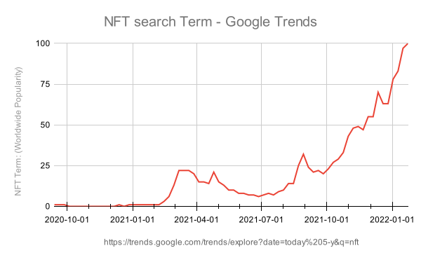
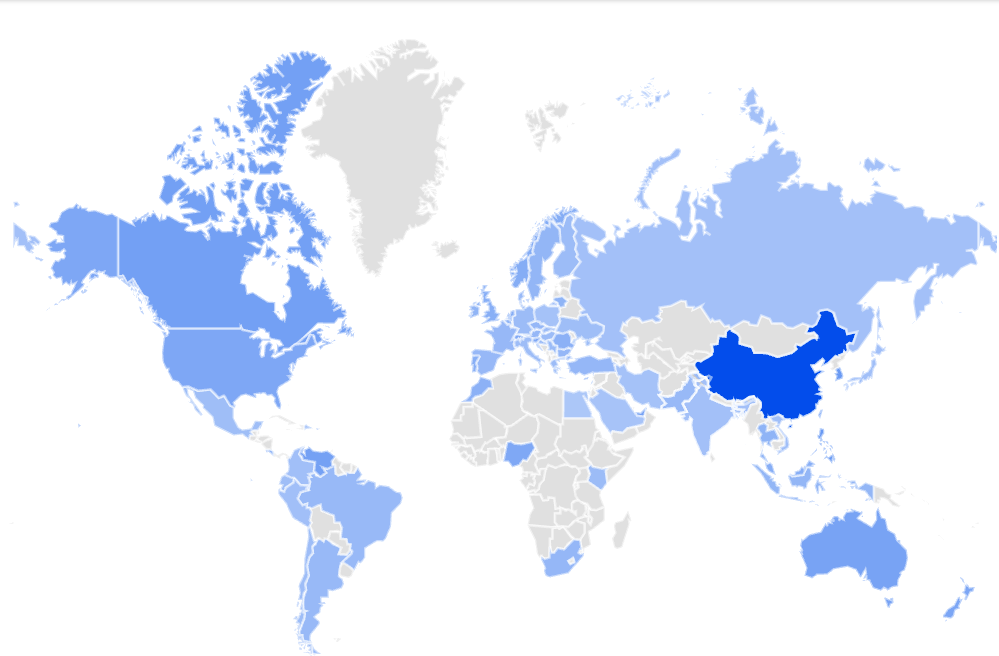

# Who Buys NFTs

 According to Google Trends NFT Started to seriously interest people since the end of 2020 and peaked in January 2022[^1]. The first peak in 11 March 2021 was provoked by the Online Christie's Auction and the sale of an NFT minted on 16 February 2021 by a digital artist Mike Winkelmann better known as Beeple. The piece of art was called "EVERYDAYS: THE FIRST 5000 DAYS" and was purchased for unprecedented USD 69,346,250 [^2].

Numbers represent search interest relative to the highest point on the chart for the given region and time. A value of 100 is the peak popularity for the term. A value of 50 means that the term is half as popular. A score of 0 means there was not enough data for this term.

_vs._Country.svg)

Interest to NFTs by country.

## Footnotes

[^1]: https://trends.google.com/trends/explore?date=today%205-y&q=nft  
[^2]: [25 Feb - 11 Mar 2021 | Online Auction 20447 Beeple | The First 5000 Days](https://onlineonly.christies.com/s/beeple-first-5000-days/beeple-b-1981-1/112924)