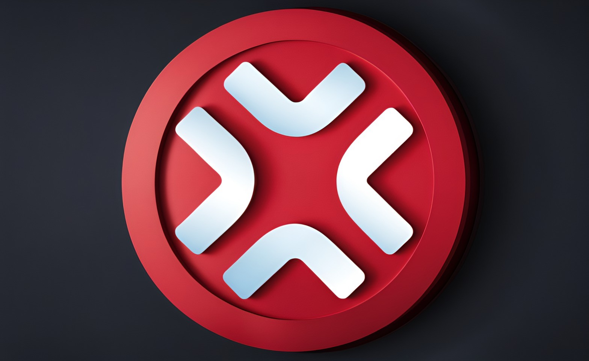
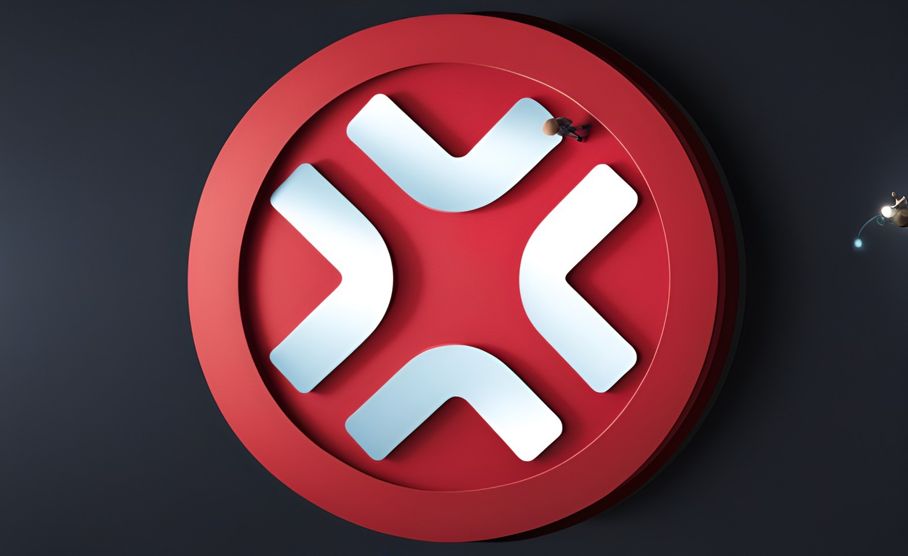
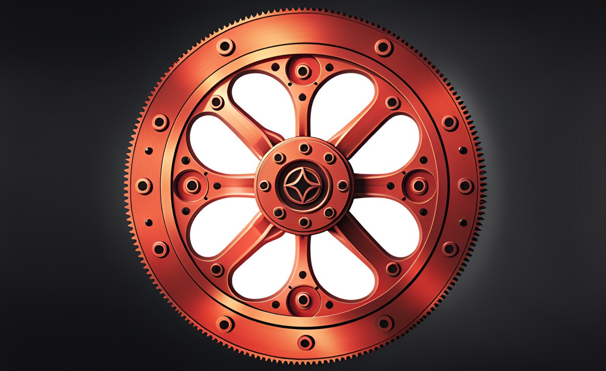
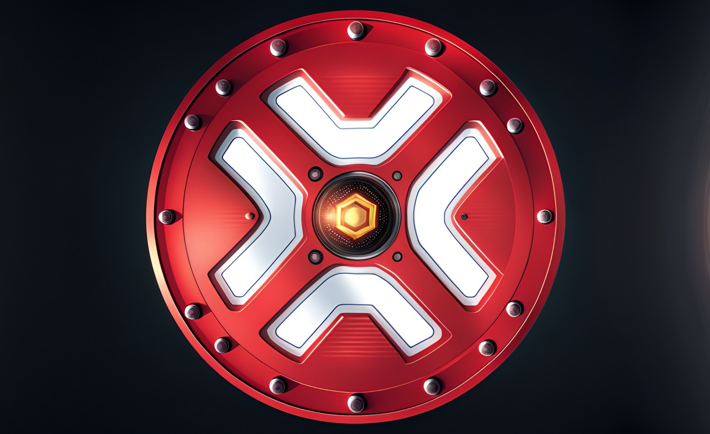
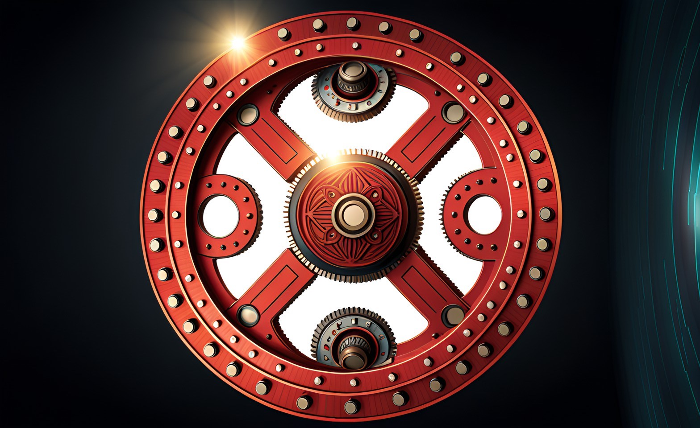

# Bridge Validators

XP.NETWORK, as a cross-chain bridge, plays a crucial role in enabling interoperability and communication between different blockchain networks. Its pioneering approach to **validator decentralization** sets it apart and makes it noteworthy.

*Validators* are essential components in the operation of a blockchain network, responsible for validating and confirming transactions and maintaining the integrity of the network. In traditional centralized systems, a limited number of validators are typically controlled by a single entity or organization, leading to centralization, trust, and reliability concerns. In contrast, XP.NETWORK has embraced a decentralized model for its validators.

**Decentralization** in this context involves the distribution of validator nodes across a network of third-party participants, reducing reliance on a single central authority or a small group of validators. This approach aligns with blockchain and distributed ledger technology principles, where removing centralized control is a fundamental advantage.

## Benefits of Validator Decentralization

### 1. Trust Minimization:
Decentralization decreases the need for users to trust a central entity, as a distributed and diverse set of validators maintains the network's integrity and consensus. It aligns with the trustless nature of blockchain technology.

### 2. Enhanced Robustness and Reliability:
Decentralized validators reduce the risk of a single point of failure. If one or a few validators become compromised or unavailable, the network can continue functioning as other validators secure benevolent transactions.

### 3. Improved Security:
A decentralized validator network is less susceptible to malicious attacks, as it is more challenging for an adversary to compromise a majority of distributed validators simultaneously.

### Cutting-Edge Technologies:
The adoption of decentralization in validator selection and management demonstrates XP.NETWORK's commitment to utilizing cutting-edge technologies. This approach may involve advanced cryptographic techniques, consensus algorithms, and governance models that promote fairness and transparency.

In summary, XP.NETWORK's choice to decentralize its validators is a significant step forward in cross-chain bridge technology. It aligns with the principles of blockchain, enhancing reliability, security, and trust minimization - moreover, the commitment to implementing cutting-edge technologies positions XP.NETWORK is a forward-thinking and innovative solution in the blockchain space.