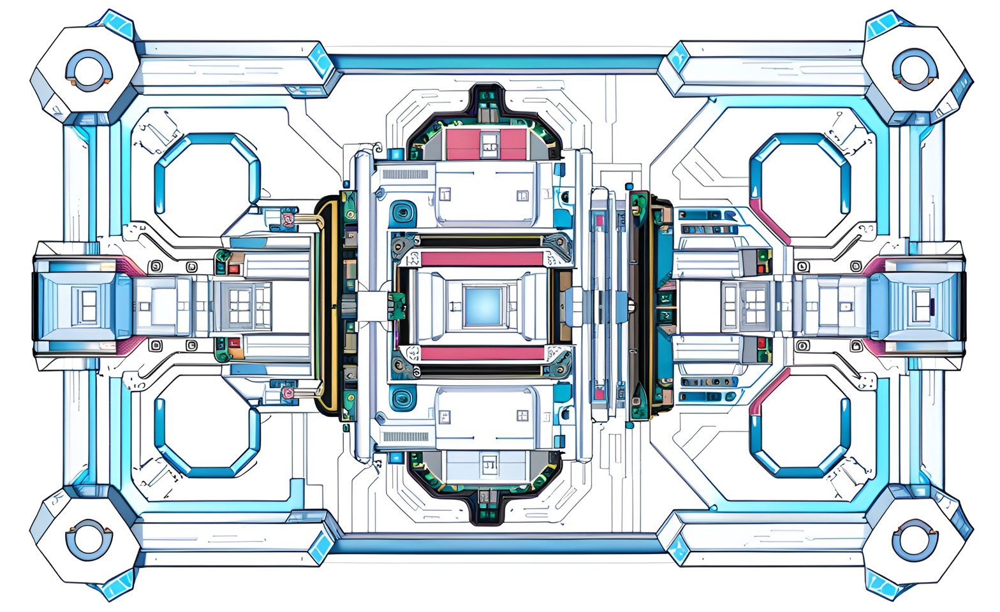
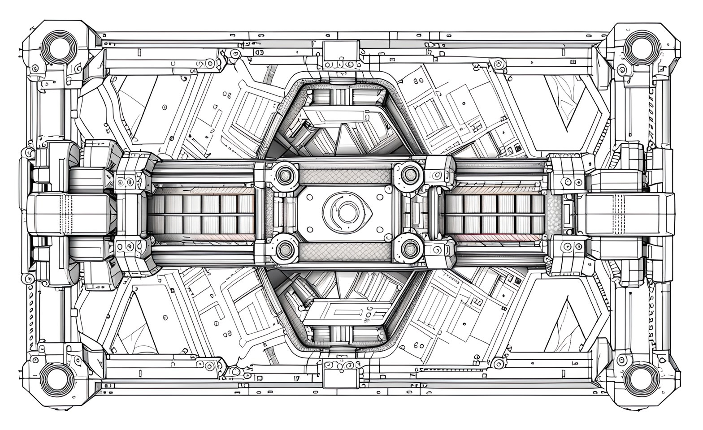

# Substrate Based Validators

## Why Substrate?

The selection of the Substrate blockchain framework for the development of the "XP.NETWORK" NFT Bridge's decentralized validators can be justified based on several fundamental technical considerations and practical advantages. In a highly scientific language, these reasons can be expounded upon as follows:

### 1. Reusability of Solved Challenges

Substrate was chosen due to its intrinsic capability to address and resolve a multitude of inherent challenges within the blockchain ecosystem. These challenges encompass complex areas such as peer-to-peer (p2p) networking, account management, and fundamental blockchain components like block and transaction management. These are formidable obstacles that demand significant engineering effort to overcome by opting for Substrate, the XP.NETWORK NFT Bridge project effectively leverages these pre-engineered solutions, thereby sparing itself the need to painstakingly develop these components from scratch.

### 2. Client Library Abstraction

In the absence of a framework like Substrate, developing a client library to interact with blockchain nodes is an arduous and time-consuming task. Substrate, however, offers a comprehensive and well-documented ecosystem for creating and managing blockchain nodes. It enables the XP.NETWORK team to sidestep the laborious process of constructing a custom client library, which would necessitate a substantial investment in both time and resources.

### 3. Proven Reliability and Endurance

Substrate has undergone rigorous testing and scrutiny by a broad and diverse community of developers and users over an extended period. The framework's robustness and dependability are corroborated by its extensive adoption and real-world usage in numerous blockchain projects. This ensures that Substrate is equipped to handle a wide array of operational conditions and exigencies, further solidifying its suitability for the XP.NETWORK NFT Bridge project.

### 4. Rich Ecosystem of Libraries and Pallets

Substrate's strength lies in its extensibility and modular design. The framework boasts an extensive assortment of libraries and pallets, augmenting and expanding the core functionalities of a blockchain. These readily available extensions offer the XP.NETWORK project is an invaluable resource for enhancing and customizing the network to meet its specific requirements. In this instance, integrating FROST signature distributed FROST group key generation and bridging logic can be seamlessly realized by incorporating the relevant pallets and libraries, thereby reducing the intricacies of implementation.

In summation, the decision to adopt the Substrate blockchain framework for the XP.NETWORK NFT Bridge's decentralized validators is underpinned by a judicious selection that aligns with both the project's requirements and the broader context of blockchain development. Substrate's pre-existing solutions, developer-friendly features, track record of reliability, and extensive ecosystem empower the XP.NETWORK team to focus our efforts on domain-specific functionality, ultimately accelerating the project's development timeline while minimizing development risks.

## Substrate Obstacles
Within the Substrate framework, two distinct architectural components exist - the outer node and the runtime. Each of these components demands different sets of skills and knowledge from Rust programmers, and herein, we explore the challenges developers might face when crafting libraries and pallets in this complex ecosystem.

### 1. Rust Fundamentals and no_std Usage:

Developing libraries and pallets within Substrate necessitates a firm grasp of basic Rust idioms. Programmers must be well-versed in the language's core concepts, including ownership, borrowing, and lifetimes. Additionally, an understanding of working with no_std is essential. no_std is a configuration that allows Rust code to operate without the standard library, which is often required when working with runtime code. Developers need to comprehend the reasons behind employing this minimalistic approach. In Substrate, this constraint arises from the need to create compact, efficient, and deterministic runtime modules. Therefore, the challenge is building logic that functions within these constraints while delivering the desired functionality.

### 2. Macros and their Significance:

The effective use of macros is a crucial aspect of Rust programming in the context of Substrate. Developers must understand which macros are employed and, more importantly, why they are used. Macros enable metaprogramming, a technique where code can be generated at compile time. In the Substrate framework, macros are often utilized to simplify and automate repetitive tasks, making the codebase more maintainable and efficient. The obstacle lies in comprehending the intricacies of these macros, including when and how to create custom macros specific to the project's requirements.

### 3. Asynchronous Rust for Outer Node Development:

Substrate's outer node, responsible for client interactions and network communication, introduces more advanced concepts such as asynchronous Rust. Developers must proficiently manage asynchronous tasks, futures, and event-driven programming. The challenge is to build code that can efficiently handle concurrent operations, network requests, and other asynchronous actions. Asynchronous Rust can be complex, and handling concurrency issues, such as data races and deadlocks, requires careful consideration.

In summary, Rust programmers venturing into the realm of Substrate face distinctive challenges depending on their focus. Those working on runtime modules should master Rust fundamentals, embrace no_std constraints, and understand the macros used for code generation within this context. On the other hand, developers tackling the outer node must delve into the intricacies of asynchronous Rust to effectively manage complex client-side functionalities. While these obstacles may seem formidable, Substrate's well-documented ecosystem and community support provide valuable resources to navigate and overcome these challenges.