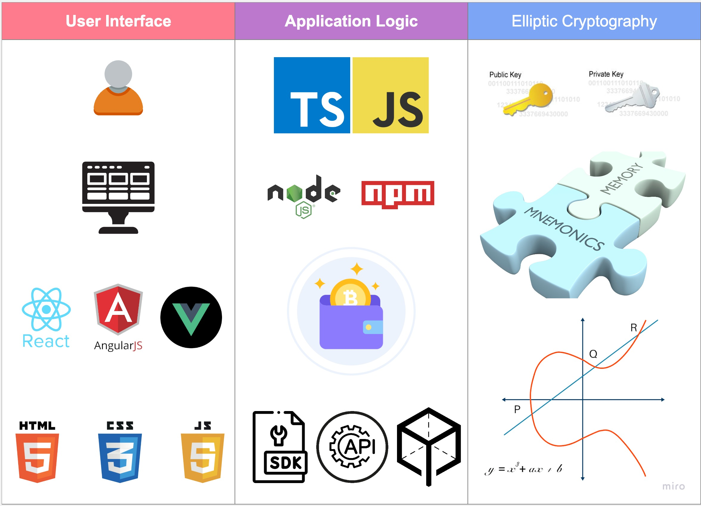

# Introduction to Wallet Support

In this part of the documentation, we will discuss the crypto wallet integration process, obstacles, and pitfalls that might expect developers on their way. We will start with understanding the concept of a crypto wallet and its typical structure and then go deeper into discussing different wallets and blockchain protocols they support.

## Concept

A crypto wallet is a piece of software or user interface that allows to:

1. Generate an [elliptic curve](https://en.wikipedia.org/wiki/Elliptic_curve) key pair ([private & public keys](https://en.wikipedia.org/wiki/Public-key_cryptography) from mnemonic, a random array of 12 or 24 simple words)
2. Store the mnemonic or the private key in a local vault, the PC or mobile Internet browser, or a cold wallet.
3. Enables read and write interaction with the supported blockchains directly or via calling smart contract functions.
4. Support one or several token standards, primarily for fungible and sometimes non-fungible tokens.

Theoretically, it is possible to interact with the blockchain without a crypto wallet. In that case, one could store the mnemonic or a private key of an account in a file and access it every time one needs to sign a transaction. Interacting with the blockchain this way is possible via multiple CLI tools or protocol's SDK libraries, allowing blockchain interaction from code without a user interface.

## Structure

A crypto wallet typically consists of two main components: the client-side interface and the server-side infrastructure (in the case of browser extensions, the server-side infrastructure is often minimal). Let's break down the structure of a crypto wallet:

### 1. Client-Side Interface:
- **User Interface**: The client-side interface provides a graphical user interface (GUI) that allows users to interact with the wallet. This interface is typically built using web technologies like HTML, CSS, and JavaScript if a wallet is a browser extension. It utilizes JavaScript frameworks like React, Vue.js, or Angular to create a responsive and interactive user experience.
- **Application Logic**: The client-side application logic handles user interactions, communicates with the blockchain network, manages accounts, and executes transactions. This part of the UI includes features like account management, transaction signing, and interaction with decentralized applications (dApps) through protocol SDK libraries or web3 API calls to blockchain nodes allowing RPCs (Remote Procedure Calls).
- **Wallet Encryption**: The client-side wallet encrypts sensitive data like private keys and mnemonics. Users must set up passwords or passphrases to protect their wallets and ensure secure access. They implement elliptic curve algorithms to generate private and public keys and sign messages. The most popular WEB3 algorithms are: secp256k1, Curve25519, secp256r1 and ed25519.

### 2. Server-Side Infrastructure (Minimal in the case of browser extensions):
- **Blockchain Network Interaction**: The wallet can connect to blockchain networks like Bitcoin, EVM, Solana, or others. It communicates with the respective network's nodes or through intermediary APIs like Infura to fetch blockchain data, submit transactions, and retrieve account information.
- **Account and Transaction Management**: The wallet may store account-related data such as addresses, balances, and transaction history. However, in the case of browser extensions, this data is often stored locally on the user's device, and a centralized server-side infrastructure may need to be involved.
- **Network Configuration**: The wallet may allow users to configure the network they want to connect to, including choosing custom nodes or using predefined network configurations like the Ethereum mainnet, testnets, or other blockchain networks.

### 3. Additional Features:
- **Token Support**: Wallets often support managing and interacting with various tokens, including fungible tokens (ERC-20) and non-fungible tokens (ERC-721) on EVM or other blockchain platforms.
- **Browser Integration**: Extensions integrate with the browser environment to interact with web pages and dApps. They inject JavaScript code into visited web pages to detect and handle cryptocurrency-related transactions or interactions.
- **Security Measures**: Wallets implement security features such as seed phrase backup, hardware wallet integration, and two-factor authentication (2FA) to enhance the security of users' funds and accounts.

## Wallet Integration Milestones

Integrating a wallet with a decentralized application (dApp) involves enabling the dApp to interact with the user's cryptocurrency wallet for various transactions and operations. The process of wallet integration typically includes the following steps:
### 1. Choosing A Wallet:
Integrating new blockchain protocols involves the integration of new wallets popular in the integrated ecosystem. More often than not, the wallets are chosen because of their popularity which, in its turn, depends on user experience, security and 
### 2. Connecting to the Blockchain Network:
The first step of wallet integration is implementing the connection between the wallet and the dApp, XP.NETWORK bridge in our case.
### 3. Requesting User Permission:
When the user loads the dApp, it should request permission to access the wallet and interact with it on the user's behalf. It is typically done through the web3 library, which prompts the user to approve the connection.
### 4. Retrieving Account Information:
Once the user approves the connection, the dApp can access their account information, such as their wallet address, balance, and other relevant data. This information can display the user's fungible and non-fungible balance or account details within the dApp.
### 5. Transaction Signing:
When the user wants to perform a transaction (e.g., sending cryptocurrency, interacting with a smart contract), the dApp creates the transaction data and sends it to the user's wallet through the web3 library for signing. The wallet then prompts the user to approve or reject the transaction, and if approved, it signs the transaction using the user's private key.
### 6. Broadcasting Transactions:
After the user's wallet signs the transaction, the dApp receives the signed transaction data. It then broadcasts this signed transaction to the blockchain network using the web3 library relevant to the integrated blockchain protocol and the wallet. The transaction is propagated to the network for processing and inclusion in a block.
### 7. Handling Responses and Events:
The dApp should handle responses from the blockchain network, such as transaction confirmations or errors. It can also listen for events emitted by smart contracts to update the dApp's UI or perform other actions based on these events.
### 8. Error Handling and Security:
Proper error handling is essential to provide a smooth user experience. The dApp should handle cases where the wallet is unavailable. The user rejects a transaction or other potential issues gracefully.
Security measures should be implemented to protect the user's sensitive information, and the dApp should follow best practices to prevent potential vulnerabilities.

