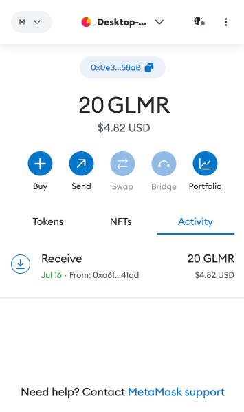
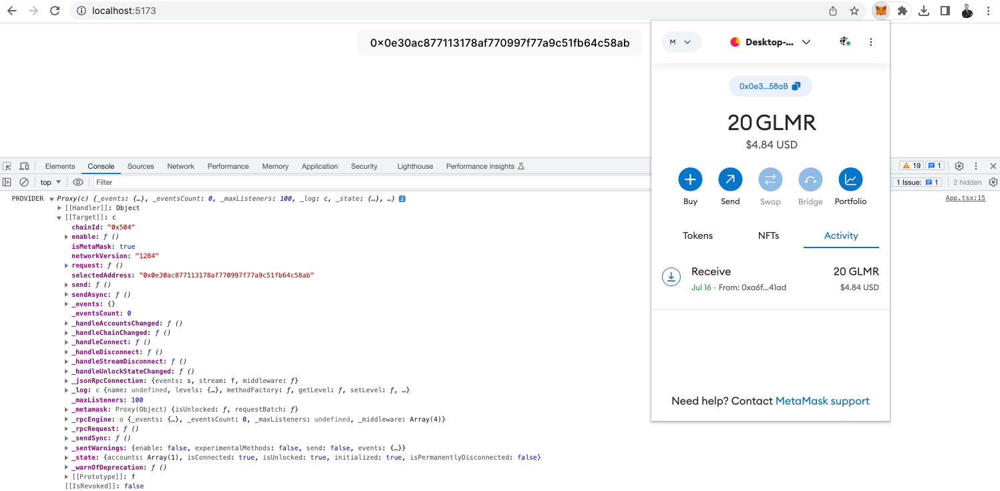
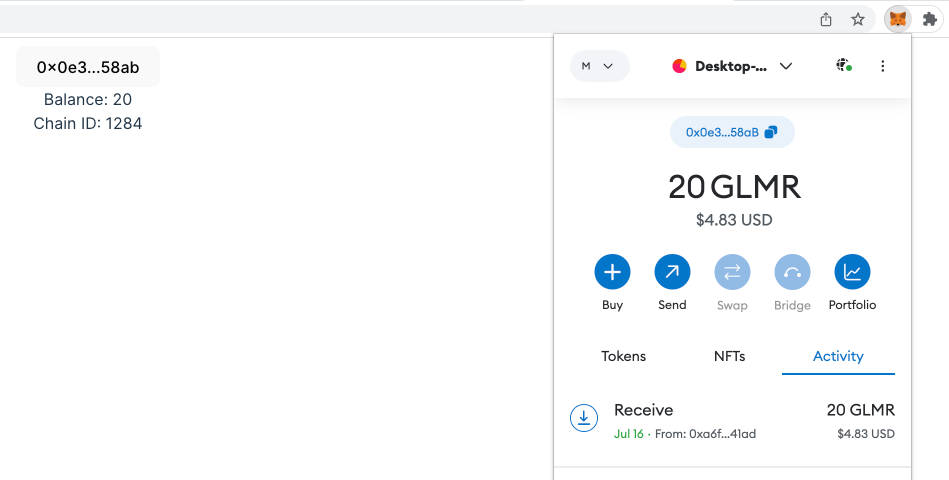

# Metamask integration

MetaMask, headquartered in San Francisco, is a decentralized Ethereum wallet founded by [Aaron Davis](https://coinmarketcap.com/alexandria/people/aaron-davis) in 2016. [ConsenSys](https://consensys.net/blog/metamask/) operates it and offers various functionalities such as storage, purchasing, sending, converting, and swapping various cryptocurrencies. This wallet is [accessible](https://metamask.io/download/) as a mobile app (iOS & Android) and a browser extension, compatible with several major web browsers (Chrome, Firefox, Brave, Edge, Opera).

<center>



</center>

One of MetaMask's key features is its non-custodial nature, ensuring users retain full control of their private keys. Notably, it stands out for securely connecting users to different blockchain-based applications, enabling them to explore the decentralized web 3.0. Furthermore, MetaMask utilizes liquidity providers to facilitate transactions, eliminating the necessity for third-party intermediaries in trade liquidity.

MetaMask has earned its position as the preferred wallet for millions of users due to its exceptional ease of integration with any Ethereum Virtual Machine (EVM) chain. Its seamless compatibility with over 60 plus EVM chains sets it apart from other wallets, making it a go-to option for cryptocurrency enthusiasts and developers.

The wallet's user-friendly interface and straightforward setup have contributed to its popularity. Users can quickly connect to various EVM chains and manage their assets conveniently. This simplicity has been crucial in attracting a vast user base, ranging from newcomers to experienced blockchain enthusiasts.

MetaMask's commitment to security and non-custodial control of private keys also instills trust in its users. People feel assured that their digital assets are safe and under their full control while using the wallet.

Moreover, MetaMask's active participation in the broader blockchain ecosystem has further solidified its reputation. The wallet demonstrates its dedication to facilitating seamless interactions with diverse, decentralized applications and ecosystems by supporting a wide range of EVM chains.

The wallet's versatility extends beyond the desktop, as it is a mobile app, enabling users to manage their crypto assets on the go. This mobile accessibility has further widened its appeal and convenience for users who prefer to manage their cryptocurrencies from their smartphones.

MetaMask's continuous updates and improvements have also contributed to its widespread adoption. The development team consistently adds new features and enhancements, responding to user feedback and staying ahead in an ever-evolving blockchain landscape.

All these factors combined make MetaMask the go-to choice for millions of users seeking a secure, user-friendly, and versatile wallet that seamlessly integrates with various EVM chains, enabling them to explore and engage with the world of decentralized finance and blockchain-based applications.

## Desktop Integration

In this tutorial we fixed all the TyepScript errors thrown during the official Metamask [integration tutorial](https://docs.metamask.io/wallet/tutorials/react-dapp-local-state/). Follow the steps below to integrate Metamask in your desktop dApp:

### 1. Creating and Running a React Repo

React has long become the WEB3 industry standard for building dApps. Create or enter your existing React Application.

```shell title="Terminal"
cd your-project-folder/
npm create vite@latest . -- --template react-ts
```
Agree to install the following package `create-vite@4.4.1` by typing `y`.

To run the project with a package manager you prefer, e.g., `yarn`, `npm`, `npx vite` or `pnpm`:

```shell title="Terminal"
yarn
yarn add @metamask/detect-provider
yarn dev
```

The default URL for the project will be: `http://localhost:5173/`. Open it in the browser of your choice to see the changes.

### 2. Connecting to Metamask

Add an interface in the root of your project to patch the TypeScript environment type checking. Update or create the file `./src/vite-env.d.ts` like so:

```ts title="./src/vite-env.d.ts"
interface Window {
    ethereum: {
        on: (string, unknown) => void,
        request: ({method:string}) => string[],
        removeListener: (string, unknown) => void,
    };
}
```
Update the `./src/App.tsx` according to the code snippet below:

```ts title="./src/App.tsx"
import { useEffect, useState } from 'react'
import './App.css'

function App() {

  const [isMetamaskInjected, setMetamaskInjected] = useState(false);

  useEffect(() => {
    if (typeof window.ethereum !== 'undefined') {
      setMetamaskInjected(true);
      console.log("METAMASK:", window.ethereum);
    }
  }, []);

  return (
    <div className="App">
      <button>
        {isMetamaskInjected
          ? "Connected"
          : "Connect MetaMask"}
      </button>
    </div>
  )
}

export default App
```

<center>


</center>

### 3. Detecting a Metamask Provider

Import `detectEthereumProvider` as default:

```ts
import detectEthereumProvider from '@metamask/detect-provider';
```

Replace all the code inside `useEffect(() => { }, [])` with:

```ts
const getProvider = async () => {
    // {silent: true} to silence console errors if missing
    const provider = await detectEthereumProvider({silent: true});
    console.log("PROVIDER", provider);
    setMetamaskInjected(Boolean(provider));
}
getProvider();
```

### 4. Injecting the user account

```ts
import { useEffect, useState } from 'react'
import detectEthereumProvider from '@metamask/detect-provider';
import './App.css'

function App() {

  const initialState = { accounts: [] as string[] };    /*NEW*/
  const [wallet, setWallet] = useState(initialState);   /*NEW*/
  const [isMetamaskInjected, setMetamaskInjected] = useState(false);


  useEffect(() => {
    const getProvider = async () => {
      const provider = await detectEthereumProvider({ silent: true });
      console.log("PROVIDER", provider);
      setMetamaskInjected(Boolean(provider));
    }
    getProvider();
  }, []);

  /** NEW from here */

  const updateWallet = async (accounts: string[]) => {
    setWallet({ accounts })
  }

  const handleConnect = async () => {

    let accounts: string[] = [];

    if (typeof window.ethereum !== 'undefined') {
      accounts = await window.ethereum.request({
        method: "eth_requestAccounts",
      })
    }

    updateWallet(accounts)
  }

  /** up to here */

  return (
    <div className="App">
      <button onClick={handleConnect}> {/* NEW */}
        {isMetamaskInjected
          ? wallet.accounts.length > 0  /* NEW */
            ? wallet.accounts[0]        /* NEW */
            : "Connect Wallet"
        : "Install Metamask"            /* NEW */}
      </button>
    </div>
  )
}

export default App
```

As a result we will inject the account from Metamask to our dApp and will be able to interact with it.

<center>



</center>

### 5. Getting the user balance & chainID

Check the changes below to see how to get the user's balance & the chain ID.

To transform the balance to a human-readable form, add the following function to a separate file for fast loading.

```ts title="./scr/utils.ts"
export const formatBalance = (balanceInWei: string): string => {
    const balance = BigInt(balanceInWei) / BigInt(1e18)
    return balance.toString()
}
```
Then update the main file with all the lines marked as new in the code snippet below.

```ts title="./src/App.tsx"
import { useEffect, useState } from 'react'
import detectEthereumProvider from '@metamask/detect-provider';
import { formatBalance } from './utils';
import './App.css'

// Moved out of the component to be created only once
const initialState = {
  accounts: [] as string[],
  balance: '',                                                 /* New */
  chainId: -1,                                                 /* New */
};

function App() {

  const [wallet, setWallet] = useState(initialState);
  const [isMetamaskInjected, setMetamaskInjected] = useState(false);


  useEffect(() => {

    const refreshAccounts = (accounts: string[]) => {           /* New */
      if (accounts.length > 0) {                                /* New */
        updateWallet(accounts)                                  /* New */
      } else {                                                  /* New */
        // if length 0, user is disconnected                    /* New */
        setWallet(initialState)                                 /* New */
      }                                                         /* New */
    }                                                           /* New */

    const refreshChain = (chainId: number) => {                 /* New */
      setWallet((wallet) => ({ ...wallet, chainId }))           /* New */
    }

    const getProvider = async () => {
      const provider = await detectEthereumProvider({ silent: true });
      console.log("PROVIDER", provider);
      setMetamaskInjected(Boolean(provider));

      if (provider) {                                           /* New */
        const accounts: string[] = await window                 /* New */
          .ethereum.request(                                    /* New */
            { method: 'eth_accounts' }                          /* New */
          );                                                    /* New */
        refreshAccounts(accounts);                              /* New */
        window.ethereum.on('accountsChanged', refreshAccounts)  /* New */
        window.ethereum.on("chainChanged", refreshChain)        /* New */
      }
    }

    getProvider();

    return () => {                                              /* New */
      window                                                    /* New */
        .ethereum?.removeListener(                              /* New */
          'accountsChanged',                                    /* New */
          refreshAccounts                                       /* New */
        );
      window                                                    /* New */
        .ethereum?.removeListener(                              /* New */
          "chainChanged",                                       /* New */
          refreshChain                                          /* New */
        );
    }
  }, []);

                    /* New from here */

  const updateWallet = async (accounts: string[]) => {

    const balance:string = await window.ethereum!.request({
      method: "eth_getBalance",
      params: [accounts[0], "latest"],
    });

    const chainIdResult:string = await window.ethereum!.request({
      method: "eth_chainId",
    });

    setWallet({ 
      accounts, 
      balance:formatBalance(balance), 
      chainId: parseInt(chainIdResult, 16) 
    })
  }

                    /* Up to here */

  const handleConnect = async () => {

    let accounts: string[] = [];

    if (typeof window.ethereum !== 'undefined') {
      try {
        accounts = await window.ethereum.request({
          method: "eth_requestAccounts",
        });
      } catch (error) {
        console.error(error);
      }
    }
    updateWallet(accounts)
  }

  return (
    <div className="App">
      <button onClick={handleConnect}>
        {isMetamaskInjected
          ? wallet.accounts.length > 0
            ? wallet.accounts[0]
              .slice(0, 5)                /* New */
              .concat("...")              /* New */
              .concat(wallet.accounts[0]  /* New */
                .slice(38, 42))           /* New */
            : "Connect"
          : "Install Metamask"}
      </button>
      <div>Balance: {wallet.balance}</div>{/* New */}
      <div>Chain ID: {wallet.chainId}</div>{/* New */}
    </div>
  )
}

export default App

```

The changes above should allow seeing the user balance and the current chainID.

<center>



</center>


