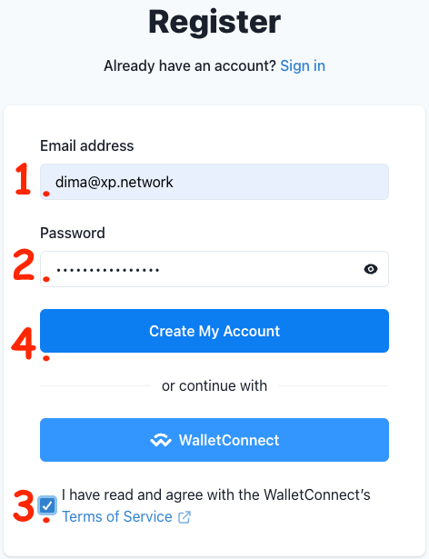
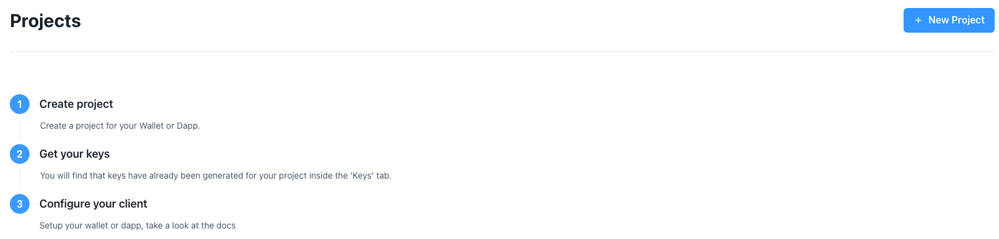

# WalletConnect Integration

WalletConnect is an open-source protocol that enables decentralized applications (dApps) to connect securely and interact with 300+ cryptocurrency wallets. It was developed to facilitate a smooth and secure connection between web-based dApps and various crypto wallets on platforms such as mobile devices and desktops. [WalletConnect v2.0](https://docs.walletconnect.com/2.0) introduces several key features and improvements to the protocol.

### 1. Chain Agnostic Interface
Since version 2.0 WalletConnect has started supporting multiple blockchains through [Chain Agnostic Improvement Proposals](https://chainagnostic.org/) [(CAIPs)](https://github.com/chainagnostic/caips). It allows the protocol to be compatible with different blockchain ecosystems that do not necessarily share the same standards, for example, only EVM-compatible [EIP-155](https://eips.ethereum.org/EIPS/eip-155) that defines [chainIds](https://chainid.network/).

### 2. Multi-Chain Support
Unlike the previous version, WalletConnect 2.0 allows applications to connect to multiple chains simultaneously. This feature enables apps to interface with wallets on different chains without requiring synchronization to switch contexts.

### 3. Pairing & Session Separation
In WalletConnect 2.0, the pairing and session have been decoupled, improving the user experience. The app can cache previously paired wallets and send new session proposals without requiring users to scan a QR code or use a deep link whenever they want to connect to a new application.

### 4. JSON-RPC Permissions
With chain agnostic interfaces, WalletConnect 2.0 addresses incompatibilities between apps and wallets regarding the JSON-RPC API methods used in a session. It requires specifying the JSON-RPC methods upfront when proposing a session and allows both apps and wallets to filter out incompatible JSON-RPC requests.

### 5. Improved Session Management
WalletConnect 2.0 improves session management with explicit expiries and request history. Sessions now include a Time to Live (TTL) to avoid indefinite sessions, and clients keep a record of JSON-RPC requests during a session to prevent duplicates and track pending requests.

### 6. Decentralized Message Relaying
In version 2.0, WalletConnect uses [Waku 2.0](https://waku.org/) as its primary transport for messages, a [decentralized message relay network](https://github.com/waku-org) built on top of [libp2p](https://github.com/libp2p/libp2p). It removes the previous requirement of two clients being connected to a centralized server for message relay.

## Supported Standards

### 1. EIP-712

[EIP-712](https://eips.ethereum.org/EIPS/eip-712) introduces a standardized way of handling structured data and messages in Ethereum smart contracts. It improved the interoperability of signed messages across different Ethereum applications and wallets. By using a schema and message hashing, it improves security and enables better interoperability between different Ethereum applications and wallets. EIP-712 enhances security by providing a clear definition of the data being signed. This reduces the risk of signature manipulation and makes it easier for users to review and approve the data they are signing.

Before EIP-712, signing data in Ethereum smart contracts often involved a process called "hashing" where the data was converted into a fixed-size hash and then signed by a wallet. However, this approach had limitations, particularly when dealing with structured data or data with nested elements. To solve this limitation, EIP-712 introduced the concept of **structured data**, where the data to be signed is defined in a specific format using a schema. The schema includes a set of typed fields, each with a name, type, and value. The data types can include basic types (e.g., integers, strings) and nested structures.

Another concept EIP-712 introduces is a **domain separator**, a unique identifier for the contract that helps differentiate different message types and avoid signature replay attacks.  Instead of hashing the data directly, a "message hash" is constructed. The message hash is generated by hashing the combination of the domain separator and the structured data according to the defined schema.

With EIP-712, when a user wants to sign the structured data, the **wallet signs the message hash** rather than the raw data itself. This preserves the structure and integrity of the data. To verify the signature, the contract can reconstruct the message hash using the same schema and then compare it with the provided signature.

### 2. EIP-1559

A major Ethereum Improvement Proposal that aims to address some of the long-standing issues with Ethereum's transaction fee model. It was proposed to improve the user experience, make transaction fees more predictable, and introduce a mechanism to better manage the supply of ether (ETH). [EIP-1559](https://eips.ethereum.org/EIPS/eip-1559) was implemented as part of the London Hard Fork, which went live on the Ethereum mainnet on August 5, 2021.

EIP-1559 introduced a number of features:

#### 1. Base Fee

Each block will have a fixed-per-block base fee, which is burned (destroyed) as part of the transaction process. The base fee moves up or down based on the network's congestion level. When the network is congested, the base fee increases, and when it's less congested, the base fee decreases.

#### 2. Dynamic Block Size

EIP-1559 allows the block size to expand or contract based on the network's demand. If blocks are consistently full, the block size can increase, and if there's less demand, the block size can decrease. This mechanism helps maintain a balance between demand and block capacity.

#### 3. Max Fee and Priority Fee

Users can set a maximum fee they are willing to pay for a transaction (max fee) and a separate fee that goes directly to miners as an incentive for including their transaction (priority fee). The transaction will be included in a block if the combined amount of the priority fee and the base fee (from the block) does not exceed the user's specified max fee.

#### 4. Fee Burning Mechanism

The base fee that is burned in each transaction is effectively removed from circulation, leading to a potential deflationary effect on the supply of ether (ETH). This is expected to make ETH scarcer over time and may impact its economic value.

#### 5. Miner Incentives

With EIP-1559, miners only keep the priority fee as their reward for including transactions in blocks. The base fee is burned, removing any incentive for miners to manipulate fees to extract more from users.

### 3. EIP-3085 adding a chain to a wallet


[EIP-3085](https://eips.ethereum.org/EIPS/eip-3085) proposes the `wallet_addEthereumChain` Ethereum Improvement Proposal, which introduces an RPC method for adding Ethereum chains to wallet applications. This proposal aims to improve the user experience for decentralized applications (dApps) by allowing them to suggest chains to be added to a user's wallet application.

- The method "wallet_addEthereumChain" accepts a single object parameter, which includes a chain ID and some chain metadata.
- The chain ID is required, and it must be specified as an integer ID of the chain represented as a hexadecimal string (per the eth_chainId Ethereum RPC method).
- Other optional fields in the parameter include blockExplorerUrls, chainName, iconUrls, nativeCurrency, and rpcUrls, which provide additional information about the chain.

```ts
export type Chain = {
  id: number,
  jsonrpc: string,
  method: "wallet_addEthereumChain",
  params: [
    {
      chainId: string,      // Required
      chainName: string,
      rpcUrls: string [],
      nativeCurrency: {
        name: string,
        symbol: string,
        decimals: number
      },
      blockExplorerUrls: string []
    }
  ]
}
```

- The wallet application has the flexibility to accept or reject the request for any reason.

```json title="Success"
{
  "id": 1,
  "jsonrpc": "2.0",
  "result": null
}
```

```json title="Failure"
{
  "id": 1,
  "jsonrpc": "2.0",
  "error": {
    "code": 4001,
    "message": "The user rejected the request."
  }
}
```

The `wallet_addEthereumChain` method **exposes the user to serious risks if implemented incorrectly**. Wallet applications should handle chain IDs correctly, ensure that submitted chain IDs are valid, prevent the same chain ID from being added multiple times, and use the submitted chain ID to sign transactions instead of using a chain ID received from an RPC endpoint. Additionally, wallets should inform users about the risks of using multiple RPC endpoints and how their on-chain activity and IP address may be exposed to these endpoints.

### 4. EIP-3326 switching active chain in a wallet

[EIP-3326](https://eips.ethereum.org/EIPS/eip-3326) proposes the "Wallet Switch Ethereum Chain RPC Method" `wallet_switchEthereumChain` enabling Ethereum applications ("dapps") to request that the wallet switches its active Ethereum chain, if the wallet has such a concept. The caller must specify a chain ID, and the wallet application may choose to accept or reject the request. If the active chain is successfully switched, the method returns null; otherwise, it returns an error.

#### Specification

- The method accepts a single object parameter with a chainId field.
- The chainId parameter specifies the integer ID of the chain as a hexadecimal string, following the `eth_chainId` Ethereum RPC method.
- The wallet must know the specified chain ID and be able to switch to the chain, servicing RPC requests to it.
- If the wallet does not have a concept of an active chain, it must reject the request.

#### Request example

```json title="RPC Request"
{
  "id": 1,
  "jsonrpc": "2.0",
  "method": "wallet_switchEthereumChain",
  "params": [
    {
      "chainId": "0x5", // Switching to Goerly
    }
  ]
}
```

#### Security Considerations:

Switching the active chain in a wallet can have significant implications for pending RPC requests and the user's experience. To avoid unintended actions for unintended chains, wallets should display a confirmation whenever a `wallet_switchEthereumChain` request is received, clearly identifying the requester and the chain that will be switched to. Pending RPC requests and chain-specific user confirmations should be canceled when switching the active chain.


### 5. ERC-4337 Account abstraction

ERC-4337 proposes a system for account abstraction by introducing a higher-layer pseudo-transaction object called a `UserOperation`. 

#### 1. Allow Users to Use Smart Contract Wallets

The proposal enables users to use smart contract wallets with arbitrary verification logic as their primary accounts, replacing the need for externally owned accounts (EOAs). This allows for greater flexibility and customization in account management.

#### 2. Decentralization

The design of ERC-4337 promotes decentralization by allowing accounts to have entry points that can be upgraded and supporting the use of multiple entities like paymasters, factories, and aggregators in a trustless manner.

#### 3. Privacy-Preserving Applications

ERC-4337 enables privacy-preserving applications where the approval of a specific user is not explicitly disclosed. This can enhance privacy in certain use cases.

#### 4. Sponsored Transactions

While sponsored transactions are one of the goals, it is not the sole focus. The proposal provides mechanisms for paymasters to sponsor transactions on behalf of users, allowing for third-party payment mechanisms.

#### 5. Aggregate Signature Support

[ERC-4337](https://eips.ethereum.org/EIPS/eip-4337) includes support for aggregate signatures, which can enhance security and efficiency in certain scenarios.

```ts title="Example request"
const request = {
  jsonrpc: "2.0",
  id: 1,
  method: "eth_sendUserOperation",
  params: [
    {
      sender,               // address
      nonce,                // uint256
      initCode,             // bytes
      callData,             // bytes
      callGasLimit,         // uint256
      verificationGasLimit, // uint256
      preVerificationGas,   // uint256
      maxFeePerGas,         // uint256
      maxPriorityFeePerGas, // uint256
      paymasterAndData,     // bytes
      signature             // bytes
    },
    entryPoint              // address
  ]
}
```

Overall, ERC-4337 aims to create an account abstraction system that empowers users with smart contract wallets, encourages decentralization, facilitates privacy-preserving applications, supports sponsored transactions, and includes advanced features like aggregate signature support.

## Integration Milestones (Example)

### 1. Creating a project ID

Open the link [https://cloud.walletconnect.com](https://cloud.walletconnect.com) and sign up:

1. Provide your email address
2. Type a password you can memorize but hard to crack for a stranger
3. Tick that you agree with the terms
4. Click the `Create My Account` button
5. Open your email & click the verification link

<center> 



</center>

Once you're in, register your wallet or dApp:

1. Click the `+ New Project` button to start a project

<center> 



</center>

2. Add the Name of your project

<center> 


</center>

3. Populate all the required fields in the `Settings` & `Explorer` tabs.
4. Click the `Verify` button

<center> 


</center>

Then follow the instructions provided here: https://docs.walletconnect.com/2.0/web/web3modal/react/wagmi/installation