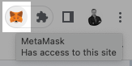
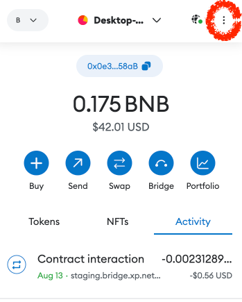
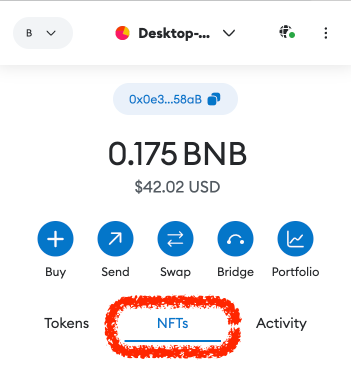
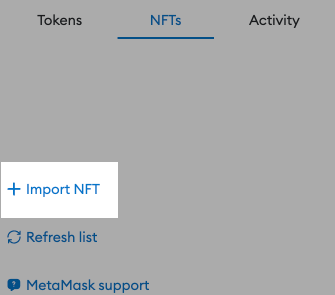
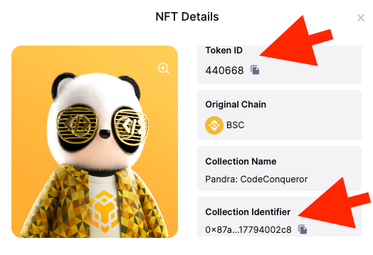
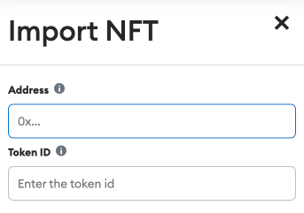
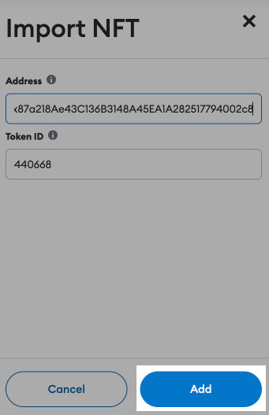
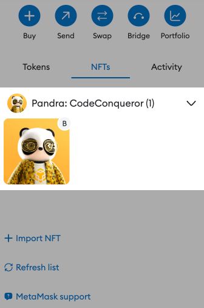
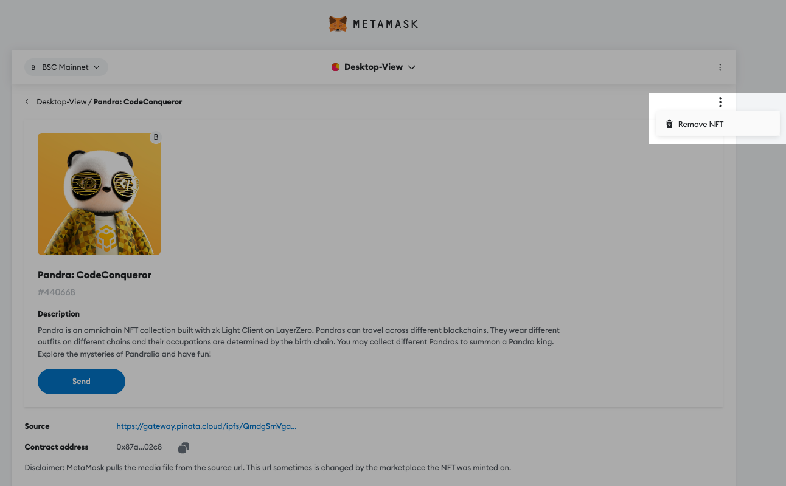

# Adding & Removing NFTs

Users from Non-EVM ecosystems often ask us how an NFT collection can be added to a wallet, for example, Metamask. 

## Adding NFTs

To add an ERC721 token contract to Metamask, you'll need the contract's address and the token ID.

Here's how to do it:

a. Click on the Metamask extension icon to open the wallet interface.

b. Open the account menu and Click on the three vertical dots in the top right corner.

c. Select the middle tab entitled "NFTs".

c. Click "+Import NFT"

d. Click on the (i) icon of the XP.NETWORK bridge NFT card to view it closer.

e. Copy the Collection identifier & the Token ID by clicking the "copy" buttons.

f. Populate the corresponding fields with the contract address and the token ID.

g. Click the "Add" button at the bottom right corner.

h. The NFT should now be visible in the wallet.

The ERC721 token should now be added to your Metamask wallet. You should refresh your wallet to see the newly added token. NFTs from this contract will now be viewable and manageable within your Metamask interface.

## Removing NFTs

If you sold or transferred all the tokens to another chain, you should delete an NFT from the wallet to better see others. To remove an NFT from the wallet, open the NFT view and click the three vertical buttons at the top right corner. Then click the "Remove NFT" menu item.

The NFT should be no longer visible in your wallet.