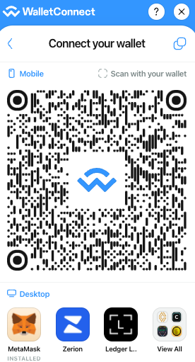
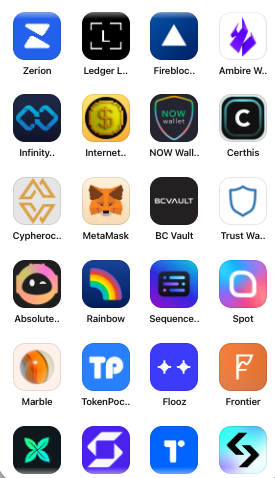
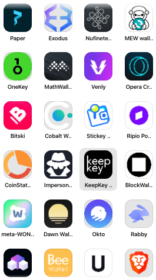
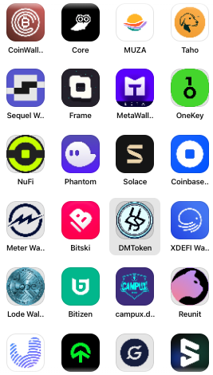
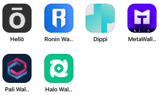
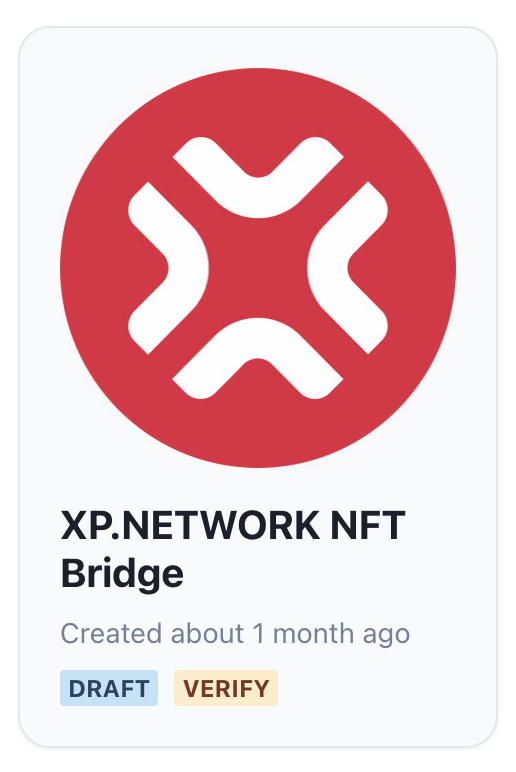

# Web3Modal

Web3Modal aims to provide a seamless and user-friendly experience for users who want to access decentralized services, such as blockchain-based applications, without needing extensive technical knowledge.

Here are some key features and functions of Web3Modal:

### Wallet Integration
Web3Modal supports multiple wallet providers, including MetaMask, Trust Wallet, Coinbase Wallet, Fortmatic, and more. It allows users to choose their preferred wallet to interact with DApps. Here are the wallets available for signing XP.NETWORK NFT Bridge's transaction via Wallet Connect:

<center>







</center>

### Network Connection & Multichain Support
It assists users in connecting to different blockchain networks, such as Ethereum, Binance Smart Chain, and others, based on the dApp's requirements. Web3Modal is designed to work with various blockchain networks, making it easier for developers to build DApps that are compatible with multiple chains. The full list of supported chains includes:

- mainnet (= Ethereum)
- goerli
- arbitrum
- arbitrumGoerli
- arbitrumNova
- aurora
- auroraTestnet
- avalanche
- avalancheFuji
- base
- baseGoerli
- boba
- bronos
- bronosTestnet
- bsc
- bscTestnet
- bxn
- bxnTestnet
- canto
- celo
- celoAlfajores
- celoCannoli
- classic
- chronos
- chronosTestnet
- crossbell
- dfk
- dogechain
- edgeware
- edgewareTestnet
- eos
- eosTestnet
- ekta
- ektaTestnet
- evmos
- evmosTestnet
- fantom
- fantomTestnet
- fibo
- filecoin
- filecoinCalibration
- filecoinHyperspace
- flare
- flareTestnet
- fuse
- fuseSparknet
- gobi
- gnosis
- gnosisChiado
- haqqMainnet
- haqqTestedge2
- harmonyOne
- iotex
- iotexTestnet
- klaytn
- linea
- lineaTestnet
- mantle
- mantleTestnet
- metis
- metisGoerli
- mev
- mevTestnet
- modeTestnet
- moonbaseAlpha
- moonbeam
- moonriver
- neonDevnet
- nexilix
- nexi
- oasys
- okc
- optimism
- optimismGoerli
- polygon
- polygonMumbai
- polygonZkEvm
- polygonZkEvmTestnet
- pulsechain
- pulsechainV4
- qMainnet
- qTestnet
- rollux
- rolluxTestnet
- ronin
- saigon
- scrollSepolia
- scrollTestnet
- sepolia
- shardeumSphinx
- skaleCalypso
- skaleCalypsoTestnet
- skaleChaosTestnet
- skaleCryptoBlades
- skaleCryptoColosseum
- skaleEuropa
- skaleEuropaTestnet
- skaleExorde
- skaleHumanProtocol
- skaleNebula
- skaleNebulaTestnet
- skaleRazor
- skaleTitan
- skaleTitanTestnet
- syscoin
- syscoinTestnet
- songbird
- songbirdTestnet
- taikoTestnetSepolia
- taraxa
- taraxaTestnet
- telos
- telosTestnet
- thunderTestnet
- titan
- titanTestnet
- wanchain
- wanchainTestnet
- xdc
- xdcTestnet
- zetachainAthensTestnet
- zkSync
- zkSyncTestnet
- zora
- zoraTestnet
- foundry
- hardhat
- localhost

And can be imported like so:

```ts
import { avalanche, bsc, mainnet } from '@wagmi/core/chains'

const { chains, publicClient } = configureChains(
  [mainnet, avalanche, bsc],
  ...
)
```


### Customization
Developers can customize the appearance and behavior of the Web3Modal popup to match the look and feel of their DApp.

For example, the CSS of a modal window can be set using `WalletConnectModal`:

The theme variables always start with `--wcm-` followed by the regular CSS keys:

- font-family
- font-feature-settings
- overlay-background-color
- overlay-backdrop-filter
- z-index
- accent-color
- accent-fill-color
- background-color
- background-border-radius
- container-border-radius
- wallet-icon-[large|small]-border-radius
- input-border-radius
- notification-border-radius
- button-border-radius
- secondary-button-border-radius
- icon-button-border-radius
- button-hover-highlight-border-radius

Text can also be set using such keys as:

- text-[big-bold|medium-regular|small-thin|xsmall-bold|xsmall-regular]-size
- text-[big-bold|medium-regular|small-thin|xsmall-bold|xsmall-regular]-weight
- text-[big-bold|medium-regular|small-thin|xsmall-bold|xsmall-regular]-line-height
- text-[big-bold|medium-regular|small-thin|xsmall-bold|xsmall-regular]-letter-spacing
- text-[big-bold|medium-regular|small-thin|xsmall-bold|xsmall-regular]-text-transform
- text-[big-bold|medium-regular|small-thin|xsmall-bold|xsmall-regular]-font-family


```ts
const modal = new WalletConnectModal({
  themeMode: 'dark',
  themeVariables: {
    '--wcm-font-family': 'Roboto, sans-serif',
    '--wcm-accent-color': '#F5841F'
  }
})
```

Custom chains can be added as long as they comply with the `Chain` type:

```ts title="Example.ts"
import { Chain } from 'wagmi'
 
export const xpnetwork = {
  id: xx_xxx,
  name: 'XPNetwork',
  network: 'xp',
  nativeCurrency: {
    decimals: 18,
    name: 'XPNET',
    symbol: 'XPNET',
  },
  rpcUrls: {
    public: { http: ['https://xp.network/rpc'] },
    default: { http: ['https://xp.network/rpc'] },
  },
  blockExplorers: {
    etherscan: { name: 'XP Explorer', url: 'https://xp.network/explorer' },
    default: { name: 'XP Explorer', url: 'https://xp.network/explorer' },
  },
  isTestnet: false
} as const satisfies Chain
```

### User-Friendly Integration
Web3Modal aims to create a user-friendly experience, ensuring users can access DApps with minimal friction. It provides a simple API that developers can integrate into their DApps, reducing the complexity of handling different wallet providers and blockchain networks.

<center>



</center>

1. Creating a project ID is the first step in a Web3 model integration. It can be done here: https://cloud.walletconnect.com/
2. Once the project ID is created, it can be used to 

Example:

3. Save your project ID in the `.env` file

```shell
touch .env
echo "PROJECT_ID=<your-project-id-here>" >> .env
```

4. Install the required packages:

```shell
yarn add @web3modal/ethereum @web3modal/react wagmi viem dotenv
```

5. Add `WagmiConfig` to the project:
```ts
import { EthereumClient, w3mConnectors, w3mProvider } from '@web3modal/ethereum'
import { Web3Modal } from '@web3modal/react'
import { configureChains, createConfig, WagmiConfig } from 'wagmi'
import { arbitrum, mainnet, polygon } from 'wagmi/chains'
import { config } from 'dotenv'
config()

const chains = [arbitrum, mainnet, polygon]
const projectId = process.env.PROJECT_ID!

const { publicClient } = configureChains(chains, [w3mProvider({ projectId })])
const wagmiConfig = createConfig({
  autoConnect: true,
  connectors: w3mConnectors({ projectId, chains }),
  publicClient
})
const ethereumClient = new EthereumClient(wagmiConfig, chains)

function App() {
  return (
    <>
      <WagmiConfig config={wagmiConfig}>
        <HomePage />
      </WagmiConfig>

      <Web3Modal projectId={projectId} ethereumClient={ethereumClient} />
    </>
  )
}
```

6. Call the web3modal via a hook:

```ts
import { useWeb3Modal } from '@web3modal/react'

function HomePage() {
  const { open, close } = useWeb3Modal()

  return <button onClick={() => open()}>Connect</button>
}
```

Enjoy your dApp!