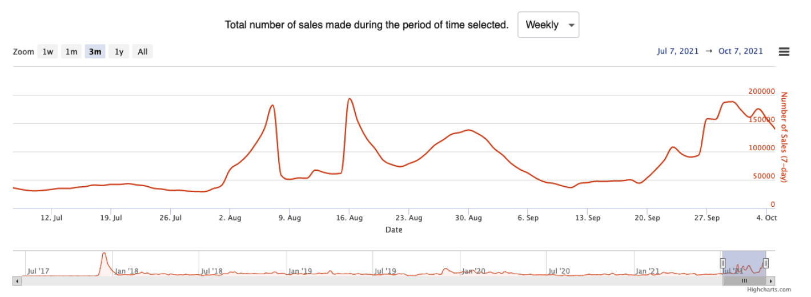

# NFTs on different chains: facts, figures, and forecasts

The rise of NFTs in 2021 has been nothing short of extraordinary. According to [nonfungible.com](https://nonfungible.com/market/history), in January 2021, weekly sales of non-fungible tokens amounted to just $2.3 million; in May, during a bullish wave in the crypto market, weekly sales reached $170 million – an incredible 74x growth in just four months. Yet even that was not the limit: in August, 7-day sales crossed the psychologically important $1 billion mark. Though sales later slumped to $450 million a week as a result of the overall bearish sentiment, it is likely that the NFT market will not only recover but also reach new highs in late 2021 and early 2022.

Credit: nonfungible.com

Other market statistics are just as impressive. The number of unique wallets that made at least one NFT transaction in 7 days [rose from 6,000 in January to 70,000](https://nonfungible.com/market/history) at the end of September 2021. Meanwhile, the number of unique sales skyrocketed from 15,000 to 190,000.

The variety of NFT collections exploded, too, while the process of buying NFTs in the primary market was standardized. Instead of digital artists selling single NFTs and small sets, projects now hold organized mints of thousands of unique but very similar assets that have different degrees of rarity. A rare Bored Ape or Sappy Seal can look just like any other to an untrained eye, yet sell for a price that is dozens of times higher than that of a regular asset. ‘Look rare’ has even become a standard way to compliment someone on a nice-looking NFT.

However, perhaps the most fascinating of the current NFT trends is the expansion from Ethereum to other blockchains. Excessive gas fees (reaching hundreds of dollars) have become a barrier for many users wishing to mint NFTs on Ethereum. Meanwhile, one can mint on Solana, Avalanche, or Binance Smart Chain for a fraction of the amount.

Non-Ethereum-based NFTs remain rather niche, but probably not for long. Polygon, Solana, Avalanche, and other smart contract ecosystems are growing very rapidly, and there are already some high-profile NFT projects on these chains. For instance, all 10,000 AvaxApes [sold out in just 13 minutes](https://avalanche.today/avax-apes-sold-10000-nfts-in-13-minutes/), while Solana Monkey Business (MBS) [has a market cap of $100 million](https://finance.yahoo.com/news/apes-monkeys-continue-dominate-thriving-115646429.html), and a very rare Degen Ape (also based on Solana) recently [sold for a record $1 million](https://nftevening.com/solana-bags-first-million-dollar-nft-sale-for-a-degenerate-ape/).

Credit: nonfungible.com

The next logical step in this evolutionary process is to connect the isolated NFT ecosystems that are growing on different chains. A fitting analogy would be the creation of a single global market out of disjointed regional or national markets of the past. The free flow of goods benefits all market players, as buyers can find better deals and sellers can make more money.

This is what XP.network is doing with its set of interconnected blockchain bridges that will eventually link dozens of networks. In a sense, we are building an infrastructure for a single global NFT market.
