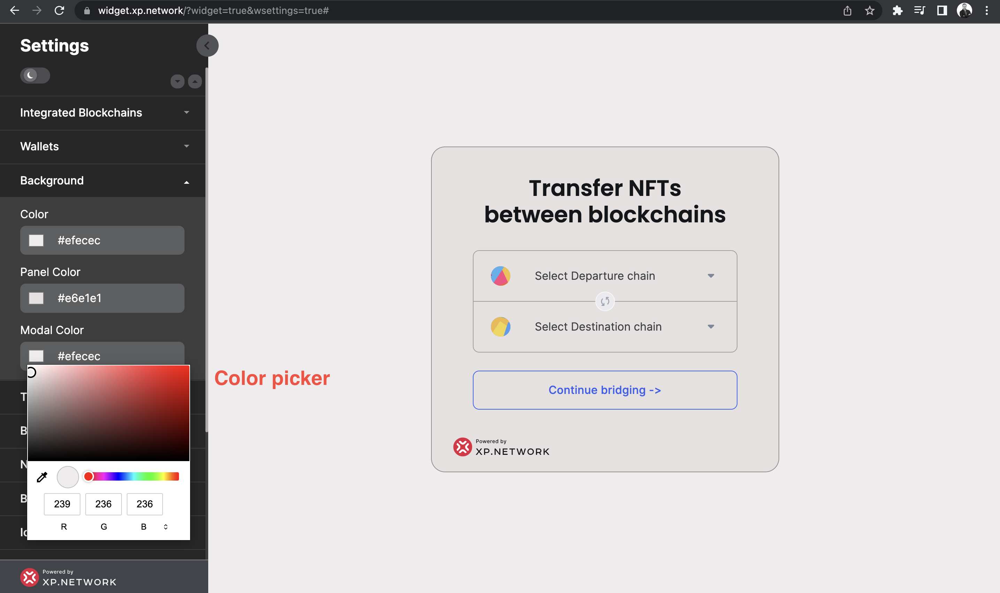
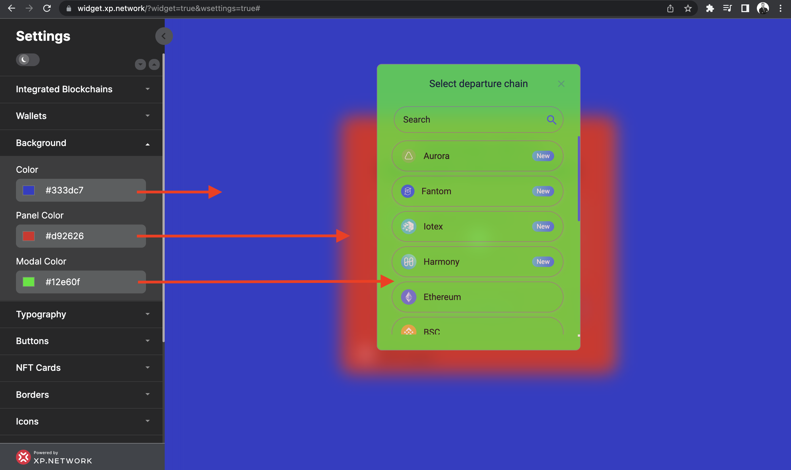

# Setting Backgrounds

To change the colors of the major surfaces, open the `Background` tab.

1. To visually set the colors - use the color picker and click the relevant setting.
2. To precisely match the style guides of the corporate palette - paste the hexadecimal values of the colors.

- The `Color` setting changes the color of the entire bridge background.
- The `Panel Color` setting impacts the departure and the destination chain selectors' background.
- The `Modal Color` setting alters the background of the pop-up window.

