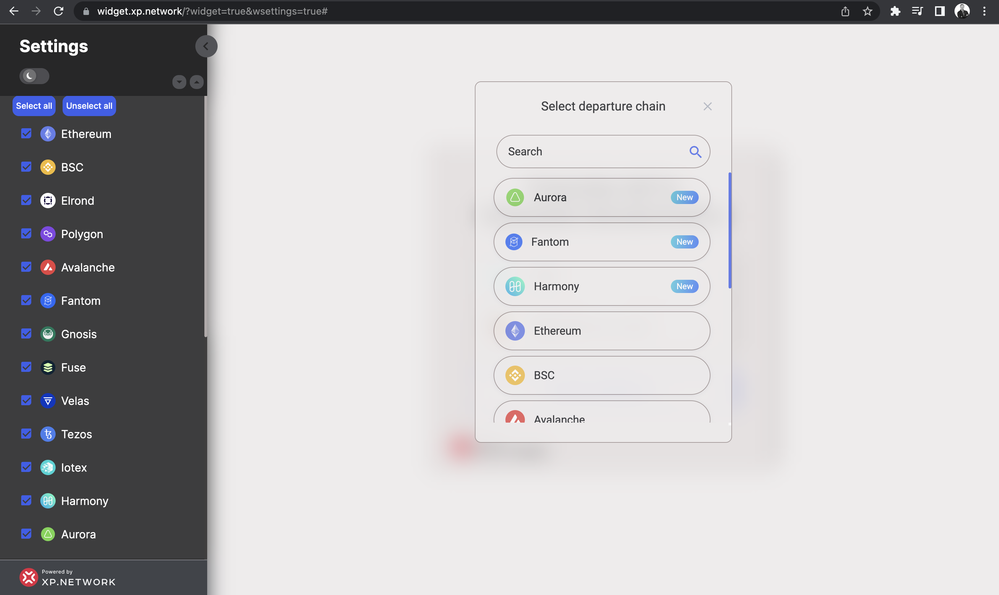
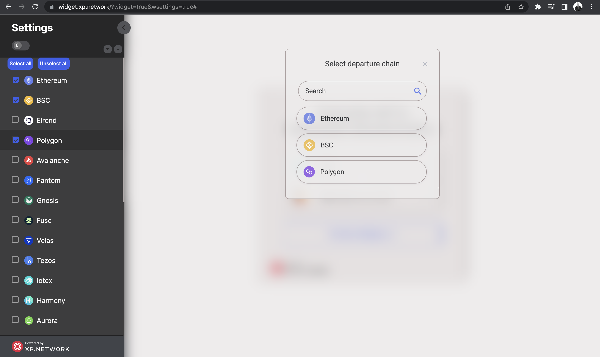

# Adding & removing the Blockchains

Open the topmost `Integrated Blockchains` tab to manipulate the presence or absence of the available chains in your version of the bridge. It may be a precaution to help your NFT ecosystem to only send their NFTs to the ledgers where you have prepared the required infrastructure to accept and list the assets properly. By default, all the available chains are selected. Deselect the chains you don't need. You will see them disappear from the selected departure or destination chain popup window, should you keep any of those open.

For example, you only plan to use the bridge between Ethereum, BSC, and Polygon. Click the `Unselect all` button. It will leave only two blockchains selected - Ethereum and BSC. Click the Polygon checkbox, and you're all set. Check the "select departure chain." 

