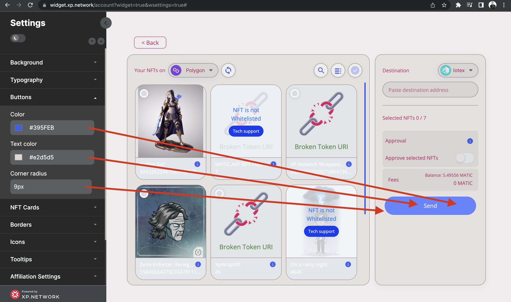

# Button settings

Button settings are quite intuitive.

1. Change the `Color` to impact the button's background.
2. The `Text color` adjusts the font color of the button text.
3. The `Corner radius` makes the button corners round or square.

