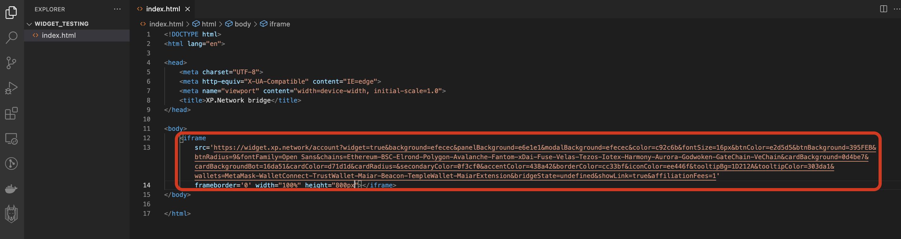

# Embedding the IFrame

Paste the resulting iframe in your frontend code. Make sure the height of the widget is at least 800px.



## Code snippet example:

```html
<!DOCTYPE html>
<html lang="en">

<head>
    <meta charset="UTF-8">
    <meta http-equiv="X-UA-Compatible" content="IE=edge">
    <meta name="viewport" content="width=device-width, initial-scale=1.0">
    <title>XP.Network bridge</title>
</head>

<body>
    <iframe
        src='https://widget.xp.network/account?widget=true&background=efecec&panelBackground=e6e1e1&modalBackground=efecec&color=c92c6b&fontSize=16px&btnColor=e2d5d5&btnBackground=395FEB&btnRadius=9&fontFamily=Open Sans&chains=Ethereum-BSC-Elrond-Polygon-Avalanche-Fantom-xDai-Fuse-Velas-Tezos-Iotex-Harmony-Aurora-Godwoken-GateChain-VeChain&cardBackground=0d4be7&cardBackgroundBot=16da51&cardColor=d71d1d&cardRadius=&secondaryColor=0f3cf0&accentColor=438a42&borderColor=cc33bf&iconColor=ee446f&tooltipBg=1D212A&tooltipColor=303da1&wallets=MetaMask-WalletConnect-TrustWallet-Maiar-Beacon-TempleWallet-MaiarExtension&bridgeState=undefined&showLink=true&affiliationFees=1'
        frameborder='0' width="100%" height="800px"></iframe>
</body>

</html>
```