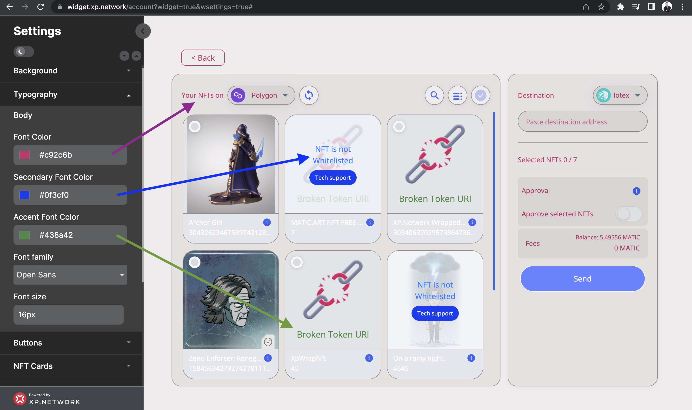

# Adjusting the Fonts

To change the color, font family, or size of the captions, open the `Typography` tab.

1. To change the color of most component labels, use the `Font Color` setting.
2. The `Secondary Font Color` impacts the captions in the middle of the NFT cards.
3. The `Accent Font Color` setting adjusts the text at the bottom of the NFT image.
4. Changing the `Font Size` will impact most labels and texts.
5. The following `Font family` are available:
   - Open Sans
   - Roboto
   - Inter
   - Josefin sans
   - Lato
   - Monserrat
   - Mukta
   - Playfair Display
   - Poppins
   - Quicksand
   - Raleway
   - Ubuntu

