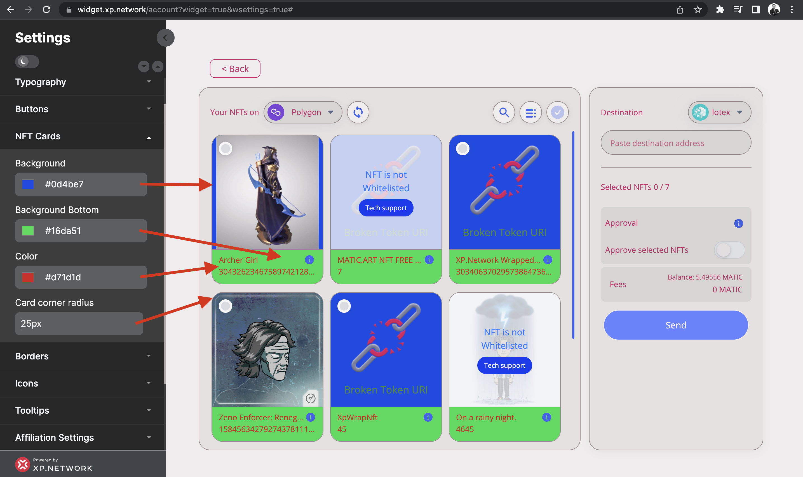

# Changing NFT Cards

Each card represents a Non-Fungible Token.

1. Change the `Background` color to impact the layer behind the NFT image or video.
2. The `Background Bottom` adjusts the lower part of the card.
3. The `Color` setting changes the color of the NFT name and ID color.
4. The `Card corner radius` makes the corners more rounded or square.

