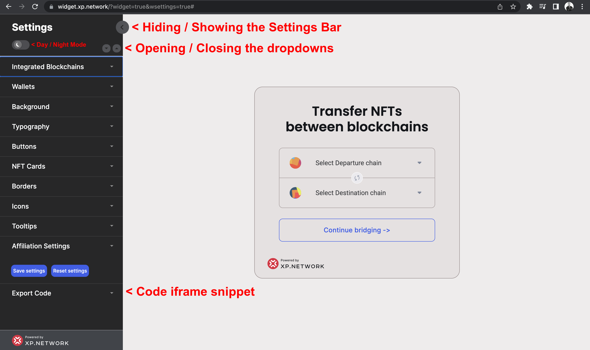

# Adjusting the Settings Panel

The widget attributes can be manipulated with the Settings panel located on the left side of the screen.

1. To view the bridge on the full screen, hide the Settings panel.
2. To edit the bridge attributes, show the Settings panel.
3. Click the Day / Night mode slider to switch between the dark-grey and white backgrounds of the Settings panel. By default, the panel is dark to contrast with the light background of the bridge screen. Should you change the background of the bridge to something dark, it would make sense to switch to the day mode of the panel.
4. To open all the dropdowns at once, click the left and close the right arrows located immediately above the `Integrated Blockchains` tab.
5. The `Save settings` button saves all the changes you already made in the local storage of your browser (E.g. Chrome). Switching to another browser  will make your widget open in a new browser (E.g. Safari) "ignorant" of all your previous changes.
6. Use the `Reset settings` button to drop all the changes you already made. It also cleans the Local storage of the browser from the widget settings stored there.
7. The HTML code of the resulting iframe will be generated in the `Export Code` tab at the very bottom of the panel.

