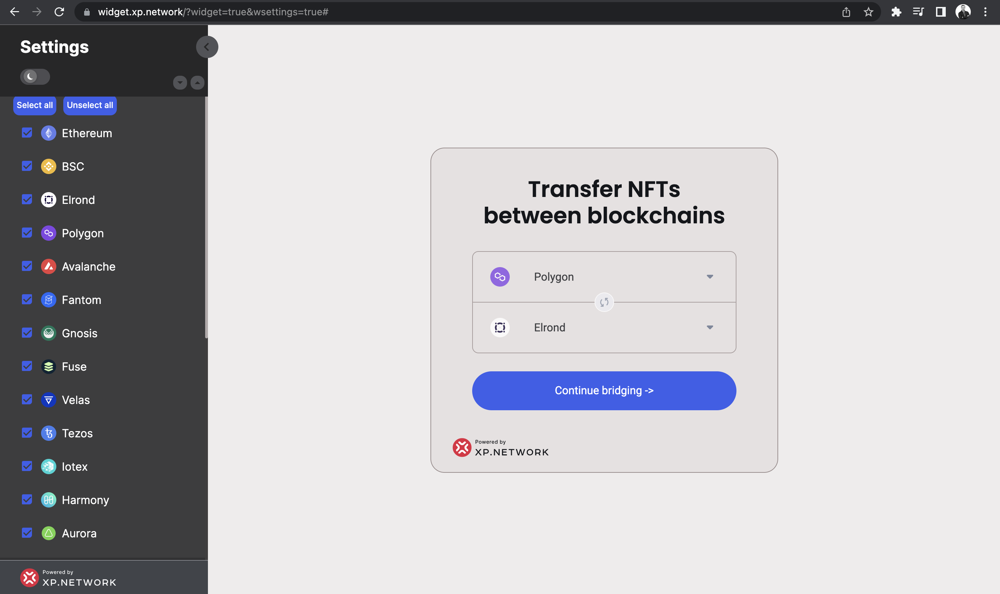
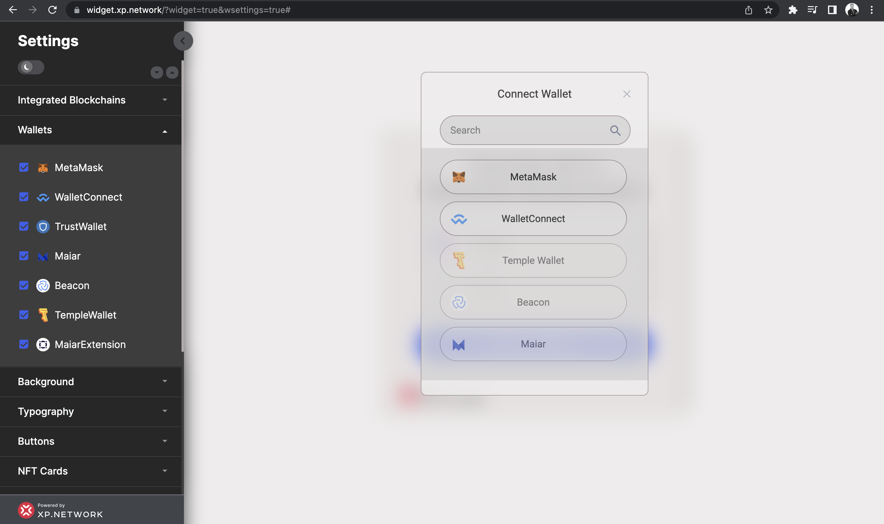

# Adding & removing the wallets

Select the departure and destination chains to see what wallets are currently available. It will activate the `Continue bridging` button making it clickable.

Click the `Continue bridging` button to see the wallets that your community will be able to use while bridging NFTs. 

By default, all the wallets are selected. Deselect the ones you want to exclude. 

If a blockchain that uses those wallets were deselected at the previous stage, its wallets would appear unselected too once you open the tab. However, deselecting a wallet does not unselect a chain since a chain can use multiple wallets.

