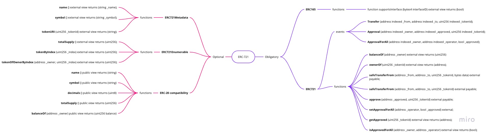
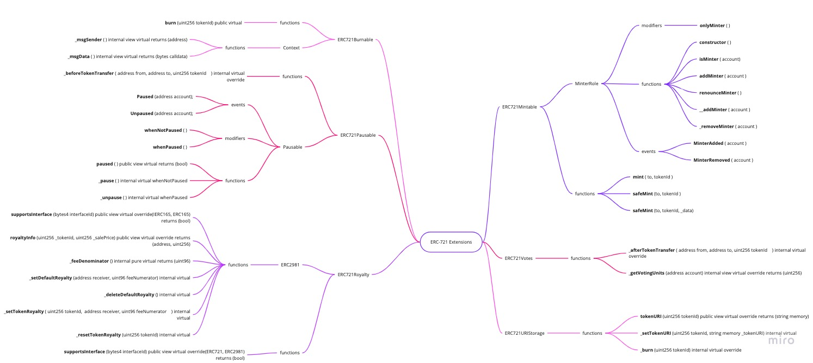

# ERC-721

The foundational standard discussed since September [2017](https://github.com/ethereum/eips/issues/721) and accepted in [2018](https://eips.ethereum.org/EIPS/eip-721). 

## Core

The core standard consists of:
+ the *obligatory* part:
  + **ERC165** checks whether a contract complies with an interface
  + **ERC721** Contains the main functionality of the contract
+ and the *optional* part
  + **ERC721Metadata** - ensures the main metadata fields (name, symbol. tokenUri)
  + **ERC721Enumerable** - allows querying the contract about the tokens and their owners
  + **ERC20-Compatibility** - allows for listing NFT in a way similar to FTs

## Extensions

Extensions are adding frequently used functionality in a commonized way.

ERC-721 Extensions comprise:
+ **ERC721Mintable**
  + relies on the MinterRole extension
  + has its native functions and events
+ **ERC721Burnable** - allows burning NFTs
  + relies on Context
  + has a burn function
+ **ERC721Pausable**
  + relies on Pausable contract
  + implements a _beforeTokenTransfer function
+ **ERC721Royalty**
  + relies on ERC2981 contract
  + implements the supportInterface function
+ **ERC721URIStorage**
  + implements the URI related functionality

> Work-in-Progress...