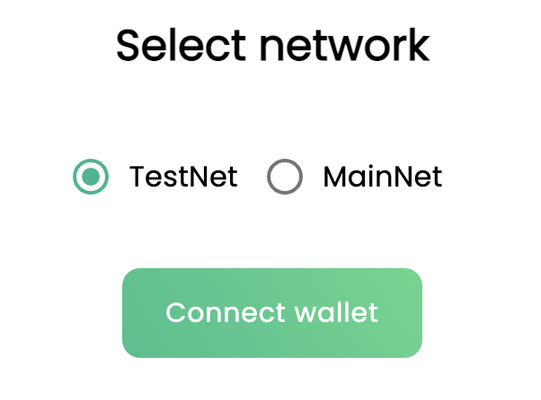
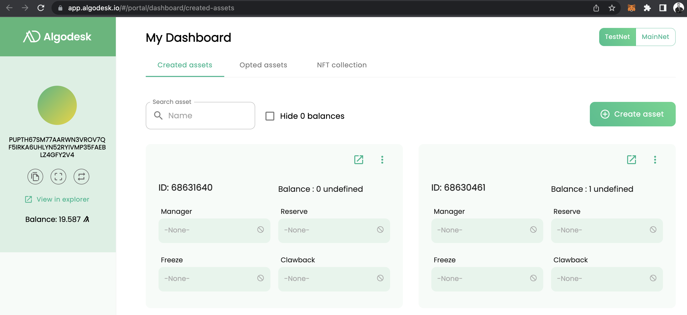
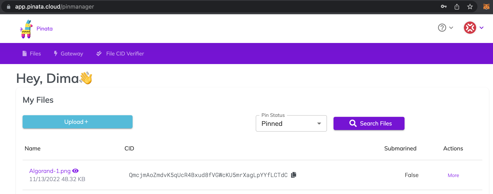
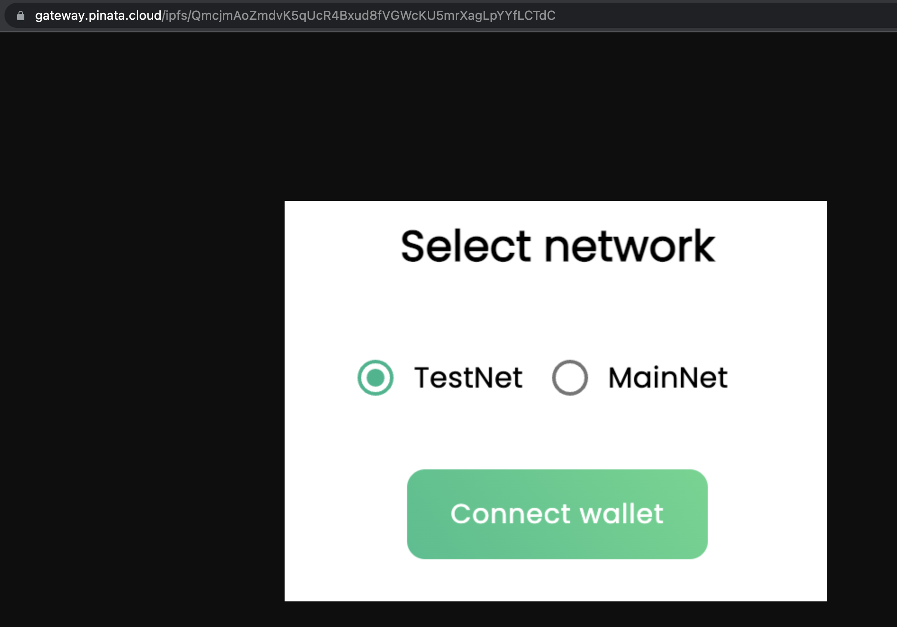
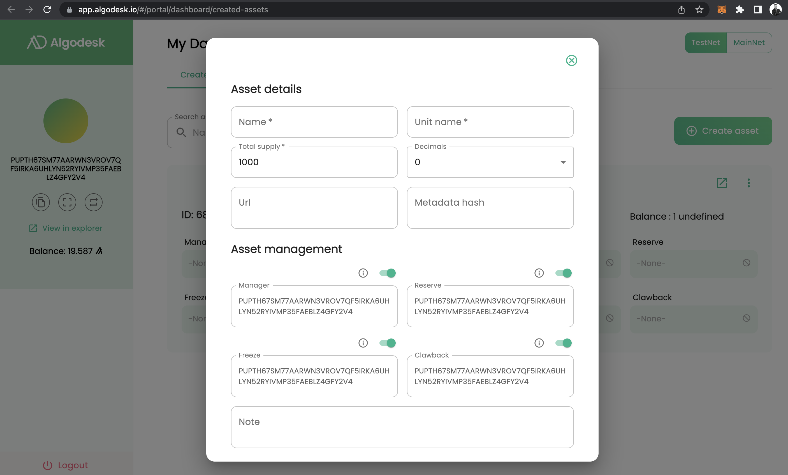
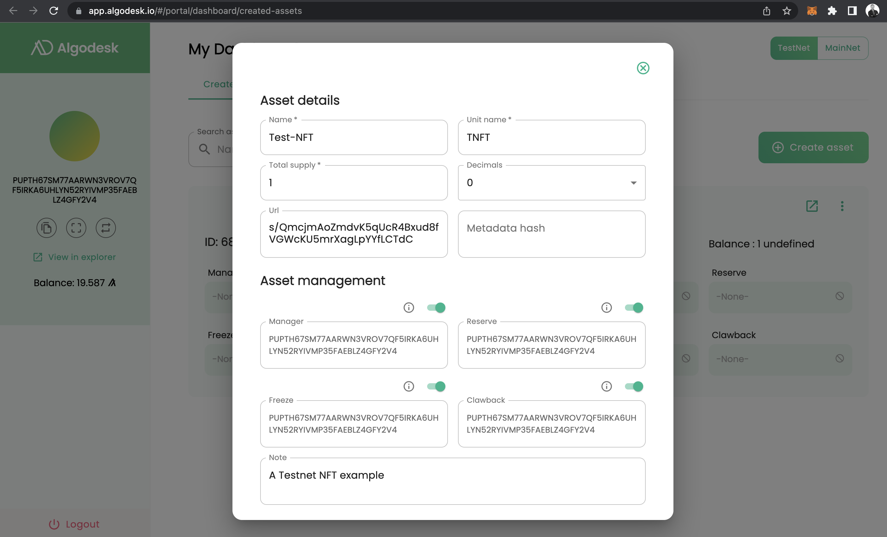
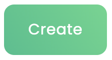
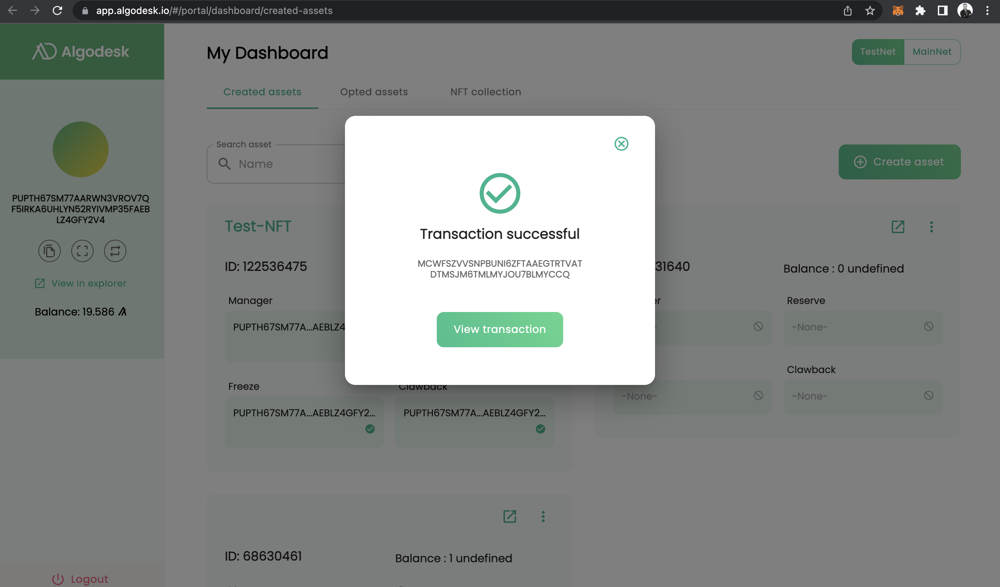
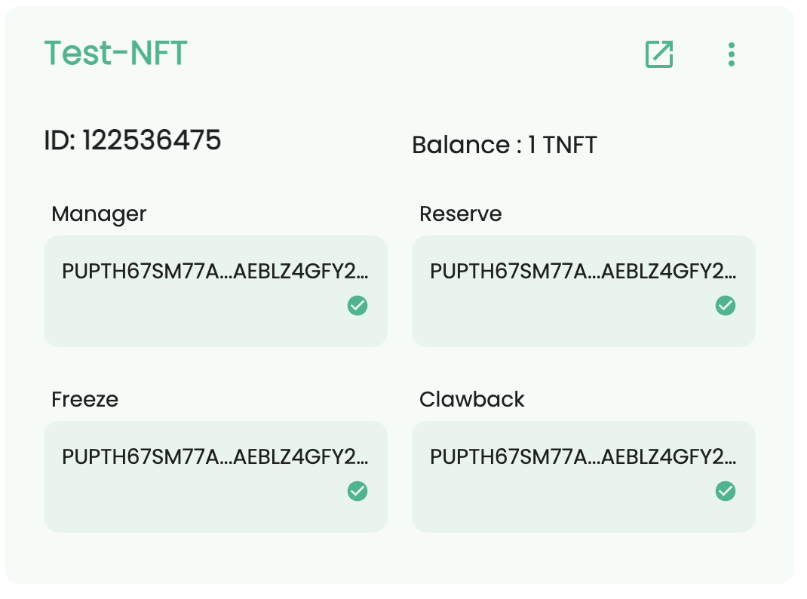
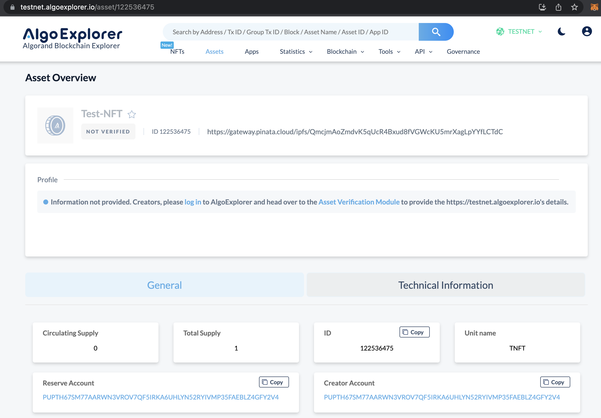

# ASA-003 Algorand NFTs

Tokens on Algorand are somewhat different from those on other chains. The first important things to know are:

1. Every time a user creates an asset, the user has to increase one's balance by 0.1 Algos or 100,000 micro Algos.
2. User accounts or contracts cannot voluntarily send assets to each other. The receiver must `opt-in` to the asset before receiving it from the sender.
3. The transaction will only succeed if the user has the minimum required balance after paying the transaction fee.
4. Token IDs are consecutive throughout the entire blockchain. If anyone mints an asset, its ID is +1 from the ID of the last minted asset by anyone on the network.

The easiest way to mint NFTs in Algorand is the following:

https://app.algodesk.io/#/login

## Creating Assets on Algorand

### 1. Switch between Testnet & Mainnet

### 2. Click Create Asset

### 3. Open your Pinata account

### 4. Upload an asset & get its link

### 5. Populate the required fields

### 6. Click the Create button at the bottom of the popup window

### 6. Wait for the transaction to succeed

### 7. View your NFT in the UI

### 8. View in the chain explorer

https://testnet.algoexplorer.io/asset/122536475

